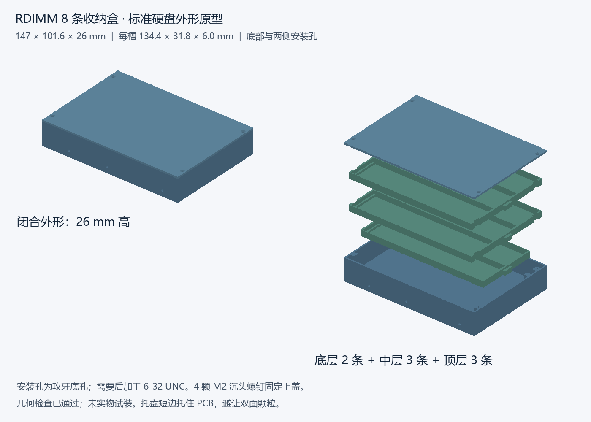

# RDIMM HDD Case

3D-printable storage for **8 bare DDR5 RDIMMs** inside a **147 × 101.6 × 26 mm** envelope, with traditional 3.5-inch HDD side and bottom mounting positions.

为服务器内存设计的硬盘位收纳盒：三层托盘，容量 2 + 3 + 3 条，优先保持标准 3.5 寸硬盘外形。目标参考内存为 Samsung M321RAJA0MB2-CCP / CCPKF，打印机参考为 Bambu Lab P2S。

**Status: engineering prototype. Geometry checked; not sliced, printed, or physically fitted.** This is not a certified ESD enclosure. Mounting holes are unthreaded pilots requiring finishing.



## Print the current prototype

- [Download all project files](https://github.com/helixzz/rdimm-hdd-case/archive/refs/heads/main.zip), or browse [v1 STL files](models/v1).
- **先阅读：[中文打印与装配说明](docs/printing.zh-CN.md)**，包含孔位、螺丝、打印方向、材料及全部尺寸来源。
- Print `fit-coupon-1-slot.stl` first. Check that the short PCB edges rest on the shelves without contacting components and that the module lifts out freely.
- Full set: `body.stl` × 1, `tray-2-slots-print-1.stl` × 1, `tray-3-slots-print-2.stl` × 2, `lid.stl` × 1. STL units are mm; use 100% scale. The lid is already flipped exterior-face-down for printing.

HDD mounts require **6-32 UNC**, not M3: 2.7 mm pilot diameter, 3.7 mm blind depth; limit installed screw penetration to **3.0 mm**. The lid uses four M2 countersunk screws, with M2 pilot holes also requiring finishing. Follow the full guide before machining or installing hardware.

## Design basis and limitations

| Item | v1 value |
| --- | --- |
| Assembled envelope | 147 × 101.6 × 26 mm |
| Capacity | 8 RDIMMs; not a proven maximum-density packing |
| Nominal cavity per module | 134.4 × 31.8 × 6.0 mm |
| Reference maximum module envelope | 133.80 × 31.40 × 5.57 mm |
| Mounting positions | 6 side, 4 bottom; traditional HDD pattern |
| PCB contact assumption | 2 mm component-free region at each short edge |

The envelope comes from Micron's DDR5 RDIMM reference drawing, cross-checked against another Samsung double-sided RDIMM drawing. It is **not a measured or verified mechanical drawing for the exact target Samsung part**. Sources and coordinate conventions are recorded in the [design/printing guide](docs/printing.zh-CN.md#设计基准与来源).

Automated checks cover closed meshes, connected parts, assembly and simplified RAM interference, and 3 mm screw penetration. They do not establish print tolerances, tapping strength, exact component placement, chassis compatibility, or ESD performance. Ordinary PETG/ASA is not inherently static dissipative. A 38 mm upright variant is a future design direction; chassis clearance must be established before adopting it.

## Rebuild on another computer

Use **Python 3.12** and Git on Windows, macOS, or Linux. From the repository root:

```sh
python -m venv .venv
# Windows PowerShell:
.venv\Scripts\Activate.ps1
# macOS / Linux instead:
# source .venv/bin/activate
python -m pip install -r requirements.txt
python src/build_case.py
```

The generator writes five STL files, `verification.json`, and a mesh-derived PNG preview to ignored `build/`. Geometric assertions run as part of generation; do **not** run Python with `-O`. To choose another directory, pass `--output-dir PATH`. The default preview labels are English; for Chinese labels supply `--font PATH_TO_CHINESE_FONT` (font not bundled).

The design parameters currently live near the top of `src/build_case.py`. Changing dimensions requires reviewing the construction and checks, not just editing a single number. Commit source changes and intentionally regenerated `models/v1/` artifacts together; normal rebuilds leave the tracked baseline untouched. GitHub Actions rebuilds on Windows and Linux and uploads the generated files.

## Collaborating

See [CONTRIBUTING.md](CONTRIBUTING.md) for the edit/build/review workflow and [AGENTS.md](AGENTS.md) for agent handoff constraints. Open an issue for print feedback or design proposals. Include module part number, material, nozzle/layer settings, measurements, and photos when available. Share changes in a branch and pull request so work from different computers can be reviewed together.

## License

Original source, CAD/model files, previews, and documentation in this repository are provided under the [MIT License](LICENSE). Referenced manufacturer drawings are linked as design references, are not redistributed here, and retain their respective owners' rights. No manufacturer endorsement or universal fit certification is implied.
