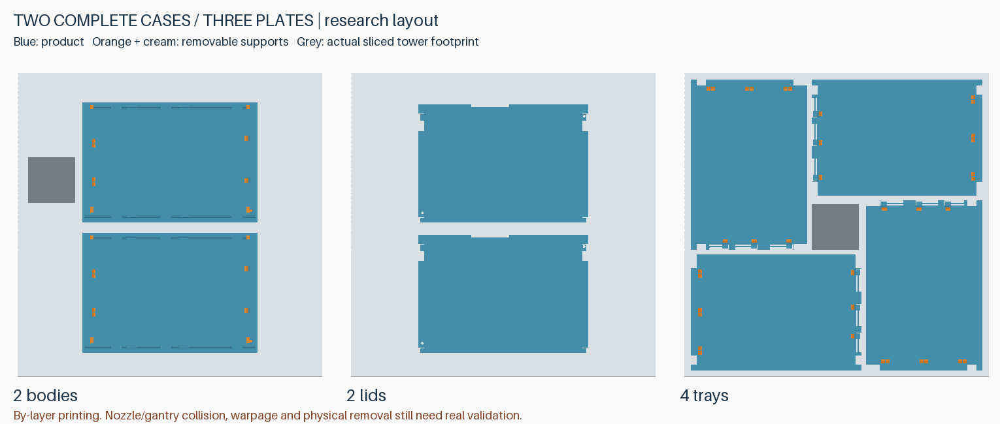

# 完整产品制造优化研究

本轮以 **8 条容量的完整盒子** 为对象：外壳（含底层槽）、盖板、两张活动托盘，共四个成品零件。评价整套打印时间、材料、装配和后处理；试件只用于筛选后的实物复核。本页为研究记录，未生成新的生产版本，已发布 v4.3 和双材料 RC3 试件不变。

## 建议优先采用的方向

1. **选择性使用 Support for PLA**：只在难接近的 DIMM 固定结构和顶盖限位结构内，放置明确建模的专用接触层；易接近的普通支撑仍用 PLA。配合抬高的支撑把手、取消底脚，以及八处拨片下方的 45° 斜撑。
2. **批量时两套分三盘打印**：两外壳、两盖板、四托盘分别集中打印。整套实际切片显示，平均每套比双材料逐套打印少约 33 分钟，专用支撑耗材接近减半。
3. **内部线宽优化作为次级候选**：单独加宽内部填充每套仅省约 6 分钟；与隔层稀疏填充合用可省约 10 分钟。保留候选，但须验证顶面和刚度，不能因切片更快直接升级生产配置。

这里没有一个已证明同时提高所有指标的方案：双材料方案仍比单材料打印慢。它是否值得，取决于实际拆支撑、清理和返工时间能减少多少；这些还没有实测。

## 统一基准与整套结果

环境：Bambu Studio **2.8.2.61**，P2S / 0.4 mm 喷嘴 / 0.20 mm 层高 / Textured PEI，PLA Basic；双材料使用 **Support For PLA（GFS02）**。AMS 实际槽位仍需映射。以下时间是切片估算，材料包含冲刷及擦料塔；不含冷却、换盘和人工清理。

所有本轮几何共用 **3.2 mm 侧面和底部安装孔**，保留孔轴位置和名义深度（侧 5.7 / 底 5.3 mm），并删除活动托盘两处旧角部薄片及底部细条。未扩大 DIMM 槽，不改四件成品的数量、容量或 147 × 101.6 × 26 mm 外包络。

| 完整一套，均为两盘 | 切片时间 | 总耗材 | 其中 Support for PLA | 换料次数 |
|---|---:|---:|---:|---:|
| 单材料公共对照 | 3:09:24 | 125.36 g | 0 | 0 |
| 单材料＋八处拨片斜撑 | 3:08:09 | 125.19 g | 0 | 0 |
| 所有自动支撑界面均用专用料 | 6:06:36 | 192.38 g | 30.42 g | 50 |
| 建模内部接触层，其他自动界面仍用专用料 | 5:20:58 | 173.62 g | 20.92 g | 34 |
| **选择性专用界面（首选材料策略）** | **4:10:29** | **147.19 g** | **7.23 g** | **12** |

八处斜撑在真实完整产品上仅省约 **75 秒**，主要价值是免去八处额外自动支撑的清理。先前四试件盘节省的十几分钟，不能外推到成品。

选择性方案相对“所有自动界面都用专用料”减少约 **1 小时 56 分钟、76% 专用料**。全套共有 28 个可拆 PLA 支撑芯和 64 个明确建模的专用接触体：外壳 10 芯 / 28 接触体，每张托盘 9 芯 / 18 接触体。抬高把手避免底脚形成更多专用接触层；八个拨片斜撑消除其下方的额外自动支撑。

这 64 个接触体在切片中属于模型挤出，逐体分配专用料。其余自动支撑设置为 PLA，顶底 Z 间隙 0.2 mm、界面间距 0.25 mm；没有把内部建模的专用接触体改回 PLA。保留两方向 800 mm³ 冲刷、普通擦料塔，关闭冲刷到成品/填充/支撑。800 mm³ 是沿用的保守试验设置，尚无实际换料污染验证。

## 批量排版：两套三盘



蓝色为成品，橙色及浅色为可拆支撑；灰色小方块为实际 G-code 中擦料塔的铺料包络。

| 打印盘 | 内容 | 切片时间 | PLA | Support for PLA | 换料 |
|---|---|---:|---:|---:|---:|
| 1 | 2 个外壳 | 3:58:59 | 145.48 g | 4.86 g | 8 |
| 2 | 2 个盖板，单材料 | 1:05:45 | 48.50 g | 0 | 0 |
| 3 | 4 张托盘，中层/顶层各 2 | 2:09:29 | 71.21 g | 2.49 g | 4 |
| **两套合计** | **8 个成品零件** | **7:14:13** | **265.19 g** | **7.34 g** | **12** |

平均每套 **3:37:07 / 总计 136.27 g / 专用料 3.67 g**。相对同一选择性方案逐套打印，时间降低约 **13.3%**，专用料降低约 **49.2%**，两套从四次打印减为三次。每套的功能接触体和冲刷设置不变，只分摊换料及擦料塔成本。尚未叠加下面的线宽/隔层填充候选，不能把两组节省直接相加。

四托盘采用 90° 递进旋转排布，模型间距 4 mm，外缘约留 5.5 mm。已检查实际挤出线宽、塔底扩展和支撑路径：中央塔与模型包围盒最小平面间距约 **3.73 mm**，整盘挤出 XY 包络约 5.50–250.50 mm，无切片警告。采用按层打印。

这是名义铺料路径检查，**不是喷头/龙门机构全空间碰撞或热翘曲仿真**。满盘边缘的粘附、长托盘翘曲和不同方向表面差异，应由第一盘完整批量件验证，不能用小试件替代。也未证明这是数学上的全局最少盘数。

## 内部填充与精细程度

以下均使用同一选择性双材料完整两盘，网格和支撑标记完全相同，仅改变表内参数：

| 变动 | 整套时间 | 比 4:10:29 节省 | 总耗材 | 取舍 |
|---|---:|---:|---:|---|
| 填充方向 45° → 0° | 4:05:02 | 5:27 | 147.72 g | 仅约 2.2%，并略增料，不优先 |
| 内部实心线宽 0.42 → 0.50、稀疏线宽 0.45 → 0.50 mm | 4:04:35 | 5:54 | 147.28 g | 温和效率候选，需看顶面与实际挤出 |
| 自动合并稀疏填充层 | 4:05:30 | 4:59 | 146.14 g | 实际出现 0.4 mm 稀疏填充层，需验证支承与刚度 |
| 加宽内部线宽＋合并稀疏填充层 | 4:00:07 | 10:22 | 146.33 g | 数值最佳，仅约 4.1%；保留次级候选 |

这些方案均维持 12 次换料、专用料 7.23 g。逐段解析 G-code 确认顶面仍采用 0.42 mm 线宽及 0.2 mm 层厚，外墙线宽集合未改变；合并的是部分稀疏填充层，内部实心填充仍为 0.2 mm 层厚。内部标称线宽不等于所有窄缝路径均恒定 0.5 mm。

保持外表面参数只能减少变量，不能证明表面质量必然不变：内部支承、热积累与流量变化仍可能影响成品。本轮没有全局提速、削减墙数/顶底层、缩减冲刷量、停用擦料塔或采用实验性稀疏擦料塔。

## 检查覆盖与实物复核筛选

- 完整几何：512 个 DIMM 位姿、242 个装载托盘进入位姿、1,520 个底层拆卸位姿、132 个盖板位姿；单体连通及原有止挡检查通过。
- 完整选择性支撑：28 个支撑芯，水平抽出路径合计 924 个采样位姿；无模型/支撑体积重叠。几何可抽出不代表粘接力小或把手不会断。
- 切片：选择性基准、四个工艺候选和三张批量盘，共 13 盘实际路径审计通过。每套核对 64 个专用接触体、10 个无自动支撑安装孔、8 个卡簧自由活动通道；批量按两套检查。接触覆盖率保留为测量值，局部线缝/倒角不被描述成处处零间隙满接触。
- 总计比较 9 组完整单套方案及 1 组两套批量方案，21 盘实际切片，无警告。单套几何材料策略、内部工艺与批量摊销分别比较。

材料到货后的优先复核只保留 **两类**：① 原尺寸功能接触面＋选择性专用界面＋无底脚把手/拨片斜撑，检查拆除力、残留、装卸和卡簧回弹；② 同一功能截面的内部线宽/隔层填充对照，检查顶面及局部刚度。先验证①；②收益较小，不值得为省十分钟牺牲质量。局部残留让位凹槽暂不扩大应用，先观察专用料是否已经消除主要残留，避免无谓减薄限位结构。

通过局部复核后，再用第一套完整件检查全层装配、盖板操作和成品质量，并用第一盘真实批量排版检查整盘打印行为。**切片和几何审计不能证实界面粘接、材料混合、疲劳、冲击强度、热变形或表面粗糙度。** 后续按完整编号候选发版，禁止把研究文件当独立 hotfix 混入现有发布包。

## 证据与复现

[汇总数据](reports/full-product-study/summary.json) · [完整几何检查](reports/full-product-study/dual-selective-geometry.json) · [逐盘实际刀路审计](reports/full-product-study/toolpath-audits.json) · [批量切片与文件哈希](reports/full-product-study/batch-two-slicing.json)。同目录保留各模式逐盘时间、耗材、特征时间及工程/G-code 哈希，不提交本机配置、原始 G-code 或官方完整预设。

```text
python src/evaluate_full_product.py --geometry-only
python src/evaluate_full_product.py --bambu <Bambu Studio executable>
python src/evaluate_full_process.py --bambu <Bambu Studio executable>
python src/evaluate_product_batch.py --bambu <Bambu Studio executable>
python src/audit_full_product.py
python src/preview_product_batch.py
python src/summarize_full_product.py
```

切片复现需先用仓库既有 v4.3 和 RC3 配置准备脚本建立本机 `build/v4.3-unpainted-projects`、`build/v4.4-rc3-dual-trial-projects`，并安装所列 P2S 耗材预设。几何检查无此本机依赖，已加入 Windows/Linux CI。研究工程全部保存在忽略的 `build/full-product-study`；尚未发布可生产的新版本。
