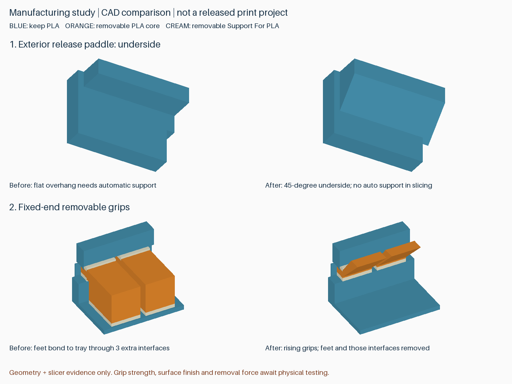

# 打印质量、效率与后处理评估

本轮完成五项独立评估，并用 Bambu Studio 2.8.2.61 对其中两项及其组合实际切片。优先候选是**拨片下方斜撑、取消支撑把手底脚**；局部残留避让作为备选。研究保留在源代码和报告中，未覆盖 v4.3 完整套件、v4.4 RC3 试件或已发布工程。Support for PLA 尚未实物验证，本页不构成新打印版本。

## 1. 拨片下方：从水平悬空改成约 45° 斜面

原结构的外侧按压拨片有水平悬空底面，需要一小柱自动支撑。候选只在拨片下方补材料：最外侧位置、顶部按压面、PCB 锁止齿及 3 mm 基座保持原位；斜面从弹臂长出，不连接固定框架。

完整八处拨片合计增加约 **32.77 mm³** 几何体积。外壳、两层活动托盘的名义装卸、弹臂释放、DIMM 包络及顶盖路径检查通过。斜撑位于自由端附近，仍可能改变局部刚度，不能把通过位姿检查解读成按压力或疲劳不变。

在 A 试件中，切片器不再生成拨片下方自动支撑，且未为此新增支撑屏蔽。专用材料最高打印层由 Z5.4 降至 Z4.8；后处理少了一处需要清理的自动支撑。这比单纯调快支撑打印速度更直接。

## 2. 支撑把手：取消底脚，改成向上伸出的斜把手

原 A 的三个支撑主体各有落到底板的垫脚；每个垫脚又需要一片专用材料隔离层。候选从槽内支撑主体向外上方伸出斜把手，取消底脚，也取消底板上对应的三个接触区。

保留固定端两件、弹簧端一件的拆除数量；没有增加散件。全盘建模界面从 **17 片减为 14 片**，所有剩余界面仍采用原厚度、原材料。修正斜把手与接触薄片的体积重叠后，23 个分件均封闭、单连通，无材料体积重叠；五个支撑主体共 165 个水平抽取位姿通过。

实际刀路中，14 处界面均保留专用材料及上下 PLA 接触，H32 孔内仍没有支撑，专用材料未进入保留零件。另检查把手区域相邻层的名义路径覆盖；这不能预测把手是否会断，尤其根部受槽口限制，仍需实物拆除验证。



上图蓝色保留、橙色及米白色拆除；是实际候选 CAD 渲染，非实拍。第二行展示固定端两件，另一个底脚位于弹簧端。

### 切片对照

同一台 P2S、0.4 mm 喷嘴、0.20 mm 层高、PLA Basic＋Support for PLA。**一组四个试件，不是完整盒子，也不是批量分摊。** 保留擦料塔，两方向冲刷量均为 800 mm³；打印速度、温度、层高和全局支撑参数不变。

| 方案 | 预计时间 | 换料 | PLA（含冲刷/塔） | Support for PLA（含冲刷/塔） |
|---|---:|---:|---:|---:|
| 已发布 RC3 对照 | 1:03:43 | 10 | 16.95 g | 5.91 g |
| 仅拨片斜撑 | 0:58:20 | 8 | 15.82 g | 4.79 g |
| 仅取消把手底脚 | 0:55:18 | 8 | 15.45 g | 4.67 g |
| 两项合并 | **0:49:55** | **6** | **14.32 g** | **3.55 g** |

合并节省约 **13 分 48 秒（21.7%）**、**4.99 g 总耗材（21.8%）**；专用耗材减少约 **39.9%**。四组切片均无警告。收益来自删除不必要的支撑接触与打印层，而非减小冲刷量或降低界面质量。完整盒子各部位高度不同，不能直接套用这一比例。

## 3. DIMM 难放入：局部容纳残留，保留承托面

将此前 B 试件的局部避让扩展到完整八个槽位，单独评估。固定端与活动齿的局部顶面/底面约让开 0.3 mm，两端保留承托区域；不把整个 PCB 槽统一加宽。布尔切除略穿过原表面，避免留下零厚度薄皮。

- 三种完整结构对照（仅斜撑、仅避让、两者组合）分别通过 512 个 DIMM 包络位姿、242 个带 DIMM 托盘放入位姿、1,520 个底层释放位姿和 132 个顶盖位姿，以及现有其他几何检查。
- 在每槽两端的凹区放入模拟残留块：**0.1、0.2、0.3 mm** 块在新结构中均不碰名义就位 PCB；旧结构相同高度残留会干涉。**0.4 mm** 残留再次产生干涉。
- 对照检查也确认：残留若落在保留承托面上，仍会干涉。不能宣称“残留 0.3 mm 都无所谓”。

建议暂列为备选。若双材料能使现有槽面干净脱离，就没有必要主动削减活动齿局部截面；若实物仍有残留卡阻，再采用此方案，并验证保持力。

## 4. 柱顶支撑：剥离方向比把手长度更关键

对 C1/C3 测试一条具体路径：以下方入口边附近为轴，把支撑主体向上转，再考虑抽出。两者在该轴、该方向的 **6° 采样位姿开始与保留件相交**；此前 0–5° 采样不相交。这只排除了这条大幅转动路线，并非证明所有剥离方式都不可行。

现有外露把手下方可容纳所建模的 5×1×1 mm 工具接近空间。但内部粘接强度并未被几何分析覆盖，不能因有入口就保证容易撬出。继续加长把手容易增加弯矩；暂不推荐把“大力向上掰”作为设计拆除方式。

优先保留水平抽出动线、专用界面和 RC3 加宽后的把手。等材料到货，区分是界面没有分离、把手断裂，还是轨道卡住，再决定是否分段剥离。现在进一步缩小接触面积可能反而降低打印中的稳定性。

## 5. 小细节与表面质量：先找实际时间大头

读取完整 v4.3 两盘现有 G-code 及切片报告，总计约 3 小时 10 分 44 秒：

| 特征 | 外壳盘 | 托盘盘 | 判断 |
|---|---:|---:|---|
| Gap infill 小间隙填充 | 52 秒 | 59 秒 | 合计约占总时间 1%；不值得为此大改配合尺寸 |
| Bridge 桥接 | 13 分 07 秒 | 1 分 08 秒 | 外壳盘更值得继续研究结构原因 |
| Internal solid infill 内部实心填充 | 31 分 26 秒 | 7 分 51 秒 | 可挖掘空间较大，但涉及刚度、顶底面质量，不能直接删层 |

外壳盘桥接路径中，Z3.2 层约有 **29.1 m**，为最大的单层桥接路径来源。这个长度来自路径解析，不是该层独立耗时，也不能由总桥接时间按长度精确分摊。先研究这一层为何需要桥接，比全局提高桥接速度更有价值。

已确认无必要的角部 0.4 mm 残片及其底部细条，可沿用先前的完整清除方案：每张活动托盘约去除 16.66 mm³，主要收益是避免断片和清理，不应宣传成显著提速。下一完整版本仍按已选定的 **3.2 mm** 安装孔处理，保留之前孔内禁支撑的独立验证；本轮几何对照没有混入孔径变化。

关于成品精细程度：朝下悬空的外圆角可能增加陡峭悬垂；该处优先考虑斜面。底板长出的内凹过渡则是另一种截面，不应一并删除。打印朝向、接触面、适配间隙应分别处理，这是 [Prusa 设计指南](https://help.prusa3d.com/article/modeling-with-3d-printing-in-mind_164135) 对本项目最有用的原则。本轮没有全局减薄壁厚、减少顶底层、扩大卡槽或提高速度。

## 结论与验证范围

优先纳入下一编号候选：**拨片斜撑＋无底脚支撑把手**。局部残留凹槽保留为备选，C 支撑大角度上掰不采用；角部残片清除、3.2 mm 孔径延续已有结论。

完成的是几何干涉、示意弯曲位姿、材料分配和名义刀路检查，**不是粘接、疲劳、冲击、热变形或表面粗糙度仿真**。实际表面改善、拆除力、把手耐断性及 DIMM 固定力仍需试印。已发布文件不变，本页研究工程不作为生产下载文件。

复现顺序：

```text
python src/evaluate_dfm_geometry.py
python src/evaluate_dfm_slicing.py --bambu <Bambu Studio 可执行文件>
python src/audit_dfm_study.py
python src/preview_dfm_study.py
```

切片研究依赖先用 RC3 工程生成脚本建立本地配置与对照 G-code；审计还读取完整 v4.3 两盘切片结果。官方预设、机器路径及 G-code 不进入公开仓库。证据：[几何](reports/dfm-study/geometry.json)、[切片对比与文件哈希](reports/dfm-study/slicing.json)、[界面与残留检查](reports/dfm-study/audit.json)。
