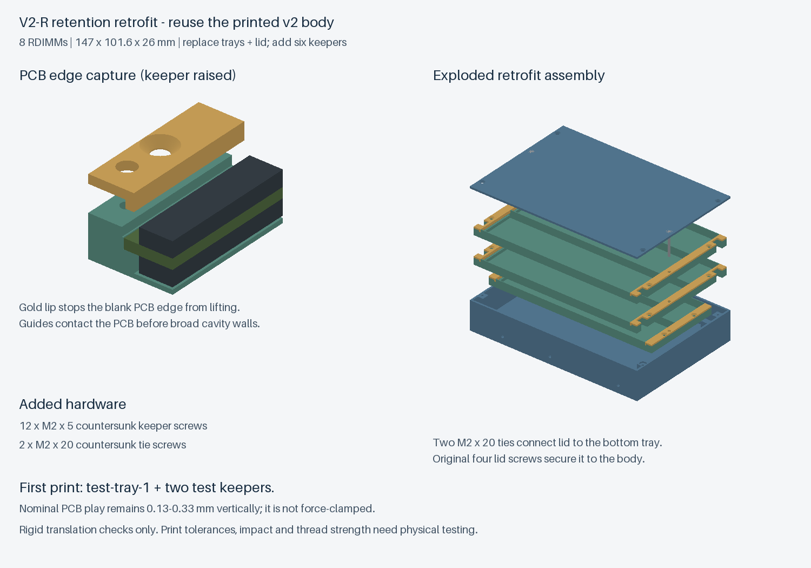
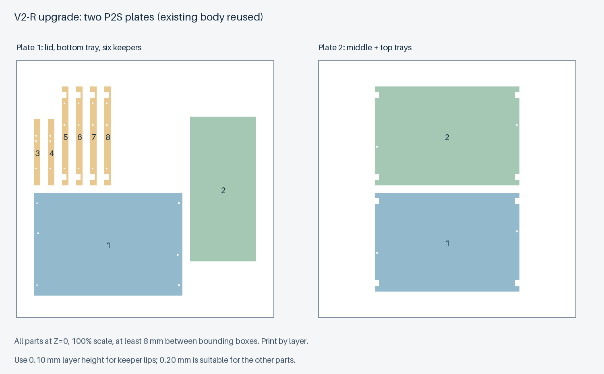

# v2-R：针对携带晃动的固定升级件

用户已打印 v2 两盘文件，反馈整体装配体验良好，但携带时有明显晃动，尚未区分托盘移动和内存移动。本升级分别处理这两处活动空间。

**保留原来的 v2 外壳，换掉全部三层托盘和盖板，再增加六根压条。** 仍为 8 条、147 × 101.6 × 26 mm。普通攻牙外壳和侧面嵌件外壳均做过数字装配检查。不能把本升级件与 v1 外壳或旧 v2 托盘混装。

状态：数字模型与检查完成，**v2-R 本身尚未打印或试装**；不是已经验证的运输容器。原 v2 的晃动反馈不等于本升级已通过实测。

## 固定方式

### 托盘与外壳

新盖板增加两处沉孔，两颗 **M2×20 沉头螺丝**依次穿过盖板、顶层和中层托盘，拧入底层托盘的塑料螺纹。三层的端部承力面相互接触，盖板内侧新增承力垫面。原来的四颗盖板螺丝继续连接盖板与外壳。

力的传递关系为：外壳 → 原盖板螺丝 → 新盖板 → 两颗贯穿螺丝 → 托盘叠层。内存不承担这条夹紧路径的载荷。贯穿螺丝通孔有装配余量，靠正确紧固和承力面接触限制托盘晃动；塑料螺纹强度仍须实际检查。

### 内存与托盘

每层两端各一根可拆压条，压条用短螺丝拧在托盘塑料承力台阶上。压条下伸的边缘挡住 PCB 短边上方，PCB 下方仍由台阶支撑；增加的端部导向则先接触 PCB 边缘，限制横向活动。

**压条是捕获式止挡，不是强压夹具。** 拧紧时压条应落在塑料台阶上，不能以压紧 PCB 作为拧紧标准。基于 PCB 厚度 1.17–1.37 mm，理论上下余量为 0.33–0.13 mm；保留这点余量是为了避免不同 PCB 厚度和打印误差造成硬压。

参考模型中，PCB 向上接触压条时，颗粒距下一层底面仍有 0.20 mm；PCB 向侧面接触短边导向时，颗粒包络距主槽侧壁仍有 0.10 mm。**这些是理想几何值，打印公差可能消耗这些余量**，必须先试小样。目标三星料号两个短边各 2 mm 无元件区仍需实际确认；现有支撑能放下内存，不自动证明新增上止挡也避开所有元件和标签。

## 文件与五金

所有新 STL 在 `models/v2-retention/`。

| 文件 | 数量 | 说明 |
|---|---:|---|
| `tray-bottom-2.stl` | 1 | 底层；含贯穿螺丝的攻牙底孔 |
| `tray-middle-3.stl` | 1 | 中层；贯穿孔 |
| `tray-top-3.stl` | 1 | 顶层；贯穿孔，中/顶层几何可互换 |
| `keeper-2-print-2.stl` | 2 | 底层左右两根压条 |
| `keeper-3-print-4.stl` | 4 | 中/顶层的左右压条 |
| `lid-retention.stl` | 1 | 新盖板，六个螺孔 |
| `test-tray-1.stl` | 先打印 1 | 单槽固定试件，不装入正式盒子 |
| `test-keeper-1-print-2.stl` | 先打印 2 | 单槽试件专用压条 |

新增五金：

- **12 颗 M2×5 沉头螺丝**：每根正式压条两颗。
- **2 颗 M2×20 沉头螺丝**：连接盖板和整叠托盘。
- 原来的四颗盖板 M2 螺丝继续使用；仍需核对头部完全沉入、螺丝不顶底。
- 单槽试件需要四颗 M2×5，试完后可拆下用于正式装配。

设计沉头口径约 4.3 mm、90°锥面；螺丝头型须实物核对。**沉头螺丝标注长度包括头部**。不要改用突出表面的圆头，也不要擅自增加长度；上方下一层托盘需要平整承力面。

新托盘上的攻牙底孔为 1.6 mm：在塑料台阶顶面 Z=5.6 mm 下方，盲孔底位于 Z=1.0 mm，实际深度约 4.6 mm。装配前用适合盲孔的 M2 丝锥加工，限制深度并清理碎屑。几何孔深不等于有效牙深，先空装试拧。M2×5 压条螺丝理论进入托盘约 3.8 mm；M2×20 贯穿螺丝在底层托盘理论有效进入约 3.6 mm。仅用手工具轻轻紧固，未给出经过验证的扭矩。

## 推荐顺序

1. 先打印 `first-test-plate.stl`：已含一个单槽托盘和两根试件压条，总塑料实体体积约 6 cm³。不要直接批量打印。
2. 先空装、攻牙并检查压条能自然落到台阶、螺钉头不突出，再拆开压条放入一条内存。确认导向只接触 PCB 短边可支撑区域，压条下面没有颗粒、焊点或堆叠标签。若不合适，应调整模型间隙，不能靠加大拧紧力强压。
3. 装上试件压条，轻缓改变放置方向，检查 PCB 被止挡保留、颗粒不接触塑料。无需用猛烈摇晃或跌落来验证。通过后再做整套升级。
4. 正式每层先放内存，再安装左右压条。两槽层用短压条，三槽层用长压条；右端压条相对左端绕竖直轴旋转 180°。对齐额外的小贯穿孔和角部避让缺口，不能反向硬装。
5. 按两槽底层、三槽中层、三槽顶层放入原 v2 外壳。新盖板应自然就位，六处孔位对齐。先将两颗长螺丝和原来的四颗盖板螺丝都轻轻带入，再交替轻紧；盖板有明显翘起时先检查堆叠、压条头部和螺丝长度。
6. 先验证整叠托盘不再有明显移动，再分别检查内存的微小装配余量。长螺丝松动、塑料牙滑丝或压条变形都会影响固定，不应把这些状态视作安装完成。

## 打印与两盘排版

- `upgrade-plate-1-lid-bottom-keepers.stl`：新盖板、两槽底托盘、两根短压条、四根长压条，共八个实体。
- `upgrade-plate-2-middle-top.stl`：两个三槽托盘。
- `first-test-plate.stl`：单槽试件及两根试件压条，先打这一盘。

这些都是每盘一个合并 STL，按 100% 比例导入，**逐层打印**，不要翻转、缩放或拆散重排。均以 256×256 mm 热床排版、零件包围盒间距至少 8 mm，现有外壳不再重复打印。

压条已翻成大平面朝下、下伸边缘朝上。由于止挡高度涉及 0.1 mm，**试件盘和升级第一盘建议统一用 0.10 mm 层高**，避免混合零件逐件设置；第二盘可用 0.20 mm。保留文件中盖板已外表面朝下的方向。薄壁及细导向需检查切片路径，不要用整体缩放补偿配合。尚未提供切好的 G-code 或实测工艺参数。

## 检查范围与仍待验证事项

- 八种单件闭合、法线一致、单实体；装配不干涉，最终外形保持 26 mm；两种原 v2 外壳分别校验。
- 参考板长、板宽、PCB 厚度取上下限，在允许平移范围各端点共检查 **512 组整盒内存位置**；单槽试件另检查 **64 组**。
- 对八个槽的六个方向各故意越界 0.05 mm，共 **48 组反向检查**，确认 PCB 确实会碰到物理止挡，而非仅把空间放大后得到“不干涉”。
- 检查新增螺丝之间及螺丝与参考内存的干涉；打印盘检查边界、间距与导出回读。

以上采用刚性几何和平移端点，不模拟打印弹性、倾斜转动、冲击、振动疲劳、塑料螺纹寿命或真实颗粒布局。仍需实物验证，不能承诺“携带绝不会损坏”。尤其不要为了彻底消除声音，把保留的 PCB 装配间隙改成未经验证的硬压紧。

防静电性能仍取决于材料与使用方式，本升级没有改变原项目的 ESD 验证状态。试装反馈请记录 [验证表](validation-retention.md)。
