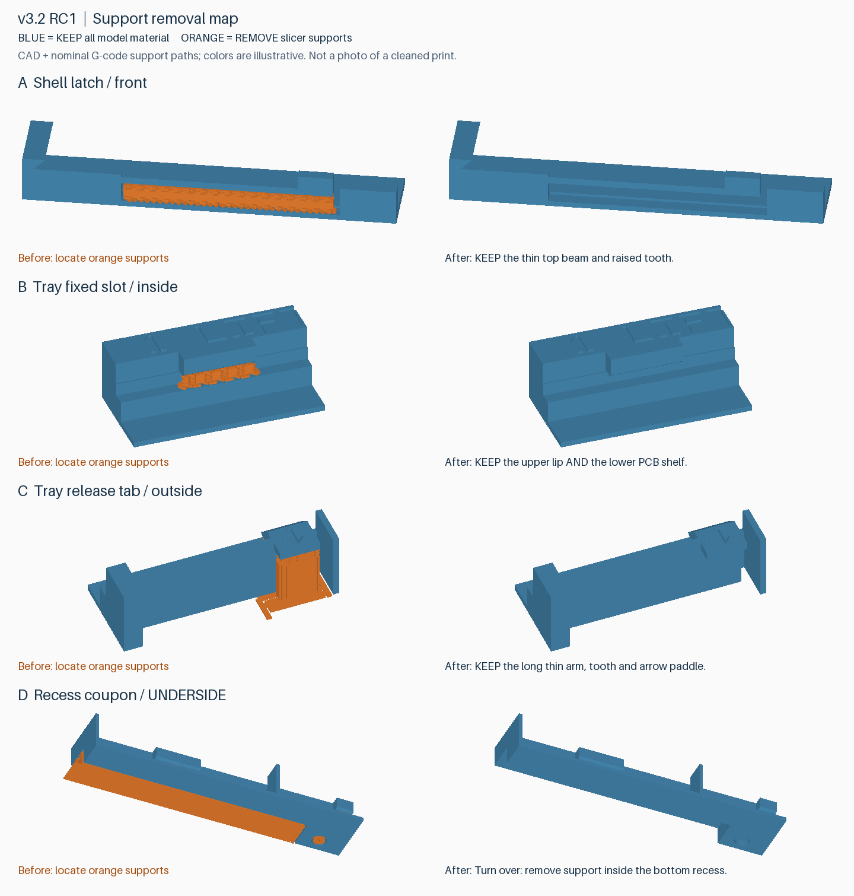

# v3.2-rc1 检查件：支撑识别与清理

下图来自实际 CAD 和交付工程的参考 G-code。**蓝色全部保留，橙色是需要清除的支撑**；颜色仅用于说明，单色实物没有这种颜色区别。左边显示支撑位置，右边显示原始模型形状；右图不是已成功拆除支撑的实拍。

| 图中位置 | 需要拆除 | 必须保留 |
|---|---|---|
| A 外壳锁扣，朝外的一面 | 长弹臂下面、缺口里的波浪状支撑与接触层 | 上方细长弹臂、末端凸起锁齿、两侧固定框架 |
| B 托盘固定槽，朝内存腔的一面 | 突出压边下、窄槽里的支撑 | 上方压边、下方托住 PCB 的台阶；不把台阶削平 |
| C 托盘活动扣，朝外的一面 | 带箭头拨片下面的支撑柱及外伸底脚；内侧挡齿下方另有局部支撑，参照 B 的槽内清理方式 | 细长弹臂、上端挡齿和带箭头拨片；细长条不是支撑 |
| D 窄条凹区试件，翻到背面 | 大凹区里的支撑，包括底脚和接触层 | 原始底面和肋；正面中间薄隔板也是模型，不要折掉 |

窄条试件正面的固定槽下也有局部支撑，按 B 清理。平整小盖板需要保留，它是锁扣试件的配套滑盖。

## 操作

1. 完全冷却后拿在手里或放稳，扶住粗框架；先从 A 外露且边界清楚的支撑处尝试。
2. 用镊子或小尖嘴钳只夹住一小块支撑的外露边缘，轻微来回松动，向开口方向取出。A 向框架外侧，B 向内存腔，D 从底部开口取出。不要把薄弹臂或槽口压边作为撬点，也不要一把扯整排。
3. 主体支撑取下后，对照右图检查残留接触层和缝隙。不要为了表面光滑而继续削模型，也不要把尖锐工具硬塞入尚未确认的缝隙。
4. **夹不住、看不清分界，或支撑带着弹臂一起弯时就停止。** 拍该处正面和侧面近照，记录“清理未完成”，不凭用力程度判定是否能拆。不要用 DIMM 撬开支撑。
5. 只有清理完成后，才轻轻空载拨动卡扣检查回弹。明显变白、裂纹、持续粘连时停止，不装内存。

最新实物反馈：检查件打印顺利，A–D 支撑现已全部拆除。A 容易施力但粘接紧密；B/C 需要技巧和镊子撬；D 最难，尤其小圆点需精密镊子寻找缝隙。后续 A 回弹正常，但盖板因小样缺少下承托而掉落，参见 [RC2 底座修正](v3.2-rc2-latch-check.zh-CN.md)。C 能固定实际 DIMM、装卸无干涉，但固定力偏弱。见 [详细记录](validation-v3.2-rc1.md)；识别和清理简便性、完整套件及运输保持力仍未通过。
