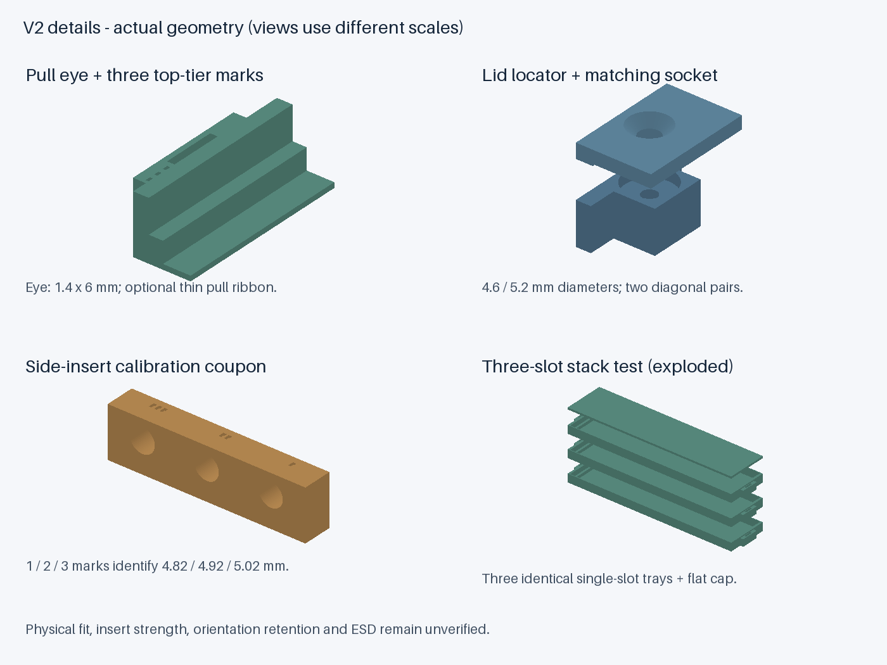

# v2：8 条版装配与试印说明

实打反馈：用户报告 v2 携带时有明显晃动。原文件保留作为已打印基线；可复用外壳的 [v2-R 固定升级件](retention.zh-CN.md) 正在等待试装，尚未验证运输性能。

v2 保持 **147 × 101.6 × 26 mm、2＋3＋3 条、原有硬盘孔位**。这是工程原型，尚未切片、打印或实物验证。请整套使用 v2，**不要混用 v1 的外壳、托盘或盖板**。

## 与 v1 的变化

| 项目 | v1 | v2 |
|---|---:|---:|
| 底座厚度 | 4.4 mm | 4.0 mm |
| 托盘层距 | 6.6 mm | 6.8 mm |
| 托盘底板 | 0.6 mm | 0.6 mm |
| PCB 短边支撑面高度（相对托盘底面） | 2.8 mm | 3.0 mm |
| 理论颗粒下方净空 | 0.10 mm | 0.30 mm |
| 理论颗粒上方至下一托盘净空 | 0.33 mm | 0.33 mm |
| 盖板主体厚度 | 1.8 mm | 1.6 mm |
| 盖板内侧总堆叠余量 | 0.3 mm | 0.2 mm |
| 底部攻牙盲孔深度 | 3.7 mm | 3.3 mm |

三层分别从 Z = 4.0、10.8、17.6 mm 开始；盖板主体从 Z = 24.4 mm 开始，闭合后仍为 26 mm。每槽名义腔体为 134.4 × 31.8 × 6.2 mm。上述颗粒净空基于 5.57 mm 参考最大包络，不包括任意翘曲、额外内衬或防静电袋。

为增加底部颗粒间隙，本版缩薄了底座与盖板；**并非所有方向的公差都增加了**。盖板堆叠余量反而减少 0.1 mm，因此堆叠试印是必须做的装配验证，不可用螺丝把变形托盘强压到位。

两处对角定位环帮助盖板在拧螺丝前就位：环外径 4.6 mm、伸入 0.8 mm；对应孔径 5.2 mm、深 1.2 mm。盖板导出的 STL 包络高度为 2.4 mm（含朝内定位环），不代表整盒增高。

托盘端部增加 1.4 × 6 mm 提拉孔，供细钩或可选的薄提带穿入，减少抓取内存本身的需要。一、二、三道凹刻标识分别对应底、中、顶层；标识均在同一端。可选提带建议宽不超过 4 mm、厚不超过 0.3 mm，先在样件上试穿；折叠段留在端部空隙，避免伸进内存槽、盖板定位孔或螺孔。提带材质和 ESD 性能未验证，模型校验也不包含提带。

## 文件与数量

文件均在 `models/v2/`，单位为毫米，100% 比例打印。

| 文件 | 数量 | 说明 |
|---|---:|---|
| `body-pilot.stl` | 二选一，1 个 | 侧面和底部均为塑料攻牙底孔 |
| `body-side-inserts.stl` | 二选一，1 个 | 六个侧孔用于指定热熔嵌件，四个底孔仍需攻牙 |
| `tray-bottom-2.stl` | 1 | 两槽，单刻线 |
| `tray-middle-3.stl` | 1 | 三槽，双刻线 |
| `tray-top-3.stl` | 1 | 三槽，三刻线 |
| `lid.stl` | 1 | 已翻转为外表面朝下，定位环朝上 |
| `fit-coupon-1-slot-print-3.stl` | 先 1 个，通过后补至 3 个 | 单槽与三层堆叠试装，非正式盒内零件 |
| `stack-coupon-cap.stl` | 1 | 试装盖板；无螺丝、无扣合定位 |
| `side-insert-coupon.stl` | 选择嵌件版时 1 个 | 三种名义孔径试印，非正式盒内零件 |

完整盒子的塑料实体体积约 135 cm³（不含试件、提带、支撑或打印损耗）；以实际切片估算用量。三个单槽试件加试装盖板约 22.3 cm³。单槽仍采用完整 RDIMM 长度，不能缩短后代替长条翘曲检查。

## 安装孔与侧面金属嵌件

孔位与坐标来源见 [v1 设计基准](printing.zh-CN.md#安装孔与五金)，v2 孔位不变。

### 普通攻牙版

`body-pilot.stl`：侧面孔径 2.7 mm、盲孔深 3.7 mm；底部孔径 2.7 mm、盲孔深 **3.3 mm**。都需要适当修孔并加工 **6-32 UNC** 螺纹。底孔背面余厚仅 0.7 mm，须限制钻头和丝锥深度。盲孔丝锥有导入段，几何孔深不等于有效螺纹深度；先在空盒试拧，不可顶底或强拧。

两种外壳的机箱螺钉伸入长度均不得超过 **3.0 mm**，这只是几何上限，实际还要按有效牙深、托架厚度和螺丝端部选择更短长度。6-32 UNC 不能用 M3 代替。轻载塑料螺纹的拆装寿命和扭矩未验证。

### 侧面嵌件版（可选）

仅按 **PEM IUTB-632-150** 的外形设计，需六颗；不要只凭“6-32”字样购买任意长度或直径的嵌件。普通长版 IUTB-632 不能替代本短版。

[PEM 官方产品规格](https://www.pemnet.com/eu/products/product-finder/iutb-632-150/)给出的名义长度为 0.150 in（3.810 mm），公差 ±0.005 in；外径 E 为 0.210 ±0.009 in；安装孔径为 0.189 至 0.192 in（约 4.801 至 4.877 mm），最小孔深为 0.180 in（4.572 mm）。本版侧孔名义直径 **4.82 mm、深度 4.70 mm**，孔柱沿安装轴厚 6 mm。

孔径试件的一、二、三道标记对应 **4.82 / 4.92 / 5.02 mm** 名义直径，用于识别打印缩孔；后两项不是厂家允许的最终孔径。应选能得到上述厂家要求实际孔径的参数，再修改 `INSERT_BORE` 重建外壳；不能因为大孔更容易插入就直接采用。

先完成试件验证，再按嵌件厂商工艺热熔安装，端面与外壳齐平，不得凸出硬盘外形包络。所有嵌件安装与塑料清理完成后才能放入内存。模型只验证最大嵌件包络不撞内存或托盘，未验证 FDM 材料中的抗拔、抗扭或热变形性能；厂商在其他材料中的强度数据不能直接套用。

**底孔暂不采用这款嵌件**：底孔轴线距侧边仅 3.175 mm，以该嵌件最大外径约 5.56 mm 计算，外侧只剩约 0.39 mm 塑料。这是本版放弃底部热熔嵌件的几何原因。它不代表所有金属固定方式都不可行；定制金属支架可在后续另行设计。

### 上盖螺丝

仍使用四颗 M2 沉头螺丝，盖板孔 2.2 mm、最大沉头口径约 4.3 mm，盒体为 1.6 mm 攻牙底孔。可从 M2×8 核对，先试空盒并确认螺丝不顶底、头部完全沉入。两个定位环只用于定位，不是卡扣；四颗盖板螺丝仍需安装。

## 推荐试印顺序

1. **单槽**：先打印一个 `fit-coupon-1-slot-print-3.stl`。确认内存短 PCB 边有可支撑区域，颗粒不顶底，放入和取出自然。目标型号短边 2 mm 无元件区仍是设计假设。
2. **堆叠**：补至三个相同试件，另打印 `stack-coupon-cap.stl`。每层放一条，短边和侧边对齐后叠放，平盖放在最上面；不得靠手压强行贴合。逐层打开检查颗粒、标签和 PCB 没有压痕或卡住。此试件验证同槽三层，不能代替正式 2＋3＋3 排布及盖板总高试装；平盖没有防滑扣，试验时保持水平。
3. **嵌件孔（可选）**：完成孔径与热熔试验，空件上检验螺丝进出和嵌件是否松转。没有嵌件工艺条件时使用普通攻牙版。
4. **整盒**：选一个外壳，打印三层正式托盘和盖板。先空装定位环与螺丝，再装内存；最后在机箱托架上空载检查孔位和净空。

P2S 打印起点：实际 0.4 mm 喷嘴配置，0.20 mm 层高；托盘底部至少三层，外壳四层墙，薄隔片用 Arachne 并检查路径连续。使用对应耗材配置。外壳和托盘底面朝下；盖板保留已导出的外表面朝下方向。侧孔上方需小跨度桥接，定位环和 0.6 mm 隔片要在切片预览中检查；尚未提供已验证的 3MF 打印配置。

## 验证边界及反馈

生成器已检查九个 STL 的闭合网格、单实体、法线一致性；两种外壳的装配与参考内存干涉；最大嵌件包络；3 mm 螺钉侵入；三层试件与内存包络；含盖板定位环的最终 26 mm 外形。

另外对八个参考元件包络分别作 X/Y/Z 各 ±0.2 mm 的八角点偏移检查，共 64 个姿态。它只检验给定误差模型下的颗粒干涉，**不代表打印公差认证，也不模拟任意方向晃动或冲击**。PCB 与支撑台阶接触是有意的，因此该偏移检查不包含 PCB 支撑接触。

v2 改善的是托盘提取、层序和盖板定位；还没有独立的 PCB 锁扣，不能据此声称倒置或运输时颗粒不会接触其他零件。机箱若竖置安装，先在空盒/代用件上验证保持方式，不能把普通松配托盘当作运输包装。独立 PCB 保持结构、ESD 材料/内衬和底部金属固定仍列为后续课题。

普通 PETG/ASA 不是天然的静电耗散材料。本版仍按裸条包络建模，没有额外计入完整防静电袋或泡棉；若采用 ESD 内衬，应先确定厚度和接触位置再重建，不能塞入现有间隙。

试印反馈请记录：提交版本、内存型号、打印机/耗材/喷嘴/层高、使用的外壳版本、孔径样件标号、卡紧或松动位置、堆叠是否自然贴合及照片。真实试装结果记录在 [validation-v2.md](validation-v2.md)，未测项目保持未测。
