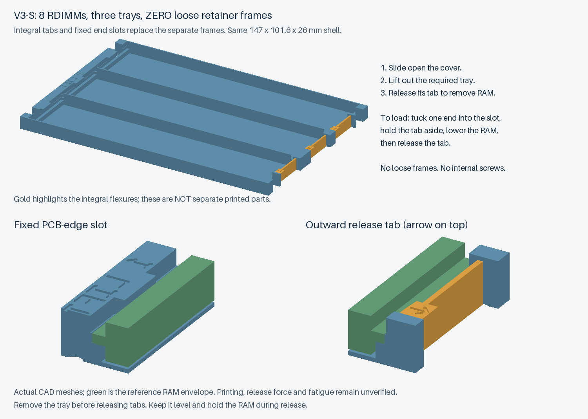
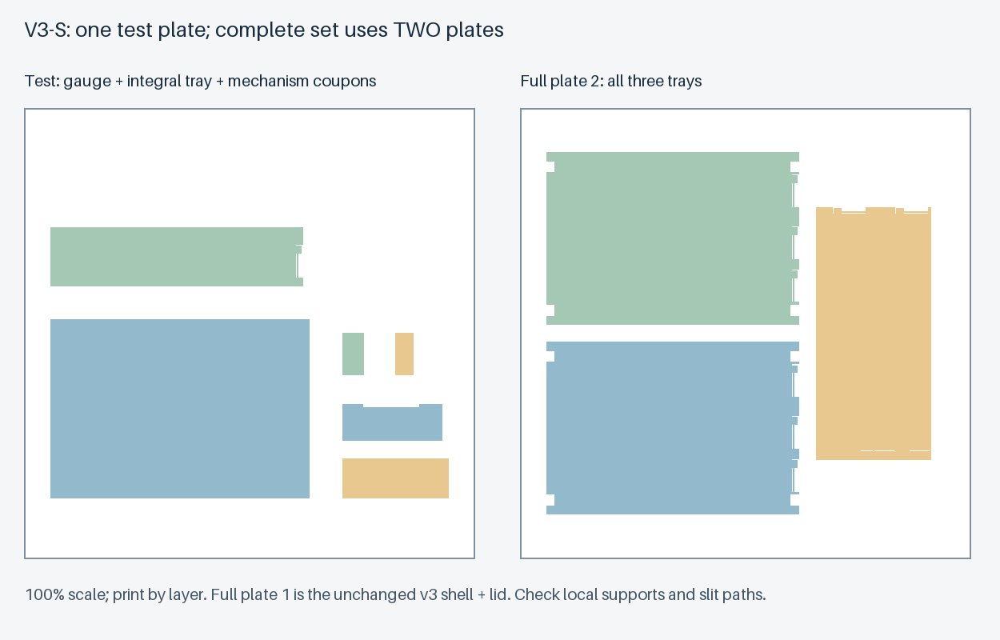

# v3-S：不用独立限位框的一体托盘原型

**本工作名称已正式命名为 [v3.1](v3.1.zh-CN.md)。** 单件几何相同，当前完整实测与批量打印请使用 v3.1 的版本化文件和 Release；本页保留设计背景。

保留 **8 条容量、147 × 101.6 × 26 mm 外形和逐层取放**，把原 v3 的三个托盘、三个限位框改为 **三个一体托盘**。每槽一端是固定 PCB 边缘槽，另一端是连在托盘上的弹性拨扣；没有需要配对、拆下或保管的限位框，也没有必装内部螺丝。

**这是一版待打印验证的替代方案，尚未验证拨扣力度、寿命或实物防脱。** 已检查几何装配与释放路径；不要把这些检查当作运输测试。

## 使用者只需要知道的操作

1. **开盖、拿出托盘。** 按原 v3 盖板上的提示滑开盖板，从固定厚端拿出需要的托盘；下层仍需逐层取出。保持水平，不抓带箭头的活动扣来提托盘。
2. **放内存。** 把一个 PCB 短边送入固定槽，沿箭头向外拨开另一端的小扣，放下内存，再松开拨扣。检查扣已回到 PCB 短边上方。不要靠猛压内存来撑开卡扣。
3. **取内存。** 扶住内存，沿箭头拨开对应扣，稍抬起这一端，再从另一端固定槽抽出。应先拿出托盘再操作，外壳内部不提供充分的拨扣行程。
4. **放回、关盖。** 托盘按 1、2、3 从下往上放回，再滑上盖板。托盘已经带有止挡，**不要额外放入旧限位框**。

装入与取出均只操作目标槽的一枚拨扣；其它槽的拨扣保持闭合。托盘仍应水平拿取，释放时扶住内存，不能在未经实测的情况下靠倒置或甩动来证明卡扣可靠。

## 与原 v3 的关系

| 项目 | 原 v3 | v3-S |
|---|---|---|
| 内部散件 | 3 个托盘 + 3 片框 | 3 个一体托盘 |
| 每槽固定 | 放好内存，再盖上对应框 | 插入固定端、拨扣放下、松扣 |
| 开盖后 | 框可直接脱离，需要水平操作 | 每槽有独立一体止挡，实际防脱仍待验证 |
| 整套排版 | 3 盘 | 2 盘 |
| 首次试件 | 1 盘、7 件 | 1 盘、6 件 |

**原 v3 外壳、滑盖、空壳试配件及滑轨 / 锁扣小样完全保留，文件逐字节复制。** 若这些已经打印，只需先补打 `test-tray-1.stl` 测试新的一体拨扣；通过后补打三张新托盘。不要混用两种内部托盘方案，不要叠加原 v3 的限位框，也不能装入 v2 / v2-R 外壳。

原 v3 的光孔 / 攻牙底孔选择、安装孔深、可选盖板螺丝和固定背板试配要求仍按 [v3 说明](v3.zh-CN.md)。SATA 凹区没有扩大或取得新的实测兼容结论。

## 打印入口

所有新文件位于 **[`models/v3-simple/`](../models/v3-simple/)**，不是原 `models/v3/`。

- **首次打印：[first-test-all.stl](../models/v3-simple/first-test-all.stl)**。空壳、一体单槽托盘、滑轨两件及锁扣两件共 6 件，同一盘一次完成。
- **已打印原 v3 试件：只补打 [test-tray-1.stl](../models/v3-simple/test-tray-1.stl)**。新试件的两端拨扣 / 固定槽截面与正式托盘相同；不同槽的位置为避让外壳柱位而变化。
- **完整第一盘**：`plate-1-body-pin-clearance-lid.stl` 或 `plate-1-body-thread-pilot-lid.stl`，任选一种；与原 v3 第一盘相同。
- **完整第二盘：[plate-2-all-trays.stl](../models/v3-simple/plate-2-all-trays.stl)**：两槽底托盘、三槽中托盘、三槽顶托盘，共三件。

保持 100% 比例、原方向、**按层打印**；不要缩放或选择逐件打印。新试件盘与托盘盘的零件包围盒间距至少 10 mm、床边余量至少 15 mm。外壳第一盘沿用原 v3 的排布。

打印准备仍需操作者处理：

- 托盘底面朝下；0.8 mm 侧向弹臂从热床开始打印，旁边为贯通开槽，不在弹臂下方埋支撑。切片后确认缝隙未粘连，箭头处可向外活动。
- 固定端的短悬挑槽口和活动扣齿仍需检查切片，必要时设置局部可移除支撑，并从内存入口方向清理干净；不能假设这一体结构完全免支撑。不要把支撑塞进弹臂贯通缝。
- 空壳和盖板锁扣底座仍需按原 v3 说明设置悬臂下方局部支撑。
- 先用单槽件确认 PCB 端部无元件、颗粒和标签不受压，空扣可回弹，再试真实内存的轻柔装卸。卡扣不能自然让位、回弹或出现白化 / 裂纹时，停止使用并调整设计，不能通过增大按压内存的力来解决。

## 几何检查与待验证内容

`src/build_simple_trays.py` 读取 v2-R 基准托盘和已生成的 v3 外壳文件。检查包括：

- 四种托盘的 576 组参考内存位置、54 组 PCB 六方向止挡反向检查；满载整盒的所有极端参考位置均不穿入其他零件。
- 弹臂示意向外让位 0–1.5 mm 的 16 个位置；每槽以 2° 小角度抬起释放端、再向外抽出 2 mm，共 3024 个装卸路径位置。反向路径可用于持扣装入；**没有模拟靠内存压迫斜面自动卡入的力学过程**。
- 两种外壳装配、26 mm 外形、十个安装占位圆柱、SATA 凹区、可选盖板螺丝、上层托盘与盖板的叠层捕获、102 个滑盖行程位置。
- 托盘单一闭合实体、STL 导出体积、排版间距和床边余量。四份排版经 Bambu Studio CLI 导入 / 导出回读，实体数量和尺寸保持；**未切片、未打印**。

弹臂长 18 mm、厚 0.8 mm；这些参数和 1.5 mm 示意行程不是实测许可力或寿命。软件只检查示意变形后的空间，不预测应力、断裂、疲劳或长期蠕变。仍使用“每个 PCB 短边有 2 mm 无元件区”的待测假设。侧向 / 转动脱出、跌落、运输和 ESD 均未认证。实测记录放在 [v3-S 验证记录](validation-v3-simple.md)。

重建：`python src/build_simple_trays.py --output-dir models/v3-simple`。可用 `--models` 指定 v2-R 源目录、`--v3-models` 指定 v3 源目录。Bambu 回读脚本使用 `--models models/v3-simple --names first-test-all plate-1-body-pin-clearance-lid plate-1-body-thread-pilot-lid plate-2-all-trays` 选择这版排版。
