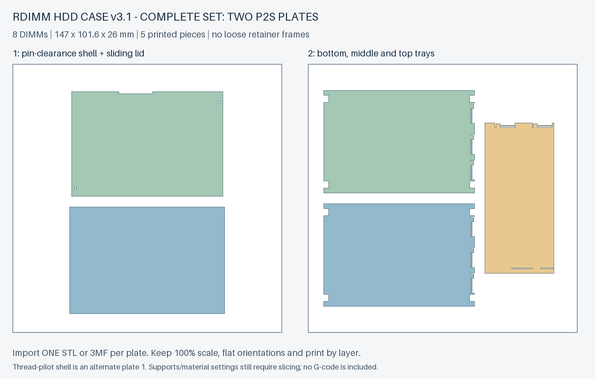
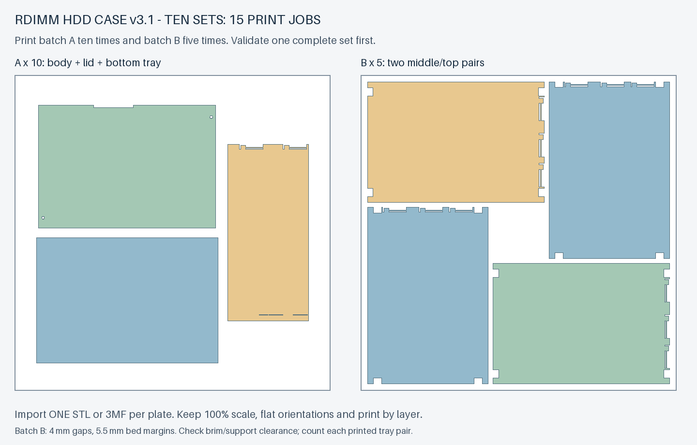

# v3.1：完整两盘实测版

v3-S 一体拨扣方案正式定名为 **v3.1**。这是供实物验证的预发布版本：保留 8 条容量、147 × 101.6 × 26 mm 外形、三层一体托盘、免工具滑盖和固定背板避让。此次版本化不改变单件几何；原 v3 外壳和滑盖可继续使用，内部使用一整套新托盘，不再装独立限位框。

**已知实物问题（2026-09-29）：** 首次外壳打印出现按压锁扣与框架粘连、无法使用；对应切片关闭了支撑，锁扣还存在局部 0.2 mm 活动间隙。当前免工具锁盖方案未通过验证，不建议据此批量制作；加支撑也尚未被实物证明可解决全部问题。详见 [v3.1 实测记录](validation-v3.1.md)。固定发布模型保持不变，修订设计需另发版本。

**打印入口：[v3.1 GitHub Release](https://github.com/helixzz/rdimm-hdd-case/releases/tag/v3.1)**。优先下载 `rdimm-v3.1-complete-pin-clearance.zip`。每盘同时提供 STL 与 3MF，二选一导入，不要把两个格式一起导入而打印重复零件。3MF 仅含已排版几何，不含机器、耗材和支撑预设，也不是 G-code。

## 完整一套：只打印两盘

| 盘 | 文件名，不含扩展名 | 零件 |
|---|---|---|
| 1，默认 | `rdimm-v3.1-plate-1-pin-clearance` | 3.6 mm 托架定位销光孔外壳 + 滑盖 |
| 2 | `rdimm-v3.1-plate-2-all-trays` | 两槽底托盘 + 三槽中托盘 + 三槽顶托盘 |

总计 **5 个零件、8 个内存位，不需要额外试件盘才能组装完整盒子**。试件仍单独保留，便于之后补测。若托架用螺丝固定而非定位销，将第一盘替换为 `rdimm-v3.1-plate-1-thread-pilot`，或下载 `rdimm-v3.1-complete-thread-pilot.zip`；它是需攻 6-32 UNC 牙的 2.7 mm 底孔，不是 M3，也不是可直接拧紧螺丝的光孔。

五件实际平面投影面积合计约 **65,847.84 mm²**，大于 256 × 256 mm 热床的 65,536 mm²。保持当前平放方向、零件不叠印且投影不重叠时，一盘不可能容纳，因而这套 **两盘是该条件下的最少盘数**。计算记录在 `models/v3.1/release-manifest.json`，不是仅用外接矩形相加。

## 首套实测的打印和装配

1. 在 Bambu Studio 选择实际 P2S / 0.4 mm 喷嘴、实际 PLA Basic 或 PLA Pure、实际热床。导入第一盘，保持 **100% 比例、原方向、按层打印**。第二盘同样处理。不要选择逐件打印或整体缩放。
2. **设置并检查支撑。** 外壳锁扣悬臂下方需要局部可移除支撑；托盘固定槽和拨扣齿的短悬挑需检查切片并在需要处设置支撑。不要把支撑塞入弹臂贯通缝，装内存前彻底清理槽口。盖板已外面朝下、托盘已底面朝下。
3. 先在不装 DIMM 的情况下试滑盖、拨扣和托盘叠放，再将正式外壳在实际托架及固定背板上轻推到底。这样无需另外打印空壳试配件，也能先判断插座是否避让；有接触不要强推。
4. 拿出托盘，先试一条 DIMM：PCB 一个短边送入固定槽，沿箭头向外拨开另一端的小扣，放下 DIMM，再松手。确认扣齿回到 PCB 边缘上方，颗粒、标签不受压。依次装满 2+3+3 个位置；不要用内存撑开卡扣。
5. 将底、中、顶托盘按 1、2、3 放回，滑盖锁好，检查外形、开合及是否仍明显晃动，再进行完整盒子插入硬盘槽的验证。盖板螺丝不是必装件；新托盘上方不要再加旧限位框。

取 DIMM 时先拿出对应托盘，保持水平，扶住 DIMM，拨扣、稍抬起释放端，再退出另一端固定槽。外壳内不提供充分拨扣行程。固定槽只按 PCB 短边各 2 mm 无元件区假设设计，仍需用这款三星内存核实。

首套请沿用实际耗材的官方配置并记录层高、壁数、填充、支撑及打印时间。下面的 0.20 mm 配置用于时间对照，**不等于已经验证 0.20 mm 下所有小间隙都合适**；紧配位置需检查，必要时局部减小层高，不能通过强压装配解决。全件统一改为 0.10 mm 会显著增加时间，无需把它作为所有表面的默认值。

## 十套批量：15 次打印任务

首套装配、真实 DIMM 和目标背板验证通过后，可使用 `rdimm-v3.1-batch-10-pin-clearance.zip`：

| 排版 | 每盘内容 | 打印次数 |
|---|---|---|
| `rdimm-v3.1-batch-a-body-lid-bottom` | 1 外壳 + 1 滑盖 + 1 底托盘 | 10 次 |
| `rdimm-v3.1-batch-b-middle-top-2sets` | 2 中托盘 + 2 顶托盘 | 5 次 |

结果恰好是 10 套：外壳、滑盖、底托盘、中托盘、顶托盘各 10 件。相对逐套两盘的 20 次，减少 **5 次换盘和启动**。这是已验证的批量排布，不声称是任意排布下十套的全局最少盘数。

批量 A 保留至少 8 mm 零件间距和床边余量；批量 B 更密，间距至少 4 mm、床边余量至少 5.5 mm。检查支撑和裙边不会越界或连到相邻功能面，不能盲目加大裙边。它仍需按层打印，零件本身与单套版完全相同。

## 速度优化的实际结果

本地 Bambu Studio **02.08.02.61**，P2S 0.4 mm、官方 **PLA Basic**、纹理 PEI 板；0.20 mm 层高、3 圈墙、15% 网格填充、上下各 0.6 mm 壳，普通自动支撑。设置固定后比较排版与填充参数，没有削薄模型、减少墙数或提高耗材流量上限。方法采用 [官方 CLI 切片接口](https://github.com/bambulab/BambuStudio/wiki/Command-Line-Usage)。

| 项目 | 基线预计 | 填充优化候选预计 |
|---|---:|---:|
| 单套第 1 盘 | 124.1 分钟 | 119.5 分钟 |
| 单套第 2 盘 | 82.5 分钟 | 79.7 分钟 |
| 单套合计 | 206.5 分钟 | 199.2 分钟 |
| 十套逐套打印，20 次任务 | 34 小时 25 分 | 33 小时 12 分 |
| 十套批量排版，15 次任务 | 33 小时 47 分 | 32 小时 28 分 |

候选仅开启“合并填充”，并将内部实心填充线宽与稀疏填充线宽改为 **0.50 mm**；其余同基线，外墙、顶面线宽、层高和墙数不改。对应可导入的候选工艺文件为 `profiles/v3.1-infill-candidate.json`，先与实际耗材配置一起验证，不是已批准的批量质量配置。

结论是 **当前这套几何的小幅参数优化约节省单套 7.4 分钟（3.6%）**；叠加批量排版，十套的估计机器时间最多比逐套基线少约 1 小时 58 分（5.7%）。主要额外收益是少换 5 次盘。不能把少 25% 的任务说成少 25% 的机器时间，也不能承诺将两小时的外壳盘减半。

这些是切片估计，包括切片器估算的准备时间，**不包括人工换盘、冷却取件或排队**。未实际计时，自动支撑的可清理性也未逐条实物验证。PLA Pure 必须选自己的官方耗材配置，不能直接套用 PLA Basic 的时间或温度。候选的强度、尺寸与表面质量尚未实测；更大的提速需要另行验证结构或喷嘴变化，不在这个固定版本中悄悄削弱卡扣、安装柱或 PCB 支撑。

## 版本与反馈

- `VERSION` = `3.1`，Git 标签 `v3.1` 和 Release 固定本次源代码与下载件。发布后不覆盖同名文件；模型或功能参数变化必须使用新版本号。
- `v3.0` 标签记录独立限位框方案；`v3-S` 是本版之前的工作名称，历史文件保留。详细兼容表见 [版本管理](versions.zh-CN.md)。
- `release-manifest.json` 记录每盘零件、STL / 3MF 的 SHA-256、盘数依据；下载包另含自身文件校验清单。文件名带版本号；实体上的操作字样保持原样，请在实测记录中标明打印的包名与版本。
- 参考切片结果：`slicing-benchmark.json`；STL / 3MF 导入回读：`bambu-import-stl.json`、`bambu-import-3mf.json`。这些不能替代实物质量结论。
- 用 [v3.1 实测表](validation-v3.1.md) 记录首套结果。尤其记录 DIMM 实际装卸、盖板手感、背板插到底、托架锁定以及外壳是否有晃动。

重建：`python src/build_v3_1.py --output-dir models/v3.1`。原 v3-S 单件几何保留，新增明确版本的整盘 STL / 几何 3MF、最少盘数证明、批量排版和发布清单。发布包不包含可直接发送打印机的 G-code。
