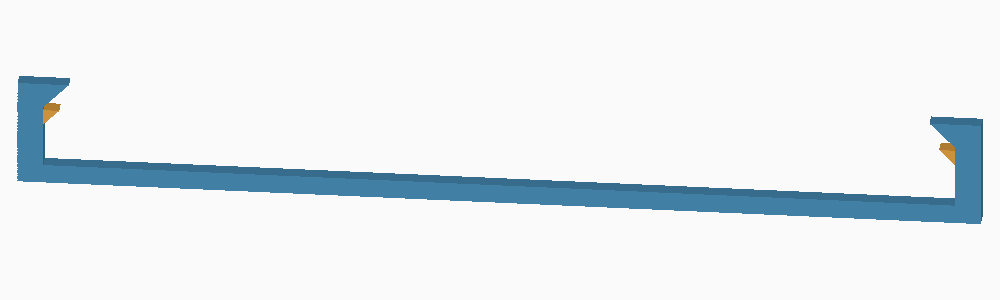

# v3.2-rc2：仅修正 A 锁扣检查件

**这是 A 试件底座的局部修订，不是完整收纳盒的新发行版。** 外壳、盖板和托盘仍保留 v3.2-rc1 几何；旧版本文件不覆盖。只需重打一个底座，继续使用现有的 RC1 小盖板，不必再打 B/C/D。

## 实测问题与原因

用户确认 RC1 A 弹臂回弹正常，但盖板推入后向下掉落。旧小样的两侧只有上压边，侧壁内侧没有下承托；前沿虽有支点，后部仍可以倾斜下落。原来的平移和上掀检查不足以覆盖此失效。

用原始 CAD 复现：绕前沿支点使盖板后部向下倾斜 0.5–5°，旧小样均无阻挡。完整外壳另有端部安装柱作为承托，同样路径在 0.1° 时已出现接触，因此不能把小样失效直接认定为完整盒子也会掉盖。但完整外壳尚未因此获得实物通过结论。

## 修改及验证

下图是底座横截面，金色为新增的永久承托（不是支撑耗材），蓝色为原结构：



- 小样两侧增加连续下承托，顶面位于原装配坐标 Z=24.2 mm；原小盖板底面 Z=24.4 mm，保留 0.2 mm 名义余量。
- 承托底面为 45° 斜面，与侧壁连为一体。外形仍为 60 × 22.6 × 6.8 mm。
- 原锁扣、按压行程和小盖板不改。B/C 的弱固定力与 D 的清理困难本轮不修改。
- 旧小样的倾斜失效作为反向检查保留；新小样在同一方向 1° 倾斜时已被承托阻挡。0.5° 内仍可能有设计间隙，不宣称完全无晃动。
- 检查了另外三个倾斜方向、平移限位、26 个锁扣示意释放位置、93 个滑盖滑出位置，以及闭合网格和 Bambu 工程回读。
- Bambu Studio 02.08.02.61 重切最终工程，无警告；新增承托上方的滑动槽未发现支撑挤出侵入。锁扣下仍有必要支撑，名义顶部间隔约 0.20 mm；其拆除难度不保证优于 RC1。

这些是几何和切片检查，修正底座尚未实物打印。弹性、磨损、持续受力、跌落和运输固定力都不由这些检查验证。

## 文件与打印

- 完整本地工程：`rdimm-3.2-rc2-plate-A-base-only-P2S-PLA-Basic.3mf`，位于构建目录 `build/v3.2-rc2-latch-check-project`。
- 仓库几何：[`models/v3.2-rc2-latch-check`](../models/v3.2-rc2-latch-check)，普通 STL/3MF 不包含打印参数。
- P2S / 0.4 mm / PLA Basic / 0.20 mm，沿用 RC1 支撑工艺。以工程方式打开带设置的 3MF；预计 **13 分钟 / 3.54 g**，不含手工清理。PLA Pure 须按实际耗材重新切片。
- 拆除底座锁扣下方支撑后，原小盖板按既有方向滑入。新加的两条下承托属于永久结构，不能拆除。
- 检查盖板是否保持在导轨高度，轻压后部是否仍掉落，锁扣是否阻止滑出，以及按下锁扣后能否正常滑出。不要强压弯曲盖板测试破坏载荷。

可暂存这个修订工程，等后续改动一起验证，不要求立即再开一盘。原 RC1 的单槽 DIMM 配合实测仍保留；它不构成三层或运输验证。

## 重建

```powershell
python src/build_latch_check_rc2.py --output-dir models/v3.2-rc2-latch-check
# 先按 RC1 构建流程生成本地公开官方预设，再执行：
python src/prepare_latch_check_rc2.py --bambu "C:/Program Files/Bambu Studio/bambu-studio.exe"
```

[几何验证报告](../models/v3.2-rc2-latch-check/verification.json) · [工程校验值及切片摘要](reports/v3.2-rc2-latch-check-slicing.json)。完整官方预设和 G-code 保留在本地构建目录，不提交仓库。未创建新 Release 或移动旧标签。
