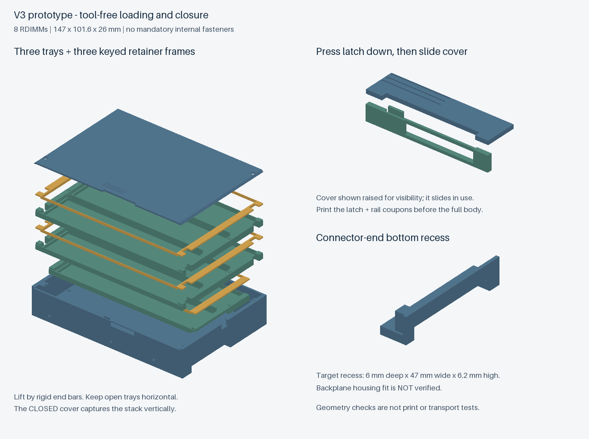
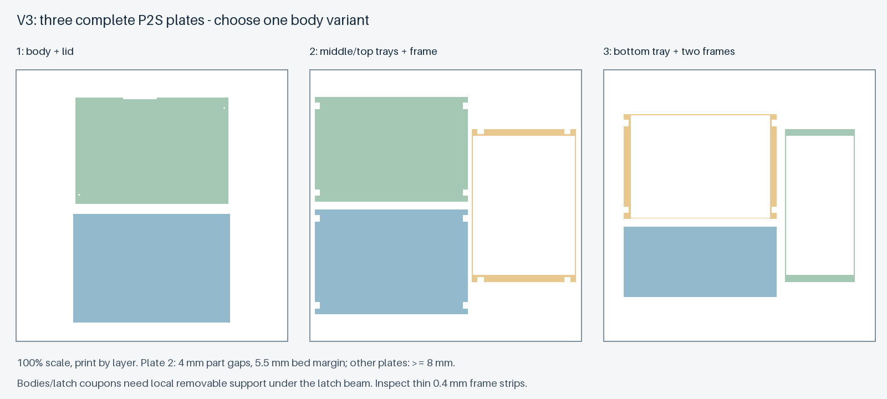

# v3：免工具取放、滑盖与固定背板避让原型

**本版为新的可打印工程原型，未实测；需要重打整套，不能混用 v2 / v2-R 零件。** 已知的实物反馈只来自旧 v2：能装配，但携带时有明显晃动。v3 是否改善晃动、能否插入目标背板、锁扣是否耐用，均须试装。

本版满足的设计目标：147 × 101.6 × 26 mm，8 条裸 DDR5 RDIMM；日常开盖、取放内存、拆装托盘均不需要螺丝刀，也没有必装的内部螺丝。外盖的两颗加固螺丝完全可选。

## 与 v2-R 的区别

| 项目 | v3 处理方式 |
|---|---|
| 外形与容量 | 147 × 101.6 × 26 mm；2+3+3 条。CAD 高度不超过 26 mm，打印成品仍须实测 |
| 侧面 / 底部孔深 | 5.7 / 5.3 mm；分别比 v2 的 3.7 / 3.3 mm 增加 2 mm |
| 安装孔容纳深度 | 以直径 3.6 mm、伸入 5.0 mm 的十个占位圆柱检查，不侵入内存和托盘 |
| 日常盖板固定 | 两端斜面滑轨捕获盖板，后挡边与按压防退扣限制滑动；默认不用螺丝 |
| 内部固定 | 三层托盘 + 三片一体限位框；定位柱限制框的横向移动，上一层托盘和闭合盖板限制抬起 |
| SATA 端 | 底部增加插座避让凹区，底层托盘作相应避让，不打印仿插头 |
| 内存接触 | 仍仅设计 PCB 短边止挡；颗粒不应作为夹紧承力面 |

**盖子锁好才形成倒置防脱结构。** 限位框是可直接提起的零件，不是自锁卡匣。开盖及取出的单层托盘应保持水平；不要把它当作独立封闭的内存盒倒置。这个选择取消了所有内部紧固件，同时便于徒手逐层取放。

限位框把原来两根压条用细连接筋连成一件，减少散件。连接筋宽 0.4 mm、高 2.4 mm，只用于保持两端相连，**不能用来提起装有内存的托盘**。拿取框和托盘时抓两端较厚的部分。若连接筋不能完整成形、翘曲或断裂，不算试装通过。

## 先打印这三种试件

所有文件在 [`models/v3/`](../models/v3)。先验证下面的小样和空壳，再打印完整三盘。

1. **`first-test-lid-mechanism.stl`**：一组滑轨小样和一组真实尺寸弹性锁扣小样，共四件。测试滑入、锁住、按下解锁、反复开合是否自然。锁扣试件下方要清理局部支撑；不能靠暴力折弯松配合。
2. **`first-test-retainer.stl`**：单槽托盘和一片限位框，共两件；不需要五金。确认框自然落在塑料承力台阶上、定位柱可以徒手装拆、PCB 短边和标签确实避开止挡。框未被下一层或盖板捕获，试件不能倒置测试防脱。
3. **`empty-fit-gauge-pin.stl`**：保留完整长宽高、安装孔、滑轨和接口凹区的镂空空壳。先不装内存，在实际托架和固定背板上轻推试配，验证十个孔的位置、定位销是否到底、插座是否避让、托架是否完全锁上。不要强推；有接触即停止。这个镂空件不能作为正式储存盒。

空壳本身的轨道与锁扣最高点已到 26 mm；需要同时验证盖板时，再打印 `lid-slide.stl` 装上。空壳使用 3.6 mm 光孔，不能由此推断攻牙版也适合相同的光滑定位销。

## 两种外壳：选择一种

| 外壳 | 孔径 / 用途 | 限制 |
|---|---|---|
| `body-pin-clearance.stl` | 十个 3.6 mm 光孔，优先用于免工具托架定位销试配 | 无螺纹，不能靠普通 6-32 螺丝在光孔里拧紧；定位销直径、形状并不通用 |
| `body-thread-pilot.stl` | 十个 2.7 mm 攻牙底孔，供 6-32 UNC 安装螺丝 | 打印后需修孔 / 攻牙；没有预先成形的螺纹。不是 M3，也不是 v2 的 PEM 嵌件版 |

两者侧孔盲深 5.7 mm，底孔盲深 5.3 mm；局部加强柱保留孔底材料，不整体增厚底板。**本收纳盒暂按实际伸入不超过 5.0 mm 使用**，仍需核对实物孔深和定位销长度。该数值是本原型的设计值，不能套用到真实硬盘。

深孔解决的是伸入空间；孔径、销肩、托架夹紧行程与打印尺寸也会影响适配。因此加深 2 mm 不等于已兼容所有免工具托架。不要为了配合孔位缩放整个模型。

孔中心保持传统位置：侧面 X=28.4988 / 70.104 / 130.0988，Z=6.35；底面 X=41.275 / 85.725，Y=3.175 / 98.425 mm。坐标 X=0 为连接器端，Y 沿宽度，Z=0 为底面。

## SATA / 固定背板避让

目前凹区的盒体坐标为：

- X=0–6.0 mm，从连接器端向内进入；
- Y=11.0–58.0 mm，宽 47.0 mm；
- Z=0–6.2 mm，底部和端面开放；其上方有 0.8 mm 塑料隔壁。

位置核对参考 [SFF-8323 Rev 1.6，图 3-1 / 3-2](https://members.snia.org/document/dl/25864) 的串行接口定位、两端和上下 keepout，以及 [Seagate Desktop HDD 手册](https://www.seagate.com/content/dam/seagate/migrated-assets/www-content/product-content/barracuda-fam/desktop-hdd/barracuda-7200-14/en-us/docs/100686584aa.pdf) 的传统安装图。SFF-8323 说明的是 SAS 接口位置及其与 SATA 背板接纳位置的关系；**不能把本凹区数值说成适用于所有 SATA 插座的标准净空尺寸**。

这是以标准定位为依据选取的首轮试配包络，尚无目标背板插座外壳的实测尺寸。插座塑料壳、导向柱及托架止挡可能需要更大空间。凹区内已经检查不含打印件和可选螺丝；但“数字模型不干涉该矩形”不等于“实际背板一定能插到底”。应先用空壳验证，必要时调整凹区和底层托盘，而不是削掉内存支撑或强插背板。

## 无工具装配和取放

1. 去除打印支撑和毛刺，先空装滑盖。按下长侧面前缘的小锁扣，再沿短边方向滑入；到达另一侧挡边后释放锁扣，检查不能直接反向滑脱。滑盖沿 Y 方向打开，完全移除需要约 102 mm 侧向空间；通常先把盒子从硬盘位取出。
2. 将两槽底托盘放入外壳，对准底部两处定位柱。放入两条内存后，再放上两槽限位框，两个定位孔对准托盘定位柱。框应落在塑料台阶上，不能压住颗粒或标签鼓包。
3. 依次放入中层三槽托盘、内存、三槽框，再放顶层托盘、内存、三槽框。两个三槽框几何相同，可以互换。每层板的两个短边上方都应有框的止挡唇边。
4. 按住锁扣推入滑盖，确认滑轨充分咬合、防退扣复位。盖板通过框和托盘的塑料承力面限制整叠抬起，不靠压紧 PCB。盖板不能自然闭合时，检查框方向、定位柱、翘曲和支撑残留，不要强压。
5. 开盖时保持盒子水平，按扣、滑开；通过外壳两端的指甲缺口提起顶部框，取放内存，再逐层操作。不要提细连接筋，也不要倒置敞开的盒子。

理论 PCB 上下余量仍为 0.13–0.33 mm（PCB 厚度参考 1.17–1.37 mm）；定位柱直径 2.4 mm、孔径 2.6 mm，存在明确的装配余量。滑轨和叠层也保留间隙。本版目标是限制明显移动与脱出，不承诺绝对无声、零位移或运输认证。所有接触短边仍基于“两个短边各有 2 mm 无元件区”的未验证假设。

### 完全可选的盖板加固螺丝

默认不装。需要长期固定时，可在两个外盖孔使用 **2 颗 M2×8、90°沉头、头径不超过 4.0 mm** 的螺丝；对应外壳孔需提前攻牙。它们只加固外盖，内部没有螺丝。装上后开盖就需要工具，因此日常无工具用途应留空。不要把旧 v2-R 的 M2×20 长螺丝或其他五金移植到本版。

## 完整打印：三盘

| 盘 | 文件 | 内容 |
|---|---|---|
| 1，任选一种 | `plate-1-body-pin-clearance-lid.stl` 或 `plate-1-body-thread-pilot-lid.stl` | 外壳 + 滑盖 |
| 2 | `plate-2-middle-top.stl` | 中、顶托盘 + 一片三槽框 |
| 3 | `plate-3-bottom-frames.stl` | 底托盘 + 两槽框 + 另一片三槽框 |

每盘一个合并 STL，单位 mm，100% 比例，逐层打印。保留方向：托盘底面朝下，盖板外面朝下，框的平整顶面朝下、止挡唇朝上。每份单件也独立提供，方便补打。

- 以 P2S / 0.4 mm 喷嘴配置切片。首轮建议统一 0.10 mm 层高，因为框、定位柱和滑轨配合涉及 0.1 mm 级尺寸；这不是已经验证的打印参数。
- **外壳、空壳试配件、锁扣小样需要锁扣悬臂下方的局部可移除支撑**。它是一段水平悬臂，不能直接假设无需支撑。支撑位于模型原始坐标 X=47–77、Y=0–1.8、Z≈20–23 mm；小样打印归零后坐标不同。只在该空腔内标记支撑，并允许支撑从模型表面生成；打印后从外侧开口彻底清理。
- 限位框的两条 0.4 mm 连接筋必须有连续切片路径。使用可保留细壁的墙生成设置并检查预览；不能因为软件隐藏薄壁就继续批量打印。连接筋不承载内存重量。
- 第二盘最小包围盒间距为 4 mm、床边余量 5.5 mm；其余完整盘至少 8 mm。第二盘不要使用会相互重叠的大裙边；切片时同时检查设备禁区和实际耗材设置。
- 文件是几何排版，没有预切 G-code，也未把未验证的耗材、速度和支撑参数伪装成可直接发送打印机的配置。

## 斜插容量对照

做了可复算的简化扫描，角度以“平放”为 0°。采用板高 31.4、厚度 5.57 mm、相邻板法向净间隙 0.6 mm，所有板同角度、同底部高度、单排平行排列；宽度暂按整个 98.4 mm 内腔计算，甚至还未扣除导向和安装柱。

高度 = 31.4 sinθ + 5.57 cosθ；宽度投影 = 31.4 cosθ + 5.57 sinθ；该单排方案的横向节距 = (5.57 + 0.6) / sinθ。

| 可用净高 | 扫描中最高可用角度（约） | 该方案最多数量 |
|---|---:|---:|
| 20.4 mm（现有底板 / 盖板预算） | 29.71° | 6 |
| 22.4 mm（假设进一步薄底，未设计该外壳） | 34.56° | 7 |

因此本轮保留 8 条叠放。这个计算**不是所有斜插、错层、交错方向排布的数学最大容量证明**；它只说明直观的“单排平行斜插很多条”在当前保守厚度下没有优势。结果存于 `verification.json`，生成脚本扫描步长 0.01°。

## 检查和待验证项

生成脚本检查单件闭合网格、实体连接、装配尺寸、两种外壳干涉、512 组参考内存平移端点、2048 组框横向间隙包络、48 组 PCB 六方向止挡反向检查、64 组单槽试件位置、十个 5 mm 安装占位柱、接口凹区，以及盖板锁止和按下后的 102 个滑出位置。所有必需固定检查均不依赖可选盖板螺丝。

两种第一盘、第二 / 三盘、两套先行小样盘和空壳试配件还通过了 Bambu Studio CLI 导入 / 导出回读检查：边界、实体数量、闭合性和体积均保持。记录及输入 SHA-256 位于 `models/v3/bambu-import-check.json`；用 `src/check_bambu_v3.py --bambu <已安装程序路径>` 可复跑。这是导入兼容性检查，**没有切片，也没有验证支撑和细筋的实际打印路径**。

这些是理想刚体几何检查。锁扣弯曲仅使用示意变形检查让位，**不是弹性有限元、手感或疲劳寿命预测**；定位柱强度、框翘曲、叠层实际间隙、内存倾斜转动、振动、跌落、准确三星元件布局和背板兼容仍未验证。普通打印材料的 ESD 性能也没有因此改变。

实测反馈记录在 [v3 验证表](validation-v3.md)。源文件是 [`src/build_v3.py`](../src/build_v3.py)，读取未修改的 v2-R 网格；默认输出到忽略的 `build/v3`，不会覆盖已打印版本。
