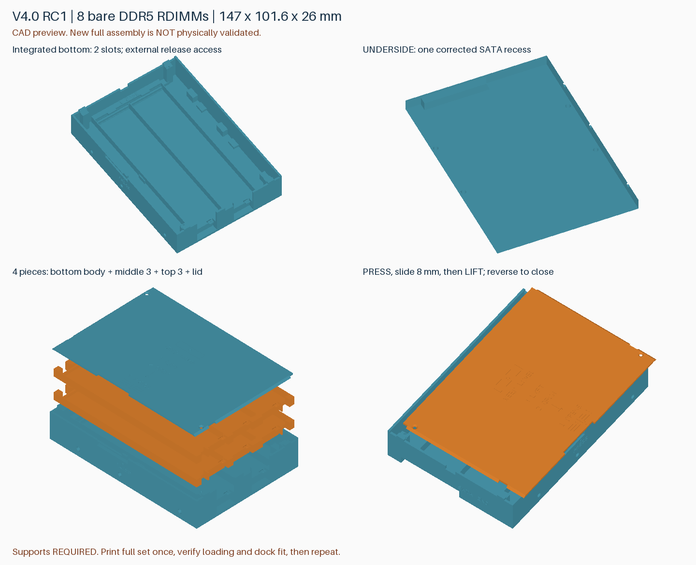
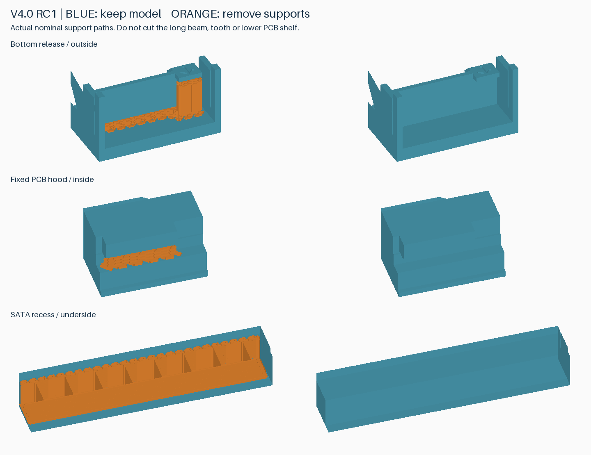

# v4.0-rc1：底层一体化与连接器方向修正

容量 8 条：底部 2 条固定在外壳中，上面两个可取出的三槽托盘。共 4 件，147 × 101.6 × 26 mm，保持传统硬盘安装孔坐标。日常操作免螺丝。**完整新版尚未打印验证**，先完成一套装配与硬盘座测试，再追加数量。

## SATA 单侧修正

旧壳在 USB 硬盘座实测时，避让区与插座处于相反侧。重新核对 [SFF-8323 Rev 1.6，表 3-1、图 3-1](https://members.snia.org/document/dl/25864)：端视图在底面基准上方显示连接器，底面图标有底部安装孔基准；不能把该图直接当成盖面朝上的顶视图。

项目坐标 X=0 是连接器端，Z=0 是底面。**盖面朝上、连接器端在远处时，新避让区位于右侧**。旧 Y=11–58 沿宽度映射为 `101.6−58` 至 `101.6−11`，即 **43.6–90.6 mm**。X=0–6、Z=0–6.2、宽度 47 mm 不变；没有扩大为双侧开口。安装孔坐标不镜像。

SFF-8323 定义 SAS 串行接口定位并说明与 SATA 背板接纳位置的关系；6 × 47 × 6.2 mm 是项目避让包络，不能称为标准保证的通用插座净空。上方隔壁 0.8 mm，底层 PCB 仍在 Z=7 mm。插座塑料外壳、导向结构与插入止挡需用空壳实测。

## 操作

1. 开盖：按 `PRESS`，沿 `OPEN` 箭头滑约 **8 mm**，四处缺口对齐后抬起。关闭反向操作，确认锁扣回弹。新盖板与新外壳成套使用。
2. 上层：直接竖直提起/放入托盘，不掰外壳。先取出托盘，再解锁 DIMM。
3. 底层：`1 BASE` 不可提起。取走上层，从**远离 SATA 的短端窗口**向外拨扣，抬起 DIMM 活动端，向活动端略移，使另一端退出固定唇边，再提起。

底层弹臂与壳底隔离，整个弹臂长度向外开放，便于接近支撑。它仍需支撑清理。此前 C 试件保持力偏弱，本版没有直接加硬卡扣；运输保持力未证实。上层最不利参考颗粒间隙仍仅约 0.1 mm；不支持马甲条或更厚模块。

## 两盘打印

仓库 3MF **只有几何，不含打印配置**。本地交付的 `*-P2S-PLA-Basic.3mf` 才含打印机、材料和支撑参数。完整厂商预设与 G-code 不公开提交。

| 盘 | 仓库几何文件 | 内容 | 参考时间 | 耗材 |
|---|---|---|---|---|
| 1 | [pin-clearance.3mf](../models/v4.0-rc1/rdimm-4.0-rc1-plate-1-pin-clearance.3mf) | 外壳＋新盖板 | 2 小时 7 分 11 秒 | 90.11 g |
| 2 | [upper-trays.3mf](../models/v4.0-rc1/rdimm-4.0-rc1-plate-2-upper-trays.3mf) | 中层＋顶层 | 1 小时 1 分 38 秒 | 34.71 g |

合计 **3 小时 8 分 49 秒、124.83 g**。平放、盘边至少 10 mm、零件包围盒间距至少 8 mm。这是保守排版，未证明任意排版下四件必需两盘；没有额外必打的试件盘。

参考：Bambu Studio 02.08.02.61、P2S、0.4 mm、PLA Basic、0.20 mm、纹理 PEI、标准速度、按层打印。2 墙、15% Grid、底 3 层、顶 5 层；普通 snug 自动支撑、允许在模型上生成，顶/底 Z 间距 0.20 mm、XY 0.35 mm。[覆盖参数](reports/v4.0-rc1-process-overrides.json)。不关闭支撑、不缩放模型。PLA Pure 未独立切片计时。

第一盘有 `thread-pilot` 几何替代件用于 6-32 攻牙底孔，不与光孔版本一起打印。当前切片报告和即用本地工程仅针对 **pin-clearance 光孔版**；光孔适合托架定位销，不能靠普通螺丝直接拧紧。

## 清理与首套验证

蓝色保留，橙色拆除，图由 CAD 和实际支撑刀路生成。底层窗口清除弹臂**下方**和拨片下的支撑，保留长臂、齿头和 PCB 下承托。SATA 凹槽支撑从底面/端面取出。上托盘按此前 B/C 试件方式清理，仍可能需要镊子。

先清理空壳并测试硬盘座能否无强压插到底，然后测试新盖板支承、短滑、抬起和锁定。接着装底层两条，确认拨片可操作、不压 PCB/颗粒；最后放入装满的上托盘，盖板应自然闭合。不要靠掰壳或强压装入。

5 套纯打印约 **15 小时 44 分**，6 套约 **18 小时 53 分**，10 套约 31 小时 28 分。换盘、冷却、清理、验证与意外另计。首套通过后按实际剩余时间追加。

## 检查范围

- 512 个模块尺寸/位置组合、242 个满载上托盘装入位置、1520 个底层 DIMM 取出位置、132 个开盖位置通过刚体采样检查。
- 检查闭盖上下/前后与倾斜止挡、上层叠放止挡、安装销 5 mm 伸入、SATA 避让盒和外形。
- 单件网格封闭连续；含配置工程导回的体积、边界、组件数与几何一致。
- 两盘 Bambu 切片无警告。28 个支撑区最小名义 Z 间距 0.20 mm、局部最小 XY 间距 0.159 mm；9 个活动间隙中央无挤出侵入。[切片报告](reports/v4.0-rc1-slicing.json) / [刀路审计](reports/v4.0-rc1-toolpath-audit.json)。
- 未模拟熔料粘接、下垂、拆支撑力度、弹臂疲劳或运输可靠性，不能称零风险或全套已实测。旧试件结果不自动转移为新版通过。

重建：`python src/build_v4.py --output-dir build/v4.0-rc1`。v3.1 与旧 RC 文件保留；不覆盖固定 Release。实际结果记录在 [验证表](validation-v4.0-rc1.md)。
