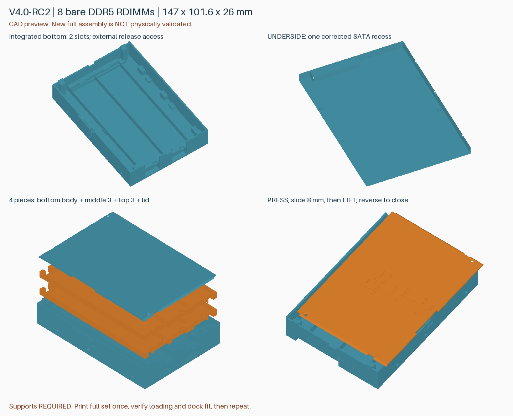
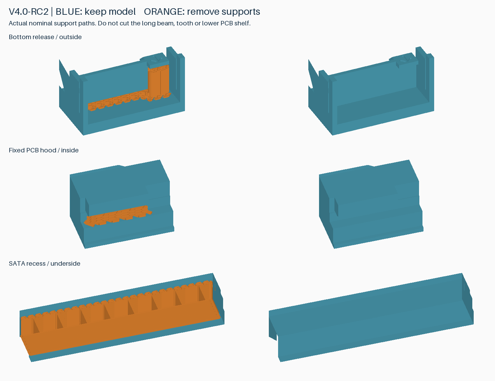

# v4.0-rc2：补足 SATA 背板导向头进深

> 后续 [v4.0-rc3](v4.0-rc3.zh-CN.md) 仅取消外壳外侧凹刻，配套零件兼容。RC2 首个外壳已完成打印并报告表面缺陷；完整实装待验证。已打印件可继续测试，不必仅为去字重打。

**外壳改用 RC2。RC1 的 6.0 mm 凹槽遗漏了标准背板连接器导向头伸入深度。** RC2 将进深改为 7.5 mm，保持单侧位置、宽度和高度；容量仍为 8 条、外形仍为 147 × 101.6 × 26 mm。完整实物验证仍待完成。

## 标准依据与计算

依据 [SATA-IO Serial ATA Revision 3.3 Gold](https://sata-io.org/system/files/specifications/SerialATA_Revision_3_3_Gold.pdf) 图 32、40、42 与表 6（PDF 第 100、110、112 页），按完全插合位置计算导向头超过设备连接器端面的距离：

`4.90 + 8.15 + 1.70 − 8.45 = 6.30 mm`

四项分别为设备端面到插合基准、背板连接器主体高度、导向头额外突出量、插合后设备基准到背板的距离。将列出的轴向公差保守线性相加为 `0.08 + 0.10 + 0.08 + 0.20 = 0.46 mm`，得到 **6.76 mm**。标准加高连接器两项同时增加 6 mm，计算结果相同。这不是整个机箱、安装和打印误差的完整公差分析。

新凹槽进深 **7.5 mm 是本项目设计余量，不是标准规定值**，比上述 6.76 mm 多 0.74 mm。它不能替代空壳实装确认。连接器宽高和硬盘定位基准仍须检查，不能仅凭这项轴向计算声称完整 SATA 兼容认证。

项目坐标：X=0 为连接器端、Z=0 为底面。新凹槽为 **X=0–7.5、Y=43.6–90.6、Z=0–6.2 mm**。盖面朝上、连接器端在远处时位于右侧，没有增加另一侧开口。

## 与 DIMM 的取舍

凹槽后隔墙保留 0.8 mm，内侧到 X=8.3 mm；最不利参考元件包络从 X=8.5 mm 起，横向间隙仅 **0.2 mm**。512 个参考模块位置/尺寸组合仍无碰撞，但该间隙较紧，必须检查实际 DIMM 下表面的元件，不能强压装入。此前用户报告的短边元件余量不等同于这处实测通过。

## 打印与复用

**仅外壳几何改变**。v4.0-rc1 的短滑抬起盖板及两个上层托盘与 RC2 布尔对比一致，已经打印可直接复用；这不适用于 v3.1 旧盖板。未开始打印则统一使用 RC2 两盘。

| 盘 | 几何文件 | 内容 | P2S 参考时间 | 耗材 |
|---|---|---|---|---|
| 1 | [pin-clearance.3mf](../models/v4.0-rc2/rdimm-4.0-rc2-plate-1-pin-clearance.3mf) | 加深外壳＋盖板 | 2 小时 7 分 18 秒 | 89.95 g |
| 2 | [upper-trays.3mf](../models/v4.0-rc2/rdimm-4.0-rc2-plate-2-upper-trays.3mf) | 中层＋顶层 | 1 小时 1 分 38 秒 | 34.71 g |

合计约 **3 小时 9 分、124.66 g**。两盘无切片警告；P2S / 0.4 mm / PLA Basic / 0.20 mm / 标准速度 / 按层打印。未用加速工艺换时间。PLA Pure 需选择实际材料后重新切片。

仓库 3MF 仅含几何；本地交付文件名以 `P2S-PLA-Basic.3mf` 结尾的才含机器、耗材和支撑配置。用 Bambu Studio **打开为工程**、保留配置、重新切片，不要关闭支撑或缩放模型。孔型为托架定位销适用的光孔；攻牙底孔是另外的几何替代件，未在本次配置工程中切片。

操作沿用 [v4 RC1 说明](v4.0-rc1.zh-CN.md#操作)：按扣、短滑 8 mm、抬盖；逐层取托盘；底层不可提起，通过外侧窗口解锁 DIMM。

先清除支撑、用空壳试插到底，再检查底层实际 DIMM 元件与隔墙的余量，最后完成满载装卸和闭盖检查。首套通过再追加；没有新加必打的检查件盘。

## 已完成的检查

- 标准导向头轴向包络：旧 6 mm 外壳相交，新 7.5 mm 外壳无相交。
- 512 个模块组合、242 个满载上托盘装入位置、1520 个底层取出位置、132 个盖板路径位置；外形、销孔、止挡与封闭网格检查通过。
- Bambu 配置工程导回几何一致，28 处支撑区及 9 处活动间隙通过名义刀路检查。
- 尚未验证完整新版打印、支撑拆除、实际插到底、保持力及运输可靠性；切片不是熔融材料或机械强度仿真。

[深度计算与几何记录](../models/v4.0-rc2/sata-depth-verification.json) · [切片报告](reports/v4.0-rc2-slicing.json) · [刀路报告](reports/v4.0-rc2-toolpath-audit.json) · [实物验证表](validation-v4.0-rc2.md)

重建：`python src/build_v4_rc2.py --output-dir build/v4.0-rc2`。旧模型目录、固定标签和 Release 保持不变。
