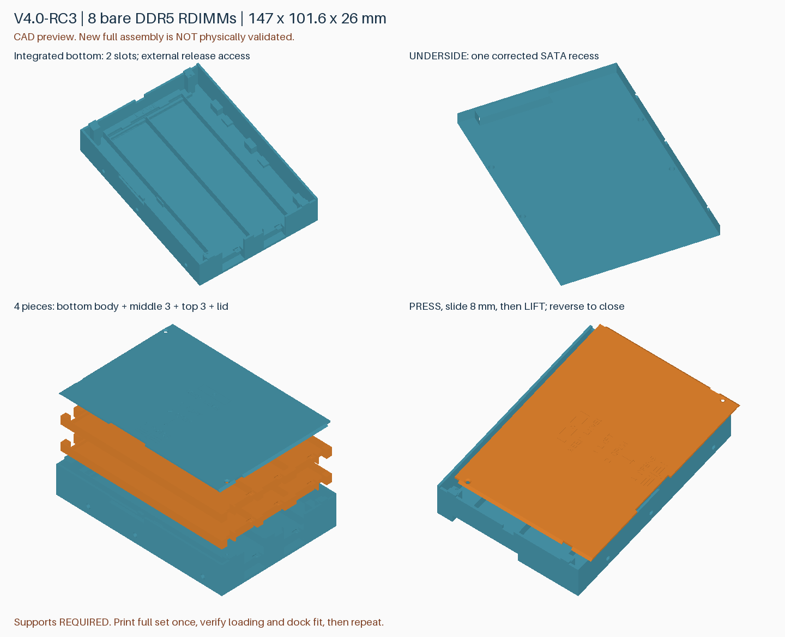
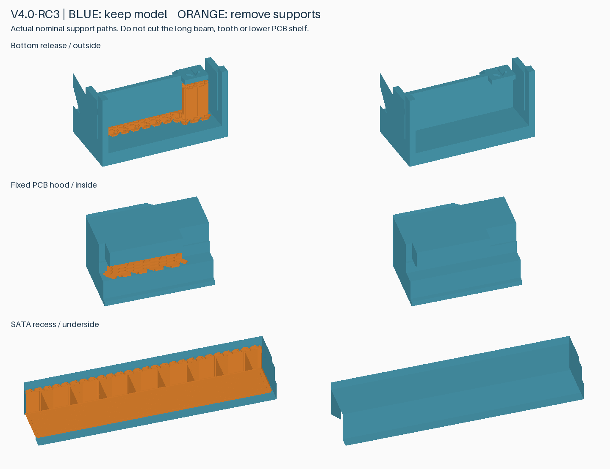

# v4.0-rc3：取消外壳侧壁凹刻

针对 RC2 首件的侧面字样周围表面缺陷，本版填平竖直外侧的 `PRESS`／箭头和 `SATA END` 凹刻。盖板与托盘上的水平操作提示保留。**这是待打印对比的表面改进候选，尚不能保证消除照片中的全部纹路。**

## 与当前零件兼容

几何布尔对比确认：仅填充外侧 0.3 mm 范围内的刻字凹槽，没有删除材料或修改内腔。卡扣、导轨、孔位、底层槽与 SATA 凹槽不变；盖板、中层托盘、顶层托盘与 v4.0-rc2 完全相同。

**已经打印的 RC2 外壳继续用于首套实装；正在打印的 RC2 托盘无需中断或重打。** 后续外壳可改用 RC3。仍需完成空壳插到底、实际 DIMM 元件避让与盖板锁定检查；取消刻字不代表这些项目已通过。

## 两盘打印

| 盘 | 几何文件 | 参考时间 | 耗材 |
|---|---|---|---|
| 1：外壳＋盖板 | [pin-clearance.3mf](../models/v4.0-rc3/rdimm-4.0-rc3-plate-1-pin-clearance.3mf) | 2 小时 5 分 31 秒 | 89.97 g |
| 2：两片上托盘 | [upper-trays.3mf](../models/v4.0-rc3/rdimm-4.0-rc3-plate-2-upper-trays.3mf) | 1 小时 1 分 39 秒 | 34.71 g |

合计约 **3 小时 7 分 10 秒、124.68 g**。第一盘比 RC2 参考切片少约 1 分 47 秒，不是明显的批量提速。P2S、0.4 mm、PLA Basic、0.20 mm、标准速度、按层打印，支撑与速度配置均保持不变；PLA Pure 使用实际材料配置重新切片。

仓库 3MF 仅含几何。本地交付的 `P2S-PLA-Basic.3mf` 含打印和支撑配置，用 Bambu Studio 打开为工程并重新切片。保持 100% 比例和支撑。第一盘是托架定位销光孔版；攻牙底孔几何为替代件，未在本次工程中切片。

## 底部横纹与内圆角

照片中的下部横纹延伸到刻字以外，不能归为刻字的单一影响。底板为 4 mm，底部实心区转为侧壁时的路径及热状态变化是后续排查方向；尚无实测高度和实际打印 G-code 对照，不能确定原因。取消刻字也不保证消除这条横纹。

本版**没有增加内圆角或倒角**：内圆角会在内腔增加材料，需要重新检查底层元件、支撑接近空间和孔位，且不能仅凭 CAD 证明改善外表面。先比较去字后的同配置样本，再决定局部圆角的位置和半径；当前不通过改变速度、壁厚或底板层数来掩盖问题。

## 验证边界

- 完整 512 个模块组合、242 个满载上托盘入口位置、1520 个底层取出位置、132 个盖板路径位置通过；网格封闭连续，外形 147 × 101.6 × 26 mm。
- 两盘配置工程重新切片并导回几何一致，无切片警告；28 个支撑区和 9 个活动间隙通过名义刀路检查。
- 保留 RC2 的单侧 7.5 mm SATA 避让深度、0.8 mm 隔墙及最不利参考元件 0.2 mm 横向间隙；完整实装、支撑拆除与保持力仍待确认。
- RC2 已完成首个外壳打印并报告表面缺陷；RC3 尚未打印。不能将先前检查件的成功视作完整 RC3 通过。

[几何差异记录](../models/v4.0-rc3/compatibility.json) · [切片报告](reports/v4.0-rc3-slicing.json) · [刀路报告](reports/v4.0-rc3-toolpath-audit.json) · [RC2 标准与操作说明](v4.0-rc2.zh-CN.md)

重建：`python src/build_v4_rc3.py --output-dir build/v4.0-rc3`。本版独立目录，不覆盖 RC2 模型、工程或固定 Release。
