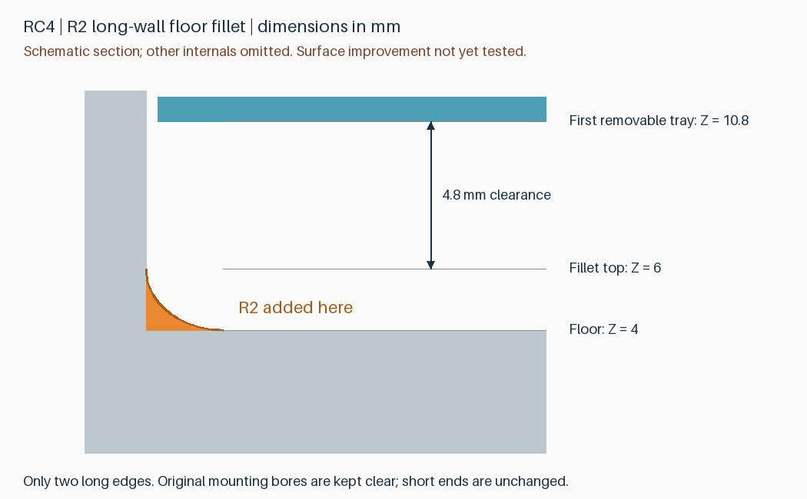

# v4.0-rc4：两条长内壁底部 R2 圆角候选

**改动较小，活动托盘可保持不变。** RC4 在 RC3 去除侧字的基础上，仅沿两条长内壁与底板相交处增加 R2 圆角，并保持原有安装孔净空。短端 SATA 隔墙、底层解锁窗口、卡扣和托盘不变。未确认实打印是否能改善外侧底部横纹。

## 高度与干涉评估

所有 Z 值从外壳底面起算。底板内表面 Z=4 mm，第一层可取出的托盘最低面 Z=10.8 mm。

| 圆角半径 | 圆角最高 Z | 到活动托盘最低面距离 | 两条长边、保留安装孔的几何检查 |
|---|---|---|---|
| R1 | 5.0 mm | 5.8 mm | 通过 |
| R1.5 | 5.5 mm | 5.3 mm | 通过 |
| **R2，本版** | **6.0 mm** | **4.8 mm** | **通过** |
| R3 | 7.0 mm | 3.8 mm | 通过 |

“低于活动托盘最低面”足以排除这一处竖直落入托盘的直接接触，但不足以证明整个盒子无干涉。底层直接装入的 DIMM PCB 最低 Z=7 mm，参考下侧元件可到 Z=4.9 mm；还存在安装孔和底层卡扣释放窗口。

直接给四边整圈添加 R2 的试算，会在安装孔原有净空内增加约 12.68 mm³ 材料，并在底层释放窗口内增加约 34.33 mm³ 材料，即使最高 Z=6 mm 也会改变这些功能区。因此本版只做两条长边，并从新增圆角中减去与旧版完全相同的侧孔、底孔切削体。

R2 是有限改动的试印选择，不是经实测优化的最佳半径。圆弧采用 64 段整圆精度，相当于每个四分之一圆 16 段；已通过导出网格封闭和连续性检查。对于本版新增形状，两条长边以外没有新增材料，没有删除 RC3 材料。

## 实际切片代价

相同 P2S / 0.4 mm / PLA Basic / 0.20 mm / 标准速度 / 按层 / 支撑配置：

| 项目 | RC3 | RC4 |
|---|---|---|
| 外壳＋盖板盘 | 2 小时 5 分 31 秒 | **2 小时 5 分 33 秒** |
| 第一盘耗材 | 89.97 g | **90.10 g** |
| 两片上托盘盘 | 1 小时 1 分 39 秒 | 1 小时 1 分 39 秒 |

第一盘估计增加 **1.52 秒、0.127 g**，实际时间不应视为秒级精度；可以看作打印成本基本不变。整套约 **3 小时 7 分 11 秒、124.81 g**。实体新增体积约 174.07 mm³，与切片耗材增量不同，因为填充和路径也随几何变化。

圆角使局部横截面逐层过渡，但不能凭切片时间、外观预览或刚体检查证明热收缩、熔料堆积和外侧横纹已消失。先用相同耗材、层高和速度比较下一只外壳，再决定是否持续采用。无需为此单独打印更多检查件，也不要求重打已经完成的外壳。

## 打印文件与复用

- [第一盘：光孔外壳＋盖板](../models/v4.0-rc4/rdimm-4.0-rc4-plate-1-pin-clearance.3mf)
- [第二盘：两片上托盘](../models/v4.0-rc4/rdimm-4.0-rc4-plate-2-upper-trays.3mf)

仓库 3MF 是纯几何；本地交付的 `P2S-PLA-Basic.3mf` 包含支撑配置。用 Bambu Studio 打开为工程，保留支撑、100% 比例、按层打印，再选择实际材料并切片。PLA Pure 未独立计时。光孔用于托架定位销；攻牙底孔是未在本次工程切片的替代几何件。

**盖板与上托盘相对 RC2/RC3 几何完全不变，正在进行的 RC2/RC3 托盘打印不需要中断。** 已有 RC2 外壳继续做首次装配和硬盘座测试，后续外壳可选择 RC4 对比圆角效果。RC4 不替换或覆盖旧版本文件。

## 验证与尚未验证的事项

本版 512 个模块组合、242 个满载上托盘入口位置、1520 个底层取出位置、132 个盖板位置检查通过；安装销净空、SATA 包络、卡扣释放、闭盖止挡、外形和封闭连续网格检查通过。两盘 Bambu 配置工程导回几何一致、切片无警告；28 个原有关键支撑区域及 9 个活动间隙通过名义刀路审计。

仍为 147 × 101.6 × 26 mm、8 条、四件、两盘。SATA 凹槽深度保持 7.5 mm，最不利参考元件与 SATA 隔墙横向间隙仍仅 0.2 mm。完整实装、空壳插到底、实际保持力以及本版支撑拆除和表面改善仍待实物验证。

[半径评估报告](reports/floor-fillet-evaluation.json) · [几何差异](../models/v4.0-rc4/compatibility.json) · [切片](reports/v4.0-rc4-slicing.json) · [刀路检查](reports/v4.0-rc4-toolpath-audit.json) · [原操作与支撑说明](v4.0-rc3.zh-CN.md)

重建：`python src/build_v4_rc4.py --output-dir build/v4.0-rc4`。半径评估：`python src/evaluate_floor_fillet.py`。
