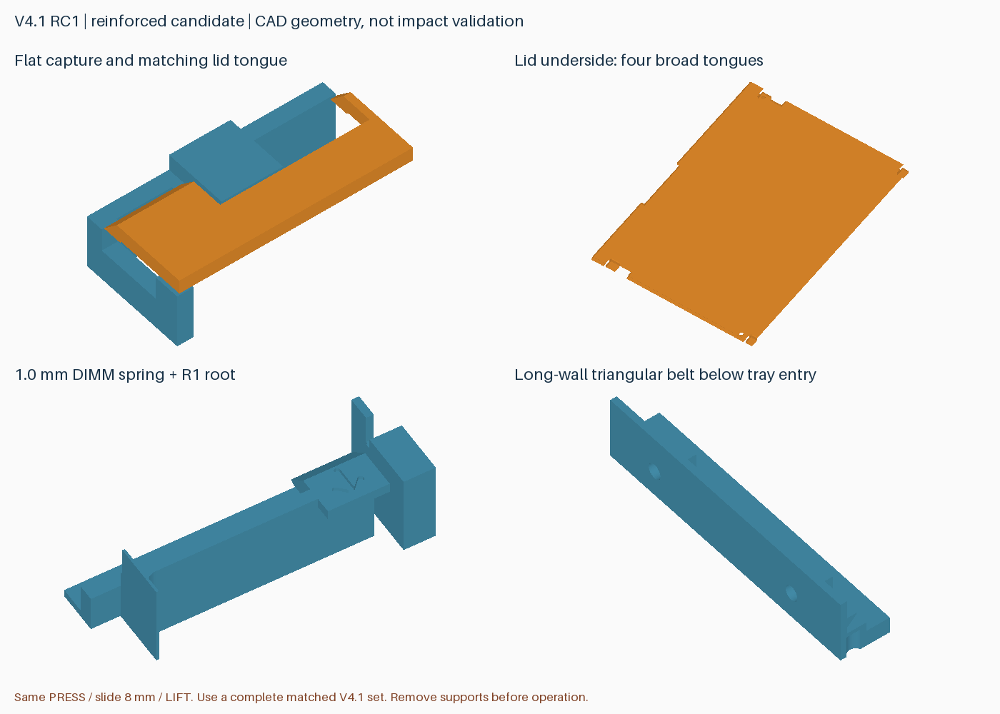
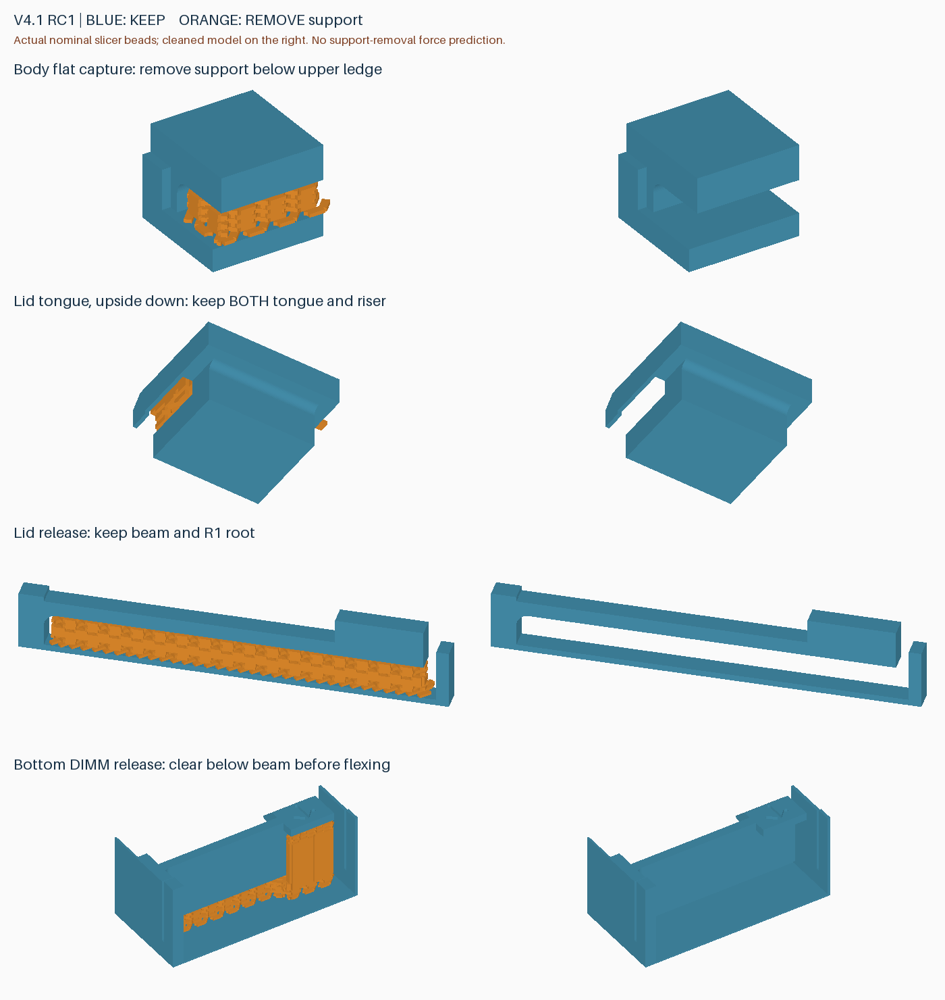

# v4.1-rc1：顶盖扣合与卡扣根部加固候选

**已由完整 [v4.2](v4.2.zh-CN.md) 取代。旧活动托盘第一弹臂基座薄弱，需更换；RC4 盖板可复用；外壳及托盘需更新才能获得全部修复。请使用 v4.2 统一发行包管理打印文件。**

针对顶盖边缘易弯、容易脱出，按压卡扣偏软，以及盖板本身偏柔的反馈，重新设计四处盖板扣合，并加固弹臂与长侧壁。保持 **147 × 101.6 × 26 mm、8 条 DDR5 RDIMM、四个零件、两盘**；操作仍是 **按压 → 滑动 8 mm → 抬盖**，内部仍逐层取放、无需螺丝刀。

**这是未打印的结构候选，不是已通过振动或跌落测试的成品。必须使用整套 v4.1 外壳、盖板和两片托盘，不与 v4.0 或 v3.x 混装。** 原有圆孔、单侧 SATA 避让、无侧面凹刻和长内壁 R2 底部圆角保留。

## 具体改动

| 部位 | 设计变化 | 目的及限制 |
|---|---|---|
| 顶盖固定 | 四个斜边扣合改为平面扣脚；外壳上压边厚 2 mm，盖板下扣脚厚 1.4 mm，名义水平重叠宽 3 mm | 将上拔载荷交给水平承托面，减小斜面将侧壁向外撑开的倾向；承托面积不等于承载能力 |
| 扣合根部 | 外壳压边根部 R0.8，盖板连接处局部 R0.4 | 缓和截面变化；盖板连接圆角止于参考元件包络之前 |
| 顶盖按压弹臂 | 厚度 1.0 → 1.2 mm，根部 R1，止退齿宽 5 → 7 mm | 提高截面刚度及止退接触宽度；手感、回弹和疲劳需要验证 |
| 八个 DIMM 卡扣 | 弹臂厚度 0.8 → 1.0 mm，根部 R1，齿及拨片宽度 4 → 4.8 mm | 增加根部和扣齿截面；仍须先拨开再取放，不能依靠强行压入 |
| 两条长内壁 | 在底层两槽外侧空隙增加三角加强筋 | 顶面 Z=10.4 mm，距第一活动托盘最低面 10.8 mm 留 0.4 mm；孔切削体从新增材料中减去 |
| 托盘端部 | 调整避让口及顶盖扣脚经过的局部槽 | 保持垂直取放和盖板原有行程；这也是不能混用旧托盘的原因 |

四处扣脚扣除可选螺丝通道后，名义平面承托面积合计约 **52.67 mm²**，这是几何数据，不是强度或跌落评级。原可选螺丝位置保留；前端螺丝经过新的固定压边、盖板扣脚和下方底孔，起附加锁止作用。正常开合不要求螺丝，首轮功能验证也应在不装螺丝的状态进行。

没有整面向内加厚盖板：参考最不利上层元件到盖板中央的净空只有约 0.3 mm，不能将它当作可随意填充的空腔。当前优先改善已反馈最明显的边缘扣合和按压锁止，**尚未证明盖板中央抗弯性能改善**。托盘部分刚性端栏为新动线去掉了材料，不能以“所有位置都增厚”概括本版。

根部圆角、合理的弹臂截面和额外定位承托是常见的卡扣设计措施；材料、打印方向和间隙也影响结果。参考 [Protolabs 卡扣设计指南](https://www.hubs.com/knowledge-base/how-design-snap-fit-joints-3d-printing/)。其建议不构成本项目的力学验证；本次保持用户正在使用的 PLA 和切片速度，没有同时更换材料或提高速度。

## 打印工程及时间

交付包：`rdimm-v4.1-rc1-P2S-print-projects.zip`。包含第一盘外壳＋盖板、第二盘两片上托盘，以及支撑拆除图和验证记录。工程名的 `p1` 表示继续采用六侧孔的局部支撑屏蔽。**在 Bambu Studio 中打开为工程、保留配置，选择实际耗材后重新切片；不要仅导入为几何。** 仓库中的 STL 和纯几何 3MF 不携带此工艺。

P2S、0.4 mm、PLA Basic、0.20 mm、标准速度、按层打印；全局参数与 RC4-p1 相同：

| 项目 | RC4-p1 | v4.1-rc1 / p1 |
|---|---:|---:|
| 外壳＋盖板 | 2:04:39 / 89.98 g | **2:12:44 / 91.83 g** |
| 两片上托盘 | 1:01:39 / 34.71 g | **0:58:52 / 33.80 g** |
| 整套 | 3:06:17 / 124.69 g | **3:11:36 / 125.63 g** |

整套估计增加 **5 分 19 秒（2.9%）、0.94 g**，不含换盘和清理。时间为切片估计，不应当作秒级精度；PLA Pure 未独立计时。托盘因配合槽减少实体材料而缩短时间，并不表示其所有方向的刚度都提高。

## 支撑清理

六个侧孔继续不生成支撑；其他支撑必须保留。新外壳的四处平面压边下方、新盖板扣脚下方都需要清理。不能把保留的下扣脚、竖直连接段或卡扣弹臂剪掉。图中橙色是实际切片中的支撑刀路，蓝色是模型；右列为清理后的目标形状。

压边下的支撑可以从开放侧接近，但仍可能需要镊子，**尚未确认比旧试件容易拆**。冷却后逐块清理，扶住固定框架，避免拿弹臂作撬杠；清完再检查回弹与盖板行程。六孔无支撑后孔顶是否下垂、定位销配合如何，也仍待实物确认。

## 已完成的验证

- 512 个参考 DIMM 尺寸/位置组合、242 个满载托盘入口位置、1520 个底层 DIMM 取出位置、132 个盖板路径位置检查通过；另检查弹臂示意位移、闭盖直移/倾斜止挡、层间限位和 6 个可选螺丝净空组合。
- 单一连通体、封闭网格、外形包络、安装孔、SATA 避让检查通过；导出后的网格可重建一致。SATA 隔墙到最不利参考元件的 0.2 mm 横向间隙不变。
- Bambu Studio 2.8.2.61 两盘无切片警告；第一盘支撑涂色保存重开后保留 289 个屏蔽面，网格坐标/索引不变。第二盘直接复用已验证工程，字节一致。
- **36 个支撑区域、9 个活动间隙**通过名义有限线宽刀路检查；六个侧孔包围区中的支撑刀路为零。

以上不是有限元、热变形、支撑拆除力或跌落仿真。刚体“有止挡”不能证明薄壁不变形、弹臂不断裂，也不能证明内存不会受冲击损伤。

## 首件验证与验收边界

先完成一套，清理支撑后检查空盖按压、滑动、抬起及回锁，做约 20 次开合，观察裂纹、发白、永久变形和卡滞。随后做真实 DIMM 的静态装卸与硬盘槽位适配，确认末端元件不接触加固结构。

倒置、轻摇及低高度跌落筛查使用**外形、质量接近的非贵重替身**，先从低高度开始并记录高度、落面、方向、载荷和次数。每一步检查盖板是否退出、扣脚/卡扣是否损伤、替身是否脱槽。出现裂纹或失锁即停止升级测试。此类试验只能筛查样件，不能代替规范振动/冲击测试；不要用珍贵的真实 DIMM 来验证首次跌落。

当前尚未定义并验证“轻微跌落”的高度和落地条件，因此不能给出防摔保证。普通 PLA 也没有因此获得缓冲或 ESD 防护能力。

[结构数据](../models/v4.1-rc1/reinforcement.json) · [几何检查](../models/v4.1-rc1/verification.json) · [切片报告](reports/v4.1-rc1-slicing.json) · [刀路检查](reports/v4.1-rc1-toolpath-audit.json) · [六孔检查](reports/v4.1-rc1-side-hole-audit.json)

重建：`python src/build_v4_1.py --output-dir models/v4.1-rc1`。先用 `prepare_v3_2_project.py --version 4.1-rc1` 生成两盘配置，再运行 `prepare_side_hole_project.py --geometry-version 4.1-rc1`；审计使用 `audit_v4.py --version 4.1-rc1-p1 --geometry-version 4.1-rc1 --depth 7.5` 及 `audit_side_hole_supports.py --version 4.1-rc1-p1 --baseline 4.1-rc1`。厂商配置和 G-code 仍只留本地。
