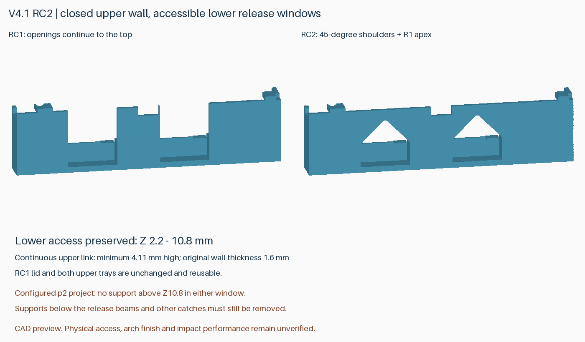
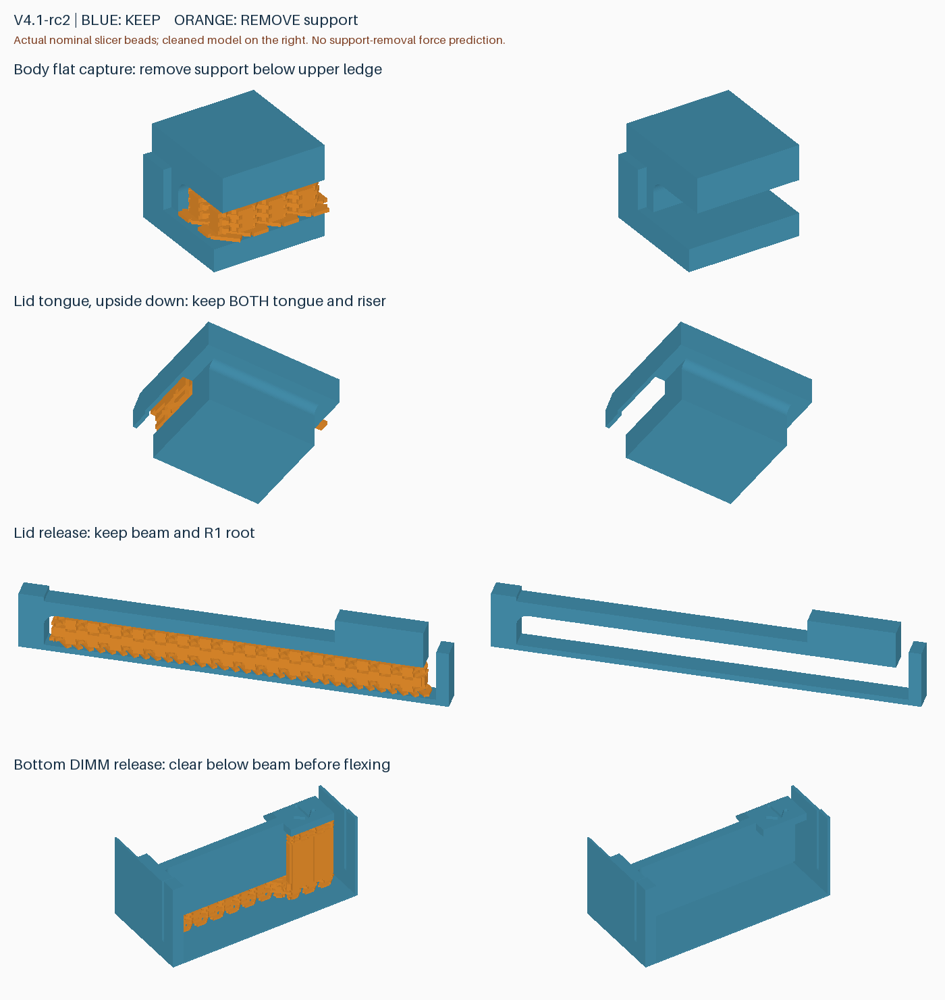

# v4.1-rc2：缩小底层拨扣窗口，恢复上方连接壁

**已由完整 [v4.2](v4.2.zh-CN.md) 取代。旧活动托盘第一弹臂基座薄弱，需更换；RC2 外壳及 RC4 盖板可复用。请使用 v4.2 统一发行包管理打印文件。**

两个大开口用于底层 DIMM 卡扣向外拨动及拆除打印支撑。RC1 将它们一直切到外壳顶边，留下了不必要的上部缺口。本版保留下部操作空间，将上方封成拱形窗口，使短端上沿重新连起来。

**仅外壳改变。v4.1-rc1 盖板和两片活动托盘原样兼容，无需重打。不要混用 v4.0 或 v3.x 的盖板、托盘。** 新包仍为四件、两盘，容量 8 条裸 DDR5 RDIMM，外形 147 × 101.6 × 26 mm，单侧 SATA 避让深度 7.5 mm；安装孔、按压/滑动 8 mm/抬盖操作及上一版加固结构均保留。

## 结构与装卸空间

- 两个窗口各宽 19 mm，原有 Z=2.2–10.8 mm 的下部空间完整保留，Z=11.2 mm 才开始收拢。
- 两侧为 45°斜面，顶部 R1 圆弧；上方连接壁最薄处高度约 4.11 mm，沿用外壁 1.6 mm 厚度。圆弧顶端最大弦长约 1.415 mm。
- 新增材料只在原短端外壁范围 X=145.4–147 mm 内；底层卡扣示意位移、DIMM 取出、满载托盘垂直装卸及盖板开合路径检查通过。
- 盖板、托盘几何相对 RC1 的增减体积均为零；外壳仅增加约 514.45 mm³ 材料。重新连接上沿的目的在于减少大缺口带来的薄弱处，尚未测得强度提升幅度。

## 立即打印用文件

交付包：`rdimm-v4.1-rc2-P2S-print-projects.zip`。使用包内 **p2 工程**，在 Bambu Studio 中选择打开为工程、保留配置，核对实际耗材后重新切片。

| 打印盘 | 内容 | P2S / 0.4 mm / PLA Basic / 0.20 mm 参考 |
|---|---|---:|
| `plate-1-pin-clearance` | 新外壳＋盖板 | **2 小时 13 分 13 秒 / 92.46 g** |
| `plate-2-upper-trays` | 两片活动托盘 | **58 分 53 秒 / 33.80 g** |
| 合计 | 完整一套 | **3 小时 12 分 6 秒 / 126.26 g** |

相比 RC1-p1 整套增加约 **30 秒、0.63 g**。这是切片估计，不含换盘和清理时间；未提高速度，也未降低原有壁数或层数。已有 RC1 第二盘可直接继续打印；已有 RC1 盖板也可复用。

`p2` 增加两个拱顶的局部支撑屏蔽，并继续屏蔽六个侧孔。自动支撑原本会在小拱顶下生成两簇支撑，本工程对 45°斜面和短圆弧顶面局部涂色后，已确认两个窗口 Z>10.8 mm 的范围内没有支撑刀路。**全局支撑仍开启，卡扣和扣脚下方等必要支撑必须保留并清理。** STL 和仓库的纯几何 3MF 不包含这些设置，不能替代交付的打印工程。

窗口宽 19 mm 不等于一次桥接 19 mm：45°两侧在 0.20 mm 层高下每层各向内推进约 0.20 mm。最终工程在 Z=20.4 mm 首次封口；按 Z=20.2 mm 已打印刀路的名义线宽计算，两窗口各四条封口路径跨越的空隙约 **1.158 mm**（0.002 mm 采样）。这是保留无支撑拱顶的依据，不是不会下垂的保证；首件仍需观察封口处是否有松散挤出或明显下垂。

图中蓝色保留，橙色拆除；右侧为清理后的形状。拱顶与上方连接壁都是永久结构，不要剪除。底层卡扣下方的原支撑仍需拆掉，清理时扶住固定框架，不要用弹臂作撬杠。

## 验证结果及边界

- 几何检查：512 个参考 DIMM 组合、242 个满载托盘入口位置、1520 个底层取出位置、132 个盖板路径位置，以及孔位、SATA、网格和止挡检查通过。
- Bambu Studio 2.8.2.61 两盘无警告；支撑涂色重开保留 361 个面，工程重存的顶点坐标和三角索引不变。
- 原有 36 个必要支撑区域、9 个活动间隙检查通过；六个侧孔内和两个窗口上部的支撑刀路均为零。
- RC1 盖板和两片托盘与新外壳的混合版本静态配合检查通过，完整运动路径另按 RC2 整套检查。

这是几何与名义刀路验证，不是实际挤出、热变形或跌落仿真。新拱顶表面质量、手指操作便利性、完整装配、抗震及跌落仍待首件验证。先完成一套并检查开合、底层拨扣、DIMM 装卸及空盒插槽配合，再决定批量数量。

[兼容性数据](../models/v4.1-rc2/compatibility.json) · [几何检查](../models/v4.1-rc2/verification.json) · [切片报告](reports/v4.1-rc2-slicing.json) · [刀路检查](reports/v4.1-rc2-toolpath-audit.json) · [六孔检查](reports/v4.1-rc2-side-hole-audit.json) · [窗口检查](reports/v4.1-rc2-window-audit.json)

重建：`python src/build_v4_1_rc2.py --output-dir models/v4.1-rc2`。配置两盘后运行 `prepare_side_hole_project.py --geometry-version 4.1-rc2 --arch-windows`；最终检查使用 `audit_v4.py --version 4.1-rc2-p2 --geometry-version 4.1-rc2 --depth 7.5`、`audit_side_hole_supports.py --version 4.1-rc2-p2 --baseline 4.1-rc2` 和 `audit_v4_1_windows.py`。窗口对照还需先生成不带 `--arch-windows` 的 p1 对照工程。厂商配置和 G-code 仅保留在本地，用户实拍图不公开。
