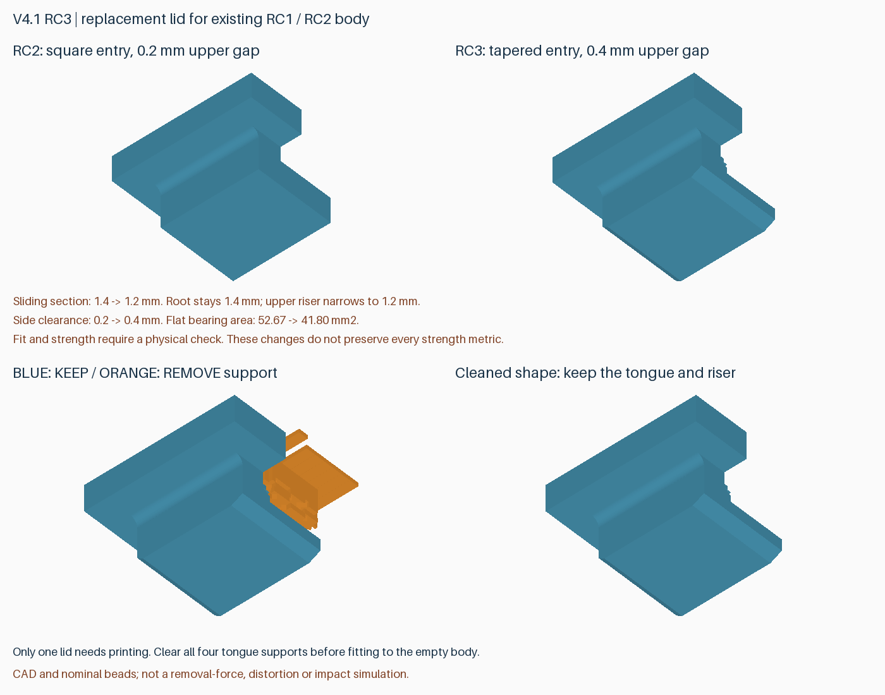

# v4.1-rc3：斜面导入、平面承托的替换盖板

**已由完整 [v4.2](v4.2.zh-CN.md) 取代。旧活动托盘第一弹臂基座薄弱，需更换；RC2 外壳及 RC4 盖板可复用。请使用 v4.2 统一发行包管理打印文件。**

后续[盖板方案交叉评估](lid-options-review.zh-CN.md)发现：分别检查偏移无干涉，并不代表横移与上浮叠加后无干涉。RC3 连接颈过渡在探索性组合位姿下仍可能碰到压边；这不是实物必卡结论，当前仍应作为空盒实测候选。本次评估未覆盖或替换此版打印文件。

用户实测 RC2：舌片刚进入便很难推进，强压后越往里越紧，装好后无法徒手取下；同时反馈此前斜面滑槽装配明显更容易。正常操作不应依赖强压或工具撬动。本版借鉴斜面导入，保留闭合后的平面扣合和按压止退，并扩大槽内名义间隙。

**只需重打一片盖板，兼容现有 v4.1-rc1 / v4.1-rc2 外壳和托盘。** 外壳、安装孔、SATA 避让及托盘均不变。不与 v4.0/v3 盖板系统混用。

## 改动及取舍

| 部位 | RC2 | RC3 |
|---|---:|---:|
| 外壳压边与盖板连接颈侧向间隙 | 0.2 mm | 0.4 mm |
| 舌片上方名义间隙 | 0.2 mm | 0.4 mm |
| 舌片下方名义间隙 | 0.3 mm | 0.3 mm |
| 舌片主要配合段厚度 | 1.4 mm | 1.2 mm |
| 舌片根部厚度 | 1.4 mm | 1.4 mm，斜面过渡 |
| 入口 | 直角 | 0.6 mm 长双面斜面，入口边厚约 0.6 mm |
| 退出端 | 直角 | 0.3 mm 长小倒角 |

入口斜面负责引导，全行程间隙负责减轻卡紧；闭合后仍由水平扣合面承托，操作保持按压、滑动 8 mm、抬起。未整体缩放模型或使用全局 XY/流量补偿。原有根部圆角、盖板中心厚度和元件包络不变。

**这不是无代价的强度升级。** 连接颈上部局部宽度从 1.4 减至 1.2 mm，平面承托面积从约 52.67 降为 **41.80 mm²**。舌片局部减薄后不能声称保持原强度。名义上浮余量增大约 0.2 mm；新版在上抬 0.55 mm 时验证有刚体止挡，而旧版 0.4 mm 探针不再适用。

## 打印

交付包 `rdimm-v4.1-rc3-replacement-lid-P2S.zip` **只含一盘新盖板**。其中 `plate-3-replacement-lid` 的 3 是布局编号，不是要打三盘。打开 `rdimm-4.1-rc3-plate-3-replacement-lid-P2S-PLA-Basic.3mf` 为工程，保留朝向和支撑配置，按实际耗材重新切片。

P2S / 0.4 mm / PLA Basic / 0.20 mm 标准参考：**36 分 38 秒、24.25 g**，不含清理时间。四个舌片仍需要支撑；图中蓝色保留、橙色拆除，不要把导入斜面剪掉。先在空盒上检查能够徒手反复装卸、回锁后扣住，再装真实 DIMM。阻力明显就退出检查，不要再次强行闭合。

如果仍持续卡紧，需检查已有槽面的残余支撑、翘曲及实测尺寸，继续针对外壳调整，不能无限减薄舌片。新件无法消除旧外壳已发生的永久变形。原设计小间隙、支撑接触面和尺寸误差都可能参与卡紧，目前没有测出各项贡献。

仓库保留完整几何快照供重建；**本次配置切片和交付仅针对替换盖板**，不重新交付整套配置工程。旧 RC2 外壳及托盘文件仍有效。

## 验证

- 完整参考几何检查通过：512 个 DIMM 组合、242 个满载托盘入口位置、1520 个底层取出位置、132 个盖板路径位置；孔位、SATA、止挡、网格及可选盖板螺丝净空通过。
- 相对 RC2，盖板仅移除约 27.61 mm³，外壳和托盘增减体积为零。RC2 外壳配新盖板检查通过。
- 闭合盖板沿长轴偏移 ±0.3 mm，RC2 与外壳出现约 1.66–1.99 mm³ 干涉，RC3 干涉小于 0.001 mm³。这是名义偏移检查，不是变形公差认证。
- Bambu Studio 2.8.2.61 单盘无切片警告；四处舌片支撑名义 Z 间隔均 0.2 mm，检查范围内最小 XY 间隔约 0.159 mm。工程导入网格的边界、体积和连通体一致。
- **实际手感、保持力、疲劳及跌落未验证。** 未进行热变形或受力仿真，刀路通过不能证明实物卡紧已经解决。

[结构和兼容性](../models/v4.1-rc3/lid-fit.json) · [几何检查](../models/v4.1-rc3/verification.json) · [切片报告](reports/v4.1-rc3-slicing.json) · [支撑刀路检查](reports/v4.1-rc3-toolpath-audit.json)

重建：`python src/build_v4_1_rc3.py --output-dir models/v4.1-rc3`。配置切片使用 `prepare_v3_2_project.py --version 4.1-rc3 --plates 3-replacement-lid`，另提供模型/输出目录、Bambu 程序及配置路径。审计使用 `audit_v4.py --version 4.1-rc3 --geometry-version 4.1-rc3 --depth 7.5 --plates 3-replacement-lid`。旧版本和私人照片不覆盖、不公开。
