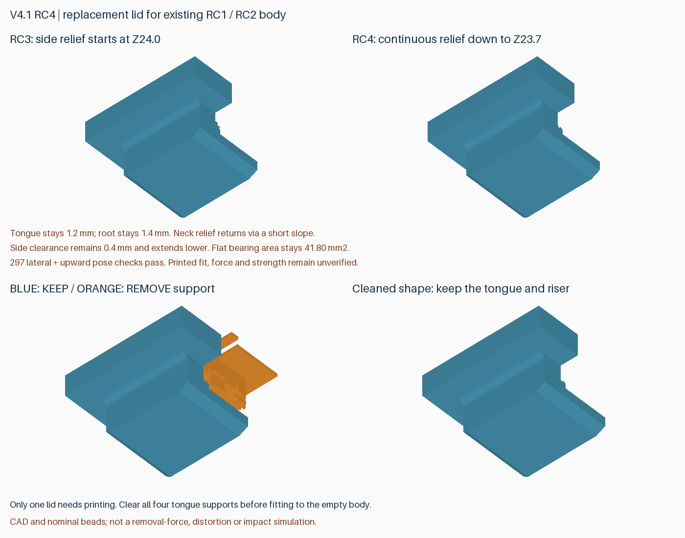

# v4.1-rc4：连续颈部间隙的替换盖板

**只重打一片盖板，继续使用 v4.1-rc1 / v4.1-rc2 外壳和托盘。** 打印约 **36 分 39 秒，24.25 g**。本版落实近期选型建议，修正 RC3 连接颈下方的小台阶，保留斜面导入、平面承托和按压止退。

## 直接打印

交付包：`rdimm-v4.1-rc4-replacement-lid-P2S.zip`。

其中的 `rdimm-4.1-rc4-plate-3-replacement-lid-P2S-PLA-Basic.3mf` 是带打印配置的单盖板工程。**在 Bambu Studio 中选择打开为工程，按实际耗材重新切片**。保留外表面朝下、0.4 mm 喷嘴、0.20 mm 层高和支撑配置；参考耗材为 PLA Basic。文件名中的 `plate-3` 是布局编号，只有一盘，不需要先打印另外两盘。

打印后清除四处舌片支撑，再用现有空壳轻试：按住止退扣、滑动检查阻力，然后检查闭合回锁及徒手释放。若越推越紧就退出，不用强压或工具撬合。通过后再装内存。原有外壳的残余支撑、翘曲或永久变形仍会影响配合。

蓝色保留，橙色是应拆支撑；不要剪掉舌片、连接颈或入口斜面。

## 改动范围

- 原 RC3 侧间隙只从 Z24.0 mm 起扩大，以下留有台阶。本版将 0.4 mm 侧间隙连续延伸到 Z23.7 mm，再经 Z23.4–23.7 mm 的短斜面接回根部。
- 舌片主体仍厚 1.2 mm，根部保留 1.4 mm，连接颈最小宽度仍为 1.2 mm；没有再次整体削薄舌片。
- 相对 RC3，仅局部移除约 **1.509 mm³**。压边下的承托区域不变，名义平面承托面积仍为 **41.80 mm²**。局部截面有变化，不能据此承诺强度完全不变。
- 顶盖主体厚度、入口 0.6 mm 斜面、退出倒角、上下间隙、按压后滑动 8 mm 再抬起的操作不变。
- 外壳、安装孔、SATA 避让及托盘几何均未变化。不要与 v4.0/v3 盖板系统混用。

仓库保留完整几何快照供重建；此次只配置切片和交付一片替换盖板，原 RC2 外壳和托盘打印工程继续使用。

## 已完成的检查与边界

- 完整几何检查通过：512 个 DIMM 组合、242 个满载托盘入口位置、1520 个底层取出位置、132 个盖板路径位置，以及网格、孔位、SATA、止挡和可选盖板螺丝净空。
- RC2 原外壳配新盖板名义装配通过；横移 X=−0.3/0/+0.3 mm，上浮 Z=0/0.15/0.25 mm，滑程 Y=−8…0 mm（每 0.25 mm）共 **297 个组合位置**，与刚性外壳交叠均小于 0.001 mm³。该检查隔离弹性止退扣；正常解锁由完整装卸路径检查覆盖。
- 已复现的 RC3 横移 +0.3、上浮 +0.15 mm 干涉为 0.124561 mm³，新盖板对应干涉消除。偏移量是探索值，未测量实际打印误差。
- 另一个横移 −0.3、下压 −0.15、滑到 −8 mm 的探针触及侧壁上沿，RC3/RC4 都约 0.331 mm³；它位于本次连接颈修订之外。因此不宣称任意歪斜姿态均无干涉，也不建议向下压着盖板硬推。
- Bambu Studio 2.8.2.61 结果文件报告成功、无切片警告；工程导入网格边界、体积及连通体检查通过。四处舌片支撑的名义 Z 间隔为 0.2 mm，检查范围内最小 XY 间隔约 0.159 mm。时间比 RC3 增加约 0.8 秒，耗材近似不变。
- 本次 CLI 在写完结果和完整 G-code 后未于 90 秒内退出。已独立核验成功结果、文件完整性、G-code 结束标记和支撑刀路；交付的是需重新切片的工程，不含预切片 G-code。详见报告中的退出超时记录。
- **实际装卸手感、保持力、疲劳及跌落仍待实物验证。** 几何和刀路检查不模拟表面粗糙、热翘曲、粘接或操作力。

[结构及组合位置检查](../models/v4.1-rc4/lid-fit.json) · [完整几何检查](../models/v4.1-rc4/verification.json) · [切片报告](reports/v4.1-rc4-slicing.json) · [支撑刀路](reports/v4.1-rc4-toolpath-audit.json)

## 重建

`python src/build_v4_1_rc4.py --output-dir models/v4.1-rc4`

配置工程：`prepare_v3_2_project.py --version 4.1-rc4 --plates 3-replacement-lid`，另提供模型/输出目录、Bambu 程序及配置路径。审计：`audit_v4.py --version 4.1-rc4 --geometry-version 4.1-rc4 --depth 7.5 --plates 3-replacement-lid`。预览：`preview_lid_fit_rc4.py`。源代码及报告提交后运行 `package_lid_fit.py --version 4.1-rc4`，包中记录提交号和 SHA-256。
