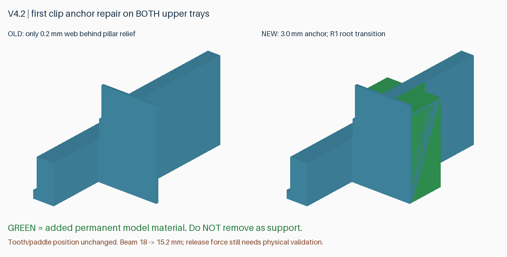
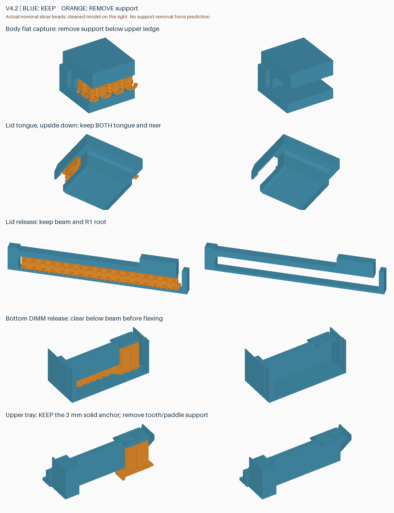

# v4.2：完整两盘发行版

这是一个以 **147×101.6×26 mm 的 3.5 英寸硬盘外形**收纳 **8 条无散热片 DDR5 RDIMM** 的盒子。底层两个槽位与外壳一体，另有两片各容纳三条内存的活动托盘。开盖后逐层取放；托盘与盖板日常使用均无需螺丝，盖板可选螺丝只用于额外加固。

v4.2 是完整版本：统一源码、四个零件、两盘工程、说明及检查报告，通过固定标签 `v4.2` 发布。**无需搜集或拼接历史补丁。** 正式版本号表示交付内容固定，不表示已经完成跌落或寿命认证；3 mm 基座和完整装配仍待本轮实物验证。

## 下载与打印

从 [v4.2 Release](https://github.com/helixzz/rdimm-hdd-case/releases/tag/v4.2) 下载 `rdimm-v4.2-complete-P2S.zip`，解压后用 Bambu Studio **打开为工程**，按实际耗材重新切片。参考为 P2S、0.4 mm 喷嘴、PLA Basic、0.20 mm 层高。

| 打印盘 | 工程文件 | 零件 | 参考耗时 | 耗材 |
|---|---|---|---|---|
| 1 | `rdimm-4.2-plate-1-pin-clearance-P2S-PLA-Basic.3mf` | 外壳＋盖板 | 2 小时 13 分 06 秒 | 92.42 g |
| 2 | `rdimm-4.2-plate-2-upper-trays-P2S-PLA-Basic.3mf` | 中层＋顶层托盘 | 59 分 25 秒 | 33.94 g |
| 合计 | 两盘、四件 | 完整一套 | 约 **3 小时 12 分 32 秒** | **126.37 g** |

时长是切片估计，不含换盘、拆支撑和装配。保留工程中的方向、支撑和局部屏蔽：六个侧孔内及两个拱顶上部不生成支撑，其余卡扣、舌片和 SATA 避让顶面仍需支撑。不要全局关闭支撑。包内 STL 用于其他切片器，**不包含这些打印配置**。

完整包包括两盘工程、四个零件的 STL、支撑示意、几何/刀路报告、提交号和 SHA-256。源码可在同一 Release 的 Source code 下载项获取。

## 兼容与结构

- 目标参考：三星 M321RAJA0MB2-CCP/CCPKF 一类无散热片 DDR5 RDIMM。用户已做过该内存的局部实物装卸；**不支持马甲条，不宣称兼容未验证的 DDR4/其他板形**。
- HDD 外形及底部、两长边安装孔保留；默认交付 3.6 mm 定位销/间隙孔外壳。它不是已攻好 6-32 螺纹的金属硬盘。具体托架定位销及实际背板配合仍需检查。
- SATA 单侧避让采用 7.5 mm 名义进深，仅供避开背板插座，盒子没有电气连接功能。不能把名义避让等同于任何硬盘座均已验证兼容。
- 盖板采用 RC4 的连续连接颈间隙、入口斜面、平面承托和独立止退。按压解锁后滑动 8 mm，再抬起；装回时反向操作。
- 保留长内壁加强筋、底部 R2 过渡、卡扣根部圆角、缩小后的拱形拨扣窗口及操作标记。普通 PLA 不提供防静电认证；这是收纳结构，不作为 ESD 防护的替代品。

## 本版修复的托盘缺陷

此前两片活动托盘的第一弹臂起点为 Y14.5，外壳柱位避让切到 Y14.3，只剩约 **0.2 mm 连接薄片**。实物清理支撑后舌片脱落。理想网格仍然连通，所以旧的“连通且无干涉”检查漏掉了这个制造缺陷。

本版按反馈将基座沿弹臂方向加厚至 **3 mm**，第一弹臂起点后移至 Y17.3。基座从床面连续建立，保持与柱子末端 0.3 mm 名义间隙及 R1 根部过渡；压住 DIMM 的齿头、拨片位置均不变。自由弹臂由 18 缩至 **15.2 mm**，可能需要更大按压力，实际手感和寿命尚待确认。

绿色是新增的永久结构，**不是支撑，不能剪掉**。另外两处弹臂保持原位置和结构。

## 已有打印件如何复用

| 已有零件 | v4.2 中的关系 | 处理 |
|---|---|---|
| v4.1-rc2 外壳 | STL 字节一致 | 可以继续使用 |
| v4.1-rc4 盖板 | STL 字节一致 | 可以继续使用 |
| v4.1-rc1 至 rc4 的两个活动托盘 | 均包含旧薄弱基座 | 替换为本包第 2 盘 |
| v4.0 / v3 系列零件 | 不是本版匹配接口 | 不混装 |

从零制作时打印本包两盘即可。已有 RC2 外壳及 RC4 盖板时，可以在同一完整版本包内只选择第 2 盘；这只是复用已确认相同的零件，并非另一个补丁版本。

## 拆支撑与检查

蓝色保留，橙色拆除。托盘弹臂固定端的实心基座必须保留，只拆齿头/拨片下的支撑及其附着片。先检查六处活动托盘弹臂均连接完整、轻拨后回弹，再逐槽验证 DIMM 装卸。盖板先在空盒上徒手开合；若越推越紧、发白或出现裂纹，不继续强压。最后验证完整叠放及空盒插入目标硬盘槽的避让。

## 验证范围

- 完整几何通过：512 个 DIMM 组合、242 个满载托盘入口位置、1520 个底层取出位置、132 个盖板路径位置，以及弹臂释放、DIMM 抬起/抽出、孔位、SATA、止挡和网格检查。
- 六处活动托盘根部都有完整实心核心及跨根部连接；第一处另检查完整 3 mm 长基座。旧第一处的 1×1×6 mm 核心缺失 4.8 mm³，能够复现并拦截旧缺陷。
- 六处弹臂 × 31 层，共 **186 个逐层模型刀路连接检查**通过，排除所有支撑挤出，确认根部两侧由模型材料连通。
- 两盘 Bambu Studio 2.8.2.61 切片无警告，工程导入/支撑涂色保存通过。36 个支撑区域、九条活动间隙、六孔无支撑、两个拱顶无高位支撑及约 1.158 mm 名义封顶跨度检查通过。
- **尚未验证：完整实物配合、清理便利性、实际按压力、疲劳、振动及跌落。** 几何与名义刀路不模拟焊接强度、热翘曲或支撑拆除力。

[结构检查](../models/v4.2/tray-root-fix.json) · [完整几何](../models/v4.2/verification.json) · [切片](reports/v4.2-slicing.json) · [支撑及间隙](reports/v4.2-toolpath-audit.json) · [根部刀路](reports/v4.2-root-beads.json) · [侧孔](reports/v4.2-side-holes.json) · [拱顶](reports/v4.2-windows.json)

## 重建与版本管理

`python src/build_v4_2.py --output-dir models/v4.2`。配置两盘时使用 `prepare_v3_2_project.py --version 4.2 --plates 1-pin-clearance 2-upper-trays`（另传 Bambu、安装配置、模型目录，输出到 `build/v4.2-unpainted-projects`）。再运行 `prepare_side_hole_project.py --geometry-version 4.2 --arch-windows --source-version 4.2-unpainted --release-version 4.2` 并传 Bambu 路径，生成最终 `build/v4.2-projects`。

运行 `audit_v4.py --version 4.2 --geometry-version 4.2 --depth 7.5`、`audit_tray_roots.py`、`audit_side_hole_supports.py --version 4.2 --baseline 4.2-unpainted`、`audit_v4_1_windows.py --version 4.2 --baseline 4.2-unpainted`。源码/报告提交且标签固定后，用 `package_v4_2.py` 打包。旧标签、旧模型和旧 Release 不覆盖，后续几何改动另开新版本。
