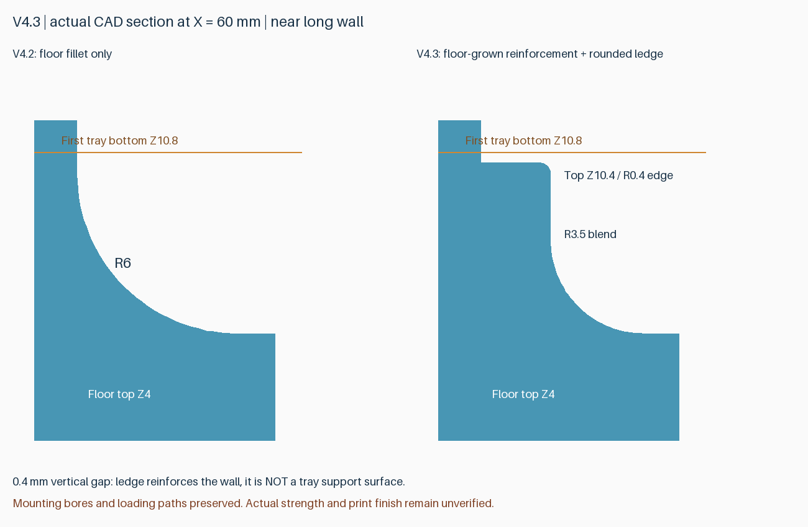
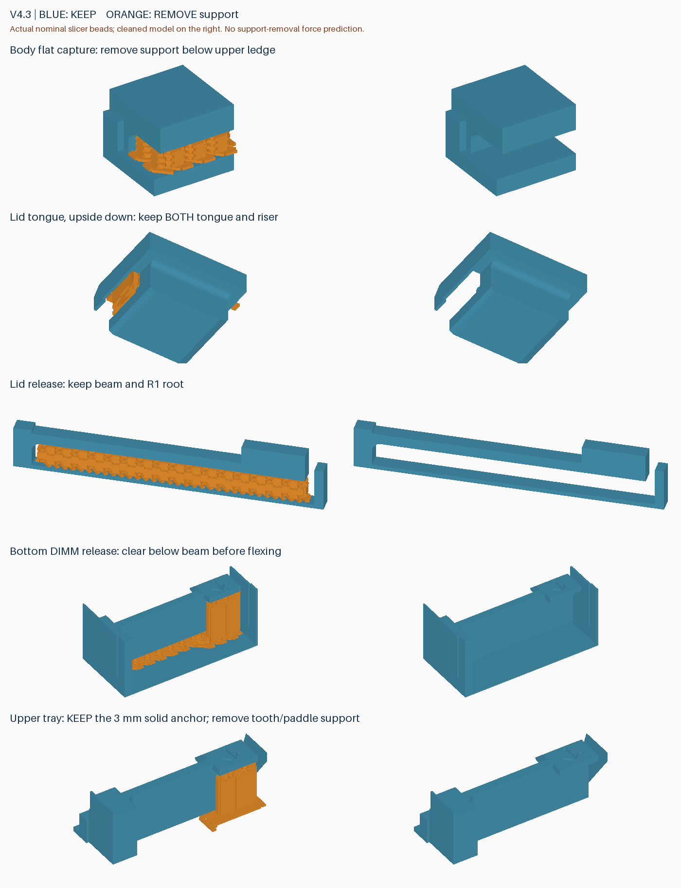

# v4.3：底部平顺过渡与侧壁加强棱

用于收纳 **8 条无散热片 DDR5 RDIMM** 的 3.5 英寸硬盘外形盒子，外形 **147×101.6×26 mm**。底层两槽与外壳一体，两片活动托盘各放三条；开盖后逐层取放。日常装卸无需螺丝，盖板的可选螺丝仅用于加固。

本版将侧壁加强棱与底部圆弧做成连续结构，同时保留 v4.2 的 3 mm 托盘卡簧基座和齿头下方 0.5 mm 框架避让。**完整两盘交付，正式版本号不代表通过跌落或寿命认证。**

## 下载与打印

从 [v4.3 Release](https://github.com/helixzz/rdimm-hdd-case/releases/tag/v4.3) 下载 **rdimm-v4.3-complete-P2S.zip**。解压后用 Bambu Studio **打开为工程**，按实际耗材重新切片；保留方向、支撑及局部支撑屏蔽，不要全局关闭支撑。参考配置为 P2S、0.4 mm、PLA Basic、0.20 mm。

| 打印盘 | 工程文件 | 内容 | 切片耗时 | 耗材 |
|---|---|---|---|---|
| 1 | `rdimm-4.3-plate-1-pin-clearance-P2S-PLA-Basic.3mf` | 外壳＋盖板 | 2 小时 11 分 14 秒 | 91.54 g |
| 2 | `rdimm-4.3-plate-2-upper-trays-P2S-PLA-Basic.3mf` | 两片活动托盘 | 59 分 30 秒 | 33.94 g |
| 全套 | 四件、两盘 | 8 条容量 | **3 小时 10 分 44 秒** | **125.47 g** |

各项分别四舍五入；不含换盘、清理与装配。相同配置相比 v4.2，整套预计仅增加约 **13 秒**，耗材约同为 125.5 g。切片预测不等于实际交付时间。两盘是当前交付排版，未证明所有排版方式中的全局最少盘数。

完整包包括两盘配置工程、四个零件 STL、截面与支撑示意、几何/刀路报告、提交号及 SHA-256；不含 G-code。STL 不包含支撑配置。同一 Release 的 Source code 对应固定标签源码。

## 加强棱如何与底部连接

- 保留旧加强棱的主要外伸位置和顶面高度 **Z10.4**，上内缘加 **R0.4** 小圆角。
- 下方使用 **R3.5 内凹圆弧**从底板顶面 Z4 平顺连接至加强棱内侧竖面；圆弧与底面、竖面均相切。它替代 v4.2 的单独 R6 外形，但保留了 v4.2 该处原有材料，并增加连续加固体。
- 第一层活动托盘底面仍是 **Z10.8**，与加强棱留 **0.4 mm** 名义间隙。**加强棱用于侧壁加固，不是托盘承托面**，没有改变堆叠高度。
- 安装孔净空、单侧 SATA 避让、底层 DIMM 空间及装卸路径均保留。没有新增向下悬空的长棱底面；原有卡扣等部位仍需支撑。

材料增加与圆弧连接的目的在于改善侧壁结构；尚未量化实际刚度、振动或跌落表现，也不保证消除外壁底部横纹。

## 旧零件复用与操作

**相对 v4.2 只更新外壳。盖板、两片托盘 STL 均逐字节相同，可继续使用。** 完整包仍提供全套两盘，避免搜集补丁。已有三件时可在第 1 盘通过“拆分为对象”分离外壳与盖板、删除盖板后重新切片；当前整盘作为单个组合网格导入，不要直接缩放模型。v4.1-rc4 盖板也与本版相同，但 v4.1 旧托盘缺少 v4.2 的基座与间隙修复，不建议沿用。v4.0/v3 零件不混装。

开盖：按压解锁，沿 OPEN 方向滑动 8 mm，再抬起；装回反向操作。先逐层取出托盘，再拨开相应 DIMM 卡簧取放内存。不要强压卡紧的盖板或用内存颗粒作施力点。

卡簧固定端的 **3 mm 实心基座是永久结构，不可剪掉**。清除齿头/拨片下方支撑，包括齿头与固定框架间可能残留的一层界面。清理后八处齿头下方模型刀路名义净空至少 0.6 mm。六个侧孔内及两处拱顶上部不生成支撑，其他必要支撑保留。

## 兼容范围

- 参考三星 M321RAJA0MB2-CCP/CCPKF 一类无散热片 DDR5 RDIMM，用户已做过该型号局部装卸。**不支持马甲条，不宣称兼容未验证的 DDR4 或其他板形。**
- 默认交付 3.6 mm 定位销/间隙孔外壳，保留 HDD 底部及侧面孔位；并非已经攻好 6-32 螺纹的金属硬盘。实际托架定位销配合需确认。
- SATA 单侧避让进深 7.5 mm，无电气连接功能；目标背板插座的实物避让仍需确认，不能保证所有硬盘座通用。
- 普通 PLA 不提供 ESD 防护认证。完整实物装配、实际按压力、疲劳、振动与跌落均未验证。

## 检查与重建

完整几何检查通过：512 个 DIMM 组合、242 个满载托盘入口位置、1520 个底层取出位置、132 个盖板路径位置；另有孔位、SATA、止挡、网格及加强截面检查。盖板、托盘与 v4.2 字节一致。

Bambu Studio 2.8.2.61 两盘正常切片无警告；36 个支撑区域、九条活动间隙、186 个根部逐层模型连接、八个齿头间隙、六孔零支撑、两个拱顶上部零支撑通过。孔口细分后新增的弦内顶点已纳入局部屏蔽，980 个涂色三角面保存后保持。几何与名义刀路检查不模拟熔融下垂、粘接强度、拆支撑力或热翘曲。

[几何](../models/v4.3/verification.json) · [加强结构](../models/v4.3/reinforcement-check.json) · [切片](reports/v4.3-slicing.json) · [支撑与间隙](reports/v4.3-toolpath-audit.json) · [根部](reports/v4.3-root-beads.json) · [齿头](reports/v4.3-tooth-clearance.json) · [侧孔](reports/v4.3-side-holes.json) · [拱顶](reports/v4.3-windows.json)

运行 `python src/build_v4_3.py --output-dir models/v4.3`。用 `prepare_v3_2_project.py --version 4.3 --plates 1-pin-clearance 2-upper-trays`（另传 Bambu、profiles、models 及 output-dir）输出至 `build/v4.3-unpainted-projects`，再运行 `prepare_side_hole_project.py --geometry-version 4.3 --arch-windows --source-version 4.3-unpainted --release-version 4.3` 并传 Bambu 路径。

运行 `audit_v4.py --version 4.3 --geometry-version 4.3 --depth 7.5`、`audit_tray_roots.py --version 4.3`、`audit_tooth_clearance.py --version 4.3`、`audit_side_hole_supports.py --version 4.3 --baseline 4.3-unpainted`、`audit_v4_1_windows.py --version 4.3 --baseline 4.3-unpainted`。用 `preview_floor_v4_3.py` 和 `preview_v4_1.py --version 4.3` 生成实际几何/支撑图；干净提交并固定标签后运行 `package_v4_3.py`。旧版本文件、标签与附件不覆盖。
