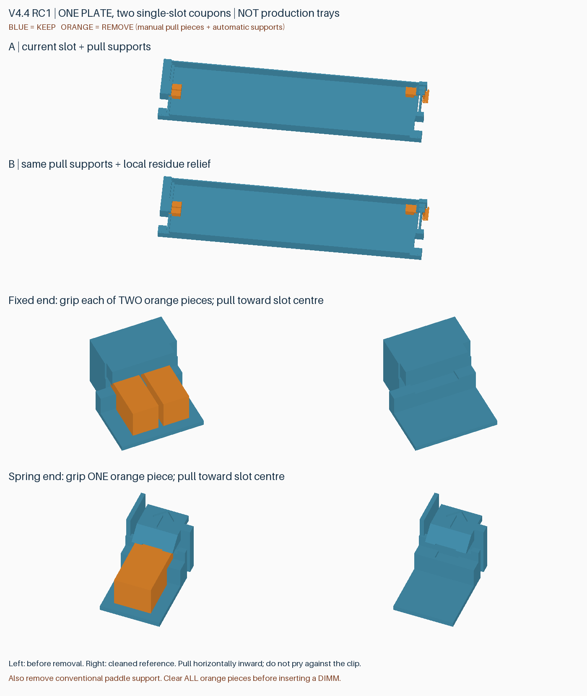

# v4.4 RC1：一盘支撑拆除与残留容忍度对比试件

**仅用于试验，不是整盒发行版，也不是可装进外壳的正式托盘。当前完整版本仍是 v4.3。** 用户反馈 v4.3 整体效果不错，但 DIMM 两端内嵌支撑难拆、残留影响入槽。本盘两个完整长度单槽 A/B，可直接用同一条实际内存比较，不需要再打印整个盒子。

## 打印入口

下载 [试件预发布](https://github.com/helixzz/rdimm-hdd-case/releases/tag/v4.4-rc1-support-trial) 的 `rdimm-v4.4-rc1-support-trial-P2S.zip`。解压后打开唯一的 `rdimm-4.4-rc1-support-trial-plate-0-support-ab-P2S-PLA-Basic.3mf`，选择 **打开为工程**。

P2S、0.4 mm 喷嘴、PLA Basic、0.20 mm 层高参考：**一盘约 31 分 55 秒、13.12 g**，不含拆支撑。按实际耗材重新切片，保持 100% 尺寸、原摆放、层高和支撑配置。PLA Pure 的实际时间及拆除表现可能不同。

**不要关闭全部支撑，也不要删除模型里的可拆支撑块。** 这次可拆块本身是建模出来的牺牲结构，在 Bambu Studio 中会显示为“模型”刀路；拨片外侧仍有常规自动支撑。工程已对手工支撑及槽顶局部屏蔽自动支撑，避免狭缝被重复填满。裸 STL/几何 3MF 不含这些配置，不作为本次打印入口。

## 两件的区别

| 标记 | 支撑 | 槽内结构 | 要比较的事项 |
|---|---|---|---|
| A | 固定端两块、卡簧端一块，均有外露夹持部 | 保留 v4.3 第一槽的接触几何 | 新支撑形状是否更容易夹住、抽出 |
| B | 与 A 相同 | 两端槽口中部的顶面与承托面分别局部避让约 0.3 mm，保留两侧各 1.2 mm 的定位面 | 少量残留是否更不容易挡住内存；锁定是否仍正常 |

两件都保留 3 mm 卡簧根部。没有统一扩大整条 PCB 槽：保留区域的承托面仍为 Z3，固定唇/齿头底面仍为 Z4.6。B 的中部齿头有局部减薄，这是试验变化，尚未确认保持力与耐用性。该方案暂未推广到整盒八个槽位。

## 拆除方式

1. 冷却取下试件，先辨认固定端的两块夹持部，以及卡簧端朝槽内伸出的一块夹持部。每件共有 **三块手工支撑**，此外还有拨片外侧的自动支撑。
2. 用平口钳或镊子夹住外露部分，沿槽长度方向**朝槽中央水平拉出**，固定端两块分别处理。必要时轻微晃动夹持块松开，不用薄齿头、弹臂或固定唇作撬点。
3. 清除拨片外侧的自动支撑。保留长弹臂、齿头、底部承托面、3 mm 实心基座；不要因为它们与支撑同色而剪掉。
4. 确认三块手工支撑均移除后，再装 DIMM。图中橙色仅用于说明，单色打印时不会自动变色。

若夹持部断裂、支撑仍牢固粘住，或薄唇随之变形，停止加力并记录位置。这正是试件需要验证的失败模式，不表示支撑已经保证能整块拔出。

## 试完反馈什么

请分别记录 A/B：

- 固定端两块、卡簧端一块：能否顺利夹住和抽出，是否断成残块，是否必须向槽内撬。
- 拆到通常能接受的清洁程度后，DIMM 能否顺畅放入和取出。不要故意留下大块支撑后强压内存。
- B 是否比 A 更容易入槽；放入后卡簧是否回位、是否增加晃动。先在桌面轻轻尝试抬起取出，不用真实内存做跌落测试。
- 固定唇底面是否明显下垂、夹持部是否牵伤保留结构。

优先用同一条无散热片 DDR5 RDIMM、同一耗材和工艺比较。并非兼容其他板形的通用内存槽。

## 已完成的检查与限制

- 两个试件及六块手工支撑均为闭合网格；每块支撑朝槽中央平移 0–8 mm 的 33 个位置均无几何干涉，共 198 个位置。
- 两种参考长度、两种 PCB 厚度的 DIMM 静态、抬起/抽出路径检查通过；上方限位仍存在。这不是强度或实际手感测试。
- 最终工程切片无警告，58 个局部支撑屏蔽面保存后保持。刀路抽样检查：支撑与保留结构最小间隙 0.2 mm；B 的中部凹槽间隙更大，拨片自动支撑仍保留。
- 在固定端非定位区域模拟一个 0.2 mm 高残留凸点，A 与参考内存相交，B 不相交。只代表该处该种残留，不表示所有残留都可以忽略。
- **未验证：悬空面实际成形、界面粘接、夹持部强度、支撑抽出力、锁定力与寿命。** 支撑与模型同材质，不能从切片间隙推断一定容易拆。

[几何与试件布局](../models/v4.4-rc1-support-trial/verification.json) · [切片记录](reports/v4.4-rc1-support-trial-slicing.json) · [刀路与残留模拟](reports/v4.4-rc1-support-trial-toolpath.json)

源码 `build_support_trial_v4_4.py`、`prepare_support_trial_v4_4.py`、`audit_support_trial_v4_4.py`、`preview_support_trial_v4_4.py` 可重建本试验。v4.3 的源码快照、已发布附件及模型均不覆盖。A/B 清理后的参考 STL 仅用于查看，不能单独替代本次配置工程打印。
