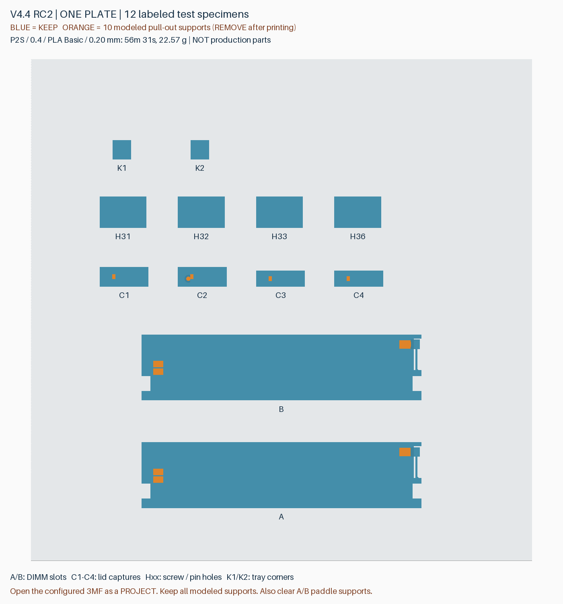
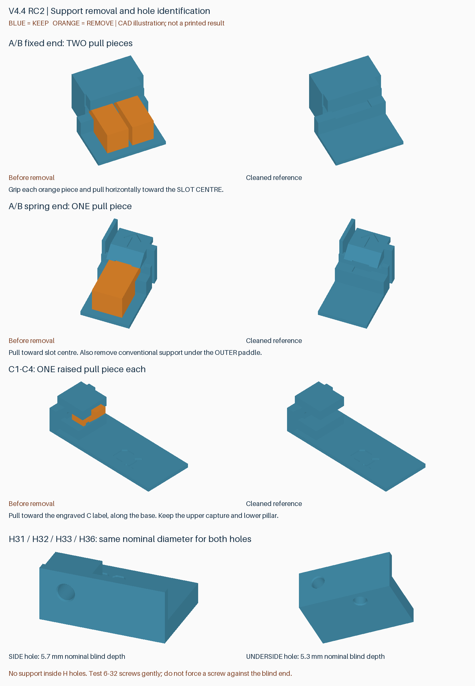

# v4.4 RC2：一盘综合改进试件

将 DIMM 槽内支撑、顶盖限位下的支撑、安装孔和托盘角部清理合在 **一盘、12 个带编号试件**中。它们是局部验证件，不能替代完整托盘或外壳；完整套件仍为 v4.3。

## 打印

下载 [v4.4-rc2-combined-trial](https://github.com/helixzz/rdimm-hdd-case/releases/tag/v4.4-rc2-combined-trial) 中的 `rdimm-v4.4-rc2-combined-trial-P2S.zip`。解压后将唯一的 `rdimm-4.4-rc2-combined-trial-plate-0-combined-P2S-PLA-Basic.3mf` **打开为工程**。

P2S、0.4 mm 喷嘴、PLA Basic、0.20 mm 层高参考：**56 分 31 秒，22.57 g**，不含拆支撑时间。使用实际耗材重新切片，保留 100% 尺寸、摆放方向和支撑配置。PLA Pure 应选择对应耗材后重新切片，时间与粘接表现可能不同。

**不要关闭全部支撑，也不要删除模型中的可拆块。** 本盘有 10 块建模支撑，在切片中显示为“模型”；A/B 外侧拨片下还需要自动支撑。工程对内嵌支撑区域和安装孔做了局部屏蔽，裸 STL / 几何 3MF 不包含这些设置，不作为打印入口。

## 每个编号测试什么

| 标记 | 改进与对照 | 需要观察 |
|---|---|---|
| A | 保留原槽接触面，固定端两块、卡簧端一块可夹取支撑 | 是否容易抽出、会不会断在里面 |
| B | 与 A 相同的支撑；槽中部承托面和顶面局部避让约 0.3 mm，保留两侧各 1.2 mm 定位面 | 少量清理残留是否更不挡 DIMM；卡簧回位、保持力是否正常 |
| C1–C4 | 从外壳四个限位位置提取的槽口，支撑改为窄接触条与凸起夹持头 | 是否能朝内抽出，避免用螺丝刀伸入槽内反复撬 |
| H31 / H32 / H33 | 3.1 / 3.2 / 3.3 mm 标称孔径，每件各有一个底孔、一个侧孔，入口小倒角 | 标准硬盘螺丝能否形成有效固定，同时检查实际托架销兼容性 |
| H36 | 原 3.6 mm 孔径对照，底孔和侧孔各一个 | 用同一颗螺丝、同一个定位销比较 |
| K1 / K2 | 托盘两个相关角部局部件；去掉废弃薄片及下面的细底条，保留主要边框 | 是否还有细条残留或容易碰断的碎片 |

A/B 与上一盘 RC1 的几何相同，方便沿用对照。B 的齿头中部有局部减薄，实际保持力与寿命尚待验证。K1/K2 对应此前确认的两处薄片位置，并非把托盘所有导向和边框都删掉；本轮处理是清除废弃残片，不是加厚残片。

C1/C2 对应较长的槽口，C3/C4 对应较短的槽口。为节省打印，柱子下段截短，并加上编号底座；槽口形状、打印朝向和层高相位保留。它们用于拆支撑测试，不能验证整盒刚性或盖板装配手感。

## 拆支撑

图中蓝色保留、橙色拆除，颜色仅用于说明，单色打印不会自动变色。

1. **A/B：**每件固定端两块、卡簧端一块，夹住外露部分，沿槽长度方向朝槽中央水平拉出。固定端两块分别处理，不把薄唇或卡簧当撬点。另拆除外侧拨片下的自动支撑，再装 DIMM。
2. **C1–C4：**夹住槽外凸起的支撑头，朝刻有 C 编号的底座方向水平抽出。上方限位唇和下方构造柱都要保留；不要掰上方限位唇。
3. **H 系列：**孔内没有设计支撑，不需要挑出“填充柱”。观察孔顶有无下垂和堵孔；如果螺丝提前顶住，应区分孔顶下垂、孔径过小和螺丝过长。
4. **K1/K2：**主要看薄片和底条所在位置是否干净。保留余下的主要边框，不需要撬掉任何蓝色部分。

如果夹持头断裂或上方薄唇跟着变形，停止加力并记录编号；本盘就是验证这些失败模式，切片通过不代表一定能整块轻松抽出。

## 安装孔比较

使用 **6-32 UNC 的常规 3.5 寸硬盘螺丝，不是 M3**。H31/H32/H33/H36 表示设计孔径，实际打印孔径会受工艺影响。每件底孔标称盲深 5.3 mm、侧孔 5.7 mm；试印孔顶的下垂可能缩短可用深度。

建议先用 H36 对照，再由 H33、H32 到 H31 逐步比较。使用同一颗短螺丝、相近的旋入深度，避免顶住盲孔底部；记录哪一档可以适度用力旋入、退出，且无开裂或滑牙。塑料中的固定可能涉及螺纹成形和磨损，不能只按材料弹性推断。若有免工具托架，再比较其定位销能否正常进出。

试件方便比较孔径，周围刚度及受力方式不等同于完整外壳，不能据此直接给出拧紧扭矩或抗拔载荷。请反馈侧孔和底孔各自最合适的编号，二者可以选不同孔径。

## 已做检查

- 12 个保留件及 10 块建模支撑均为闭合、单连通网格，整盘留有边界和零件间距。
- A/B 支撑 198 个抽出位置检查通过；C 支撑在完整外壳及局部试件上各检查 204 个抽出位置，无刚体相交。
- 托盘去掉薄片及底条后，完整装配的 512 个 DIMM 位姿、242 个带内存托盘入盒位姿、1520 个底层释放位姿及 132 个盖板位姿检查通过。
- Bambu Studio 最终工程切片无警告；829 个局部支撑屏蔽面保存后保留，网格和全局打印设置未被屏蔽操作改变。
- 最终刀路抽样检查的支撑上下间隙至少 0.2 mm；C 槽没有重复自动支撑，夹持头与支撑主体的名义挤出连接存在；八个安装孔无支撑刀路，托盘角部指定区域无底条残留刀路（该检查排除首层）。

这是几何和名义挤出路径检查，实际桥接下垂、界面粘接、拆除力、卡簧保持力、螺丝手感仍需本次试印确认。无更改已发布的 v4.3 或 RC1 文件；试验结果确定后，再整合完整新版。

请反馈：**A/B 哪个更容易清理和装内存；C1–C4 能否直接夹住抽出；H 系列侧孔/底孔各选哪档；K1/K2 是否还有细条。**

[几何与布局记录](../models/v4.4-rc2-combined-trial/verification.json) · [切片记录](reports/v4.4-rc2-combined-trial-slicing.json) · [刀路检查](reports/v4.4-rc2-combined-trial-toolpath.json)

重建脚本：`build_combined_trial_v4_4_rc2.py`、`prepare_combined_trial_v4_4_rc2.py`、`audit_combined_trial_v4_4_rc2.py`、`preview_combined_trial_v4_4_rc2.py`、`package_combined_trial_v4_4_rc2.py`。
