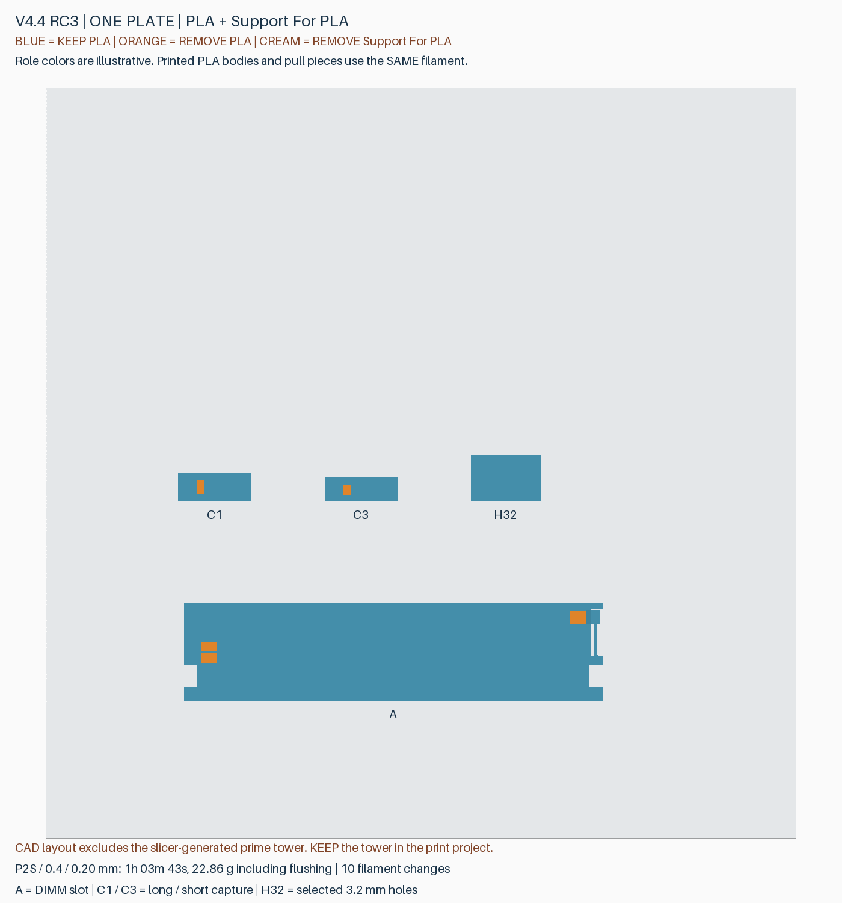
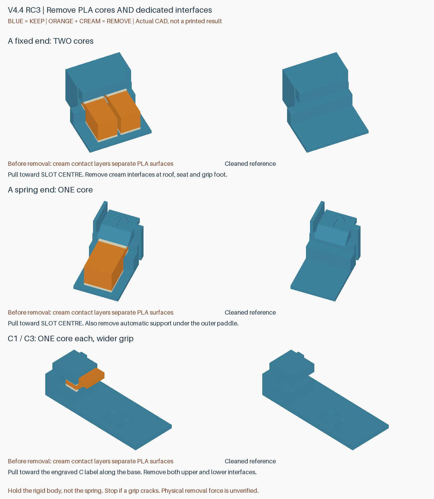

# v4.4 RC3：Support for PLA 双材料测试盘

本版针对单材料支撑难拆、抽取把手先断的问题，提供 **一盘四个试件**：A 单槽 DIMM、C1 长扣槽、C3 短扣槽、H32 安装孔。它是有固定标签和完整配置的试验版，不是完整外壳或替换托盘。当前完整套件仍为 v4.3；双材料拆除效果通过实物确认后，再应用到完整套件。

## 下载及打印

从 [Release](https://github.com/helixzz/rdimm-hdd-case/releases/tag/v4.4-rc3-dual-trial) 下载 `rdimm-v4.4-rc3-dual-trial-P2S-AMS2Pro.zip`。解压后，将唯一的 `rdimm-4.4-rc3-dual-trial-plate-0-dual-P2S-AMS2Pro-PLA-SupportForPLA.3mf` **作为工程打开**，不要只导入几何、拆分后自动落盘，也不要删除其中看似重复的薄片。

| 配置 | 本版设定 |
|---|---|
| 打印机 | Bambu Lab P2S，0.4 mm 喷嘴，AMS 2 Pro |
| 层高 | 0.20 mm，100% 原尺寸，按层打印 |
| 耗材 1 | Bambu PLA Basic：保留结构、支撑主体和把手 |
| 耗材 2 | **Bambu Support For PLA**：可拆接触层；预设 ID GFS02 |
| 参考耗时 | **1 小时 03 分 43 秒**，10 次换料 |
| 参考用料 | PLA 16.95 g + Support For PLA 5.91 g = **22.86 g**，包含冲刷和擦料塔 |

上述数据来自 Bambu Studio 2.8.2.61 的切片估计，不是实测时长。手工建模的界面本体只消耗约 0.049 g 专用材料，总用料主要还包含换料消耗与自动支撑界面。此盘目标是降低拆除难度，不代表双材料打印更快。

发送前，将工程的逻辑耗材 **1 映射到实际 PLA Basic 槽、2 映射到实际 Support for PLA 槽**；不要求一定占用 AMS 的物理 1、2 号槽。不要把两者映射为同一种 PLA，也不要换成 Support for PLA/PETG 或 Support W 预设。若实际使用 PLA Pure，请选择对应实际耗材并重新切片，时间和路径可能变化，本报告对应 PLA Basic。

保留擦料塔、两方向各 800 mm³ 的冲刷量，以及禁止冲刷进模型、填充和支撑的设置。800 mm³ 是这次试验保守采用的起点，未经混料强度实测，并非厂商保证值。此盘尚不以缩减冲刷量省时；发送前重新切片，按“耗材”着色检查：主体均为耗材 1，耗材 2 仅出现在接触界面及相关自动支撑界面、擦料塔。

## 与单材料测试盘的差异

- 5 个可拆 PLA 支撑主体与保留结构之间，明确建立 **17 个独立的 Support For PLA 接触薄片**，上、下接触面及把手底脚均按实际位置处理。只改切片器的“支撑界面耗材”不会改变旧版手工建模的 PLA 支撑，所以本版同时修改了模型分件和逐件耗材分配。
- A 保留原有 DIMM 接触位置，暂不采用 B 的额外让位，以观察更易剥离的界面是否已足够解决残留阻碍问题。外侧拨片仍有自动支撑，其界面也使用耗材 2。
- C1/C3 的把手宽度由 2.4 mm 分别增至 4.8/3.4 mm，并增大握持端、对可拆件指定 100% 填充。保留扣槽本身的几何；实际把手抗断能力仍需试印。
- 安装孔候选已经收敛为 **3.2 mm**。H32 的侧孔和底孔均为该公称孔径，保留原孔深和入口倒角，并屏蔽孔内支撑。后续完整外壳将以 3.2 mm 为默认值；本次不会回写 v4.3 或旧版下载文件，也不表示已经交付了 3.2 mm 的完整外壳。

Support for PLA 是界面耗材，拆除时仍需取下支撑，不能把它当成水溶材料。使用依据及产品区分见 [Bambu 官方产品页](https://eu.store.bambulab.com/en-ch/products/support-for-pla-petg)；工程使用本地官方 **Support For PLA @BBL P2S** 预设，不混用该页其他型号的预设。

## 打印后如何处理

图中蓝色保留；橙色 PLA 支撑主体和米白色专用接触薄片都要去除。橙色只是示意图的角色颜色，实际打印时支撑主体与保留结构使用同一卷 PLA。

1. 冷却并取下试件。A 固定端两件、弹簧端一件，沿槽向中间抽取；先扶稳刚性边框，不用弹簧承受拆除力。
2. C1/C3 各一件，沿底板朝刻字一侧抽出；清理支撑上下两面的界面薄片。若把手开始开裂，停止继续硬拉，记录是哪一件。
3. A 外侧拨片下的自动支撑也需清除。对照右侧清理后形状，确认槽内和弹簧下方没有薄片残留，再装入 DIMM 检查插拔与回弹。
4. H32 无需挖孔内支撑。普通硬盘螺丝使用 6-32 UNC，勿用 M3 代替；不得拧到盲孔底部。孔径的选择不等于任意托架销钉或螺丝长度都适配。

反馈重点：A/C 是否能直接抽取、界面是否留在槽内、把手是否完好、DIMM 放置是否更顺畅且保持正常固定。无需重复打印 RC2 的全部孔径候选。

## 已检查与未验证的范围

每个独立分件均封闭、方向一致且单连通；保留件、PLA 支撑和专用界面没有体积重叠，5 个支撑主体共 165 个名义抽取位姿通过检查。配置重存后，几何顶点舍入低于 0.000011 mm，26 个分件的材料分配及 442 个支撑屏蔽面保留。

实际切片无警告；逐处检查 17 个建模界面的专用材料路径、上下 PLA 接触、自动支撑界面材料、AMS 换料指令，以及 H32 两孔内无支撑。接触层采用紧贴设计；实际线条的圆边、接缝和入口斜面使局部并非整面零间隙，检查报告保留这些覆盖率和间隙范围。以上是名义刀路检查，**不模拟混料、粘接、收缩或拆除力，也不等于通过实物测试**。

复现入口为 `build_dual_trial_v4_4_rc3.py`、`prepare_dual_trial_v4_4_rc3.py`、`audit_dual_trial_v4_4_rc3.py`；下载包内含几何检查、切片与路径报告、清单及校验值，不含直接发往打印机的 G-code。
