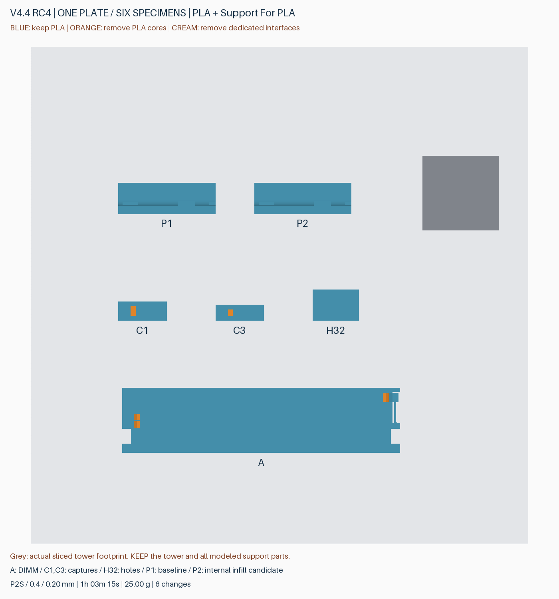
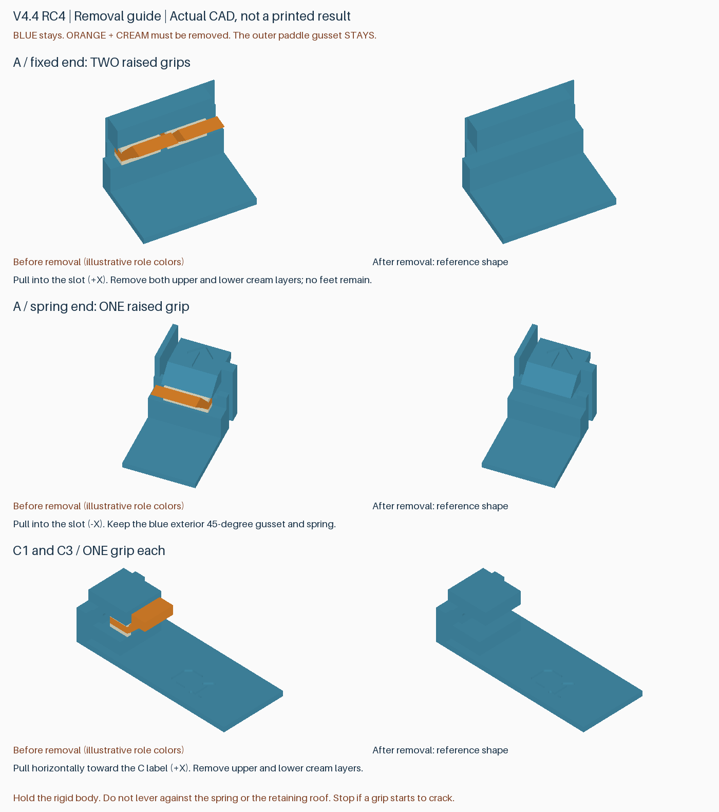

# v4.4 RC4：完整产品研究的实物验证盘

**一盘六件，P2S / 0.4 mm / 0.20 mm / AMS 2 Pro，PLA Basic＋Support for PLA。**

参考 **1 小时 03 分 15 秒，6 次换料**；PLA **21.45 g**＋Support for PLA **3.55 g**，合计 **25.00 g**，包含冲刷及擦料塔。时间来自 Bambu Studio 2.8.2.61 切片估算，不含取件和清理。

下载本版本的 `rdimm-v4.4-rc4-product-trial-P2S-AMS2Pro.zip`，解压后打开其中唯一的 `.3mf`，选择 **作为工程打开**。完整生产版本仍是 v4.3；本盘用于复核已经完成整套研究的候选，不是替换外壳或托盘。

## 打印前

1. 材料 1 对应 **Bambu PLA Basic**，材料 2 对应 **Bambu Support For PLA**（不是 Support for PLA/PETG）。发送时映射到实际 AMS 槽位。专用支撑料未到货时请先保存工程，不要将材料 2 也映射成普通 PLA。
2. 保持 **100% 比例、按层打印、Textured PEI Plate**，保留排版、擦料塔和全部零件。不要拆分组件、合并成 STL 或统一分配成一种材料。
3. P2 已设置独立对象参数；P1 及其他试件保持基准参数，无需手动切换配置。
4. **自动支撑界面显示材料 1（PLA）是有意设置。** 难拆位置的 14 个专用接触体已作为模型部件分配材料 2；不要把全局自动界面改成材料 2，否则会增加不必要的换料。

保留普通擦料塔、两方向各 800 mm³ 冲刷，关闭冲刷到成品/填充/支撑。这是沿用的试验设置，实际换料残留与结合强度仍需观察。

## 六个试件

| 标记 | 完整产品对应位置 | 验证重点 |
|---|---|---|
| **A** | 上层托盘的一个完整 DIMM 槽，保留 3 mm 卡簧基座和原接触尺寸 | 三个抬高的支撑把手，取消底脚，上下专用接触层；拨片下方增加 45° 斜撑，不再生成此处额外自动支撑；验证残留、DIMM 装卸和回弹 |
| **C1** | 较长的顶盖限位结构，保持功能截面、缩短下方立柱 | 加宽把手＋上下专用接触层，水平抽出是否顺畅，槽内是否干净 |
| **C3** | 较短的顶盖限位结构 | 与 C1 相同；短结构单独验证 |
| **H32** | 标准孔深的侧孔与底部盲孔，各一个 | 已选定 **3.2 mm** 孔径、孔内无支撑；检查孔顶、有效深度及硬盘螺丝/免工具销钉配合 |
| **P1** | 实际外壳底板＋侧壁圆弧/加强棱的 50 × 16 × 12 mm 截段 | 基准：内部实心线宽 0.42 mm、稀疏线宽 0.45 mm、不合并填充层 |
| **P2** | 与 P1 相同的截段，仅刻字不同 | 候选：内部实心/稀疏线宽 0.50 mm，合并部分稀疏填充层；比较表面和局部刚度 |

P1/P2 保持原 Z 高度和打印朝向，几何来自完整研究外壳 X35–85 / Y0–16 / Z0–12 mm 区域；除刻字外一致。实际刀路确认 P2 出现 0.4 mm 稀疏填充层，P1 为 0.2 mm；两者顶面仍为 0.42 mm 线宽、0.2 mm 层厚，外墙参数不变。

未加入尚未入选的扩大残留凹槽、激进减薄、减少冲刷或无擦料塔方案。小试件不能验证四张托盘满盘时的翘曲和粘附。

## 支撑怎么拆

冷却后取件。下图为实际 CAD 对照，**蓝色保留；橙色 PLA 芯和米白色专用接触层去除**。橙色和蓝色仅为示意，实际二者使用同一种 PLA。

- **A 固定端两个把手、卡簧端一个把手**：扶住刚性框架，逐个水平向 DIMM 槽中心拉。去除上下薄接触层。卡簧头、外侧斜撑和基座均保留。
- **C1/C3 各一个把手**：扶住底座，向刻有 C 字样的一侧水平拉出。上下接触层均需去除；不要用顶盖限位唇当撬动支点。
- **H32**：孔内没有设计支撑，不应有需要拔出的实心塞；检查桥接垂丝。先记录原状，再尝试螺丝/销钉。
- **P1/P2**：不用拆内部填充。先比较表面，再用相近的小幅手力比较弯曲感即可，不需要掰断。

若把手先变白、裂开或断裂，停止加力并记录位置，再判断是否需要镊子辅助。装入 DIMM 前清除可脱落残渣，确认卡簧可活动；不要用 DIMM 挤压未拆干净的支撑。

## 打印后反馈

| 试件 | 建议记录 |
|---|---|
| A / C1 / C3 | 能否徒手抽出；是否需镊子/撬动；把手是否完整；清理耗时；上下界面有无残留 |
| A | DIMM 是否自然入槽、两端元件避让、卡簧回弹和固定效果；在软垫上方轻轻翻转检查是否固定，不做跌落测试 |
| H32 | 侧孔/底孔是否直接可用、孔顶垂丝、螺丝咬合或过紧、免工具销钉配合 |
| P1 与 P2 | 顶面凹陷/透出填充纹、侧面横纹、圆弧过渡；P2 是否明显更软或更易裂 |

优先验证 A/C 的后处理。若 P2 表面或刚度变差，即使更快也不采用；完整产品该工艺候选仅约省 10 分钟。小截面只能筛选明显问题，不能证明整盒刚度、长跨度顶面、满盘热变形或运输保护能力。

## 已完成的检查

- 六件及独立支撑体均为连通封闭网格；五个支撑芯共 **165 个水平抽出位姿**通过，无材料实体重叠。
- 对应完整产品的 512 个 DIMM、242 个托盘进入、1,520 个底层拆卸、132 个盖板位姿检查通过。
- 导入后全部三角形对应保留，最大顶点舍入约 **0.0000108 mm**；436 个局部禁支撑标记保留。
- **14 个专用接触体**逐一核对实际材料及上下接触区域；卡簧自由段不被填充；H32 两孔无自动支撑，外侧拨片下无额外自动支撑。
- P1/P2 参数和实际刀路差异通过；擦料塔与模型平面包围盒最小间距约 **36.53 mm**；切片无警告。这些不是粘接力、热翘曲、疲劳或跌落仿真。

研究依据：[整套优化比较](full-product-optimization.zh-CN.md)。本版通过实物后再整合下一完整版本，不覆盖既有发布文件。
