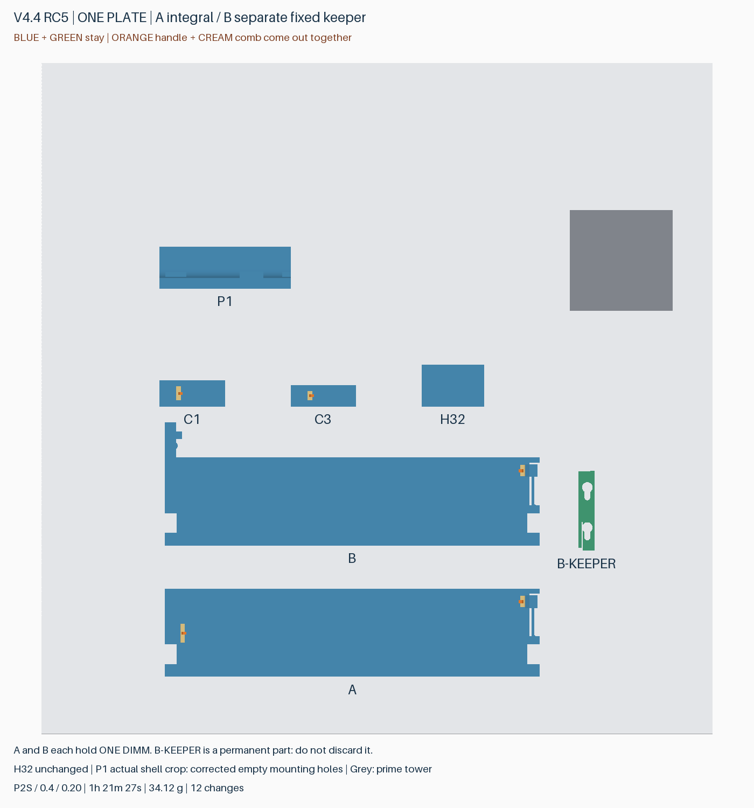
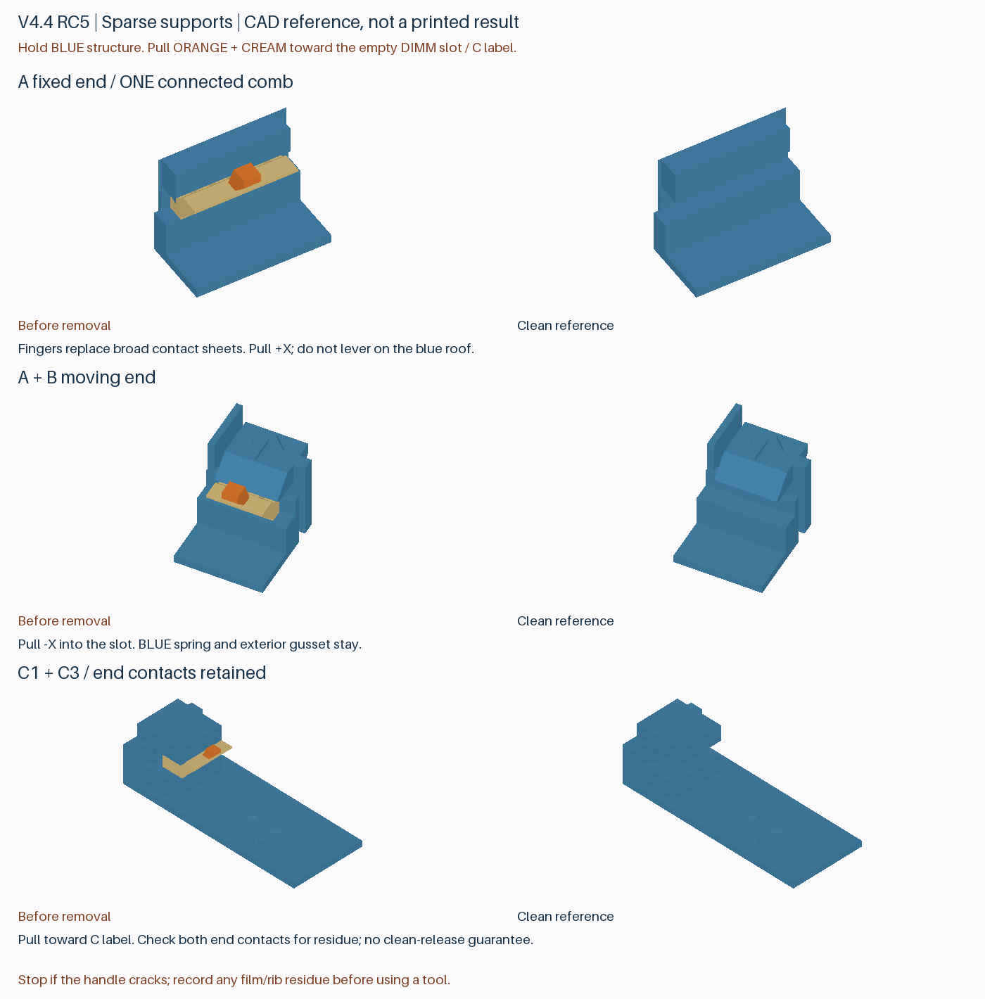
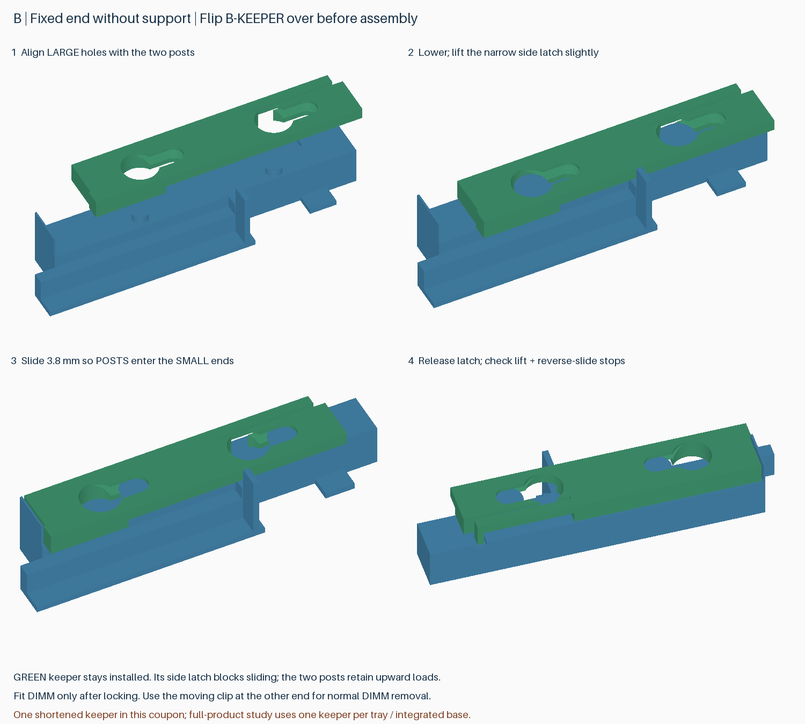

# v4.4 RC5：一体支撑与分体压条对比盘

一盘打印两种 DIMM 固定结构，比较拆支撑、装配和实际保持效果。本版为局部试件，**不能作为完整托盘装进旧外壳**。最新完整版本仍是 v4.3，旧版附件保持不变。

## 下载与打印

[下载版本包](https://github.com/helixzz/rdimm-hdd-case/releases/tag/v4.4-rc5-peel-trial)，解压后只打开其中的 **rdimm-4.4-rc5-peel-trial-plate-0-P2S-AMS2Pro.3mf**，选择打开为工程。已经排成一盘；不要用仓库的无配置几何 3MF 替代。

- P2S、0.4 mm 喷嘴、0.20 mm 层高、纹理 PEI 板，按层打印。
- 逻辑材料 1：Bambu PLA Basic；材料 2：**Bambu Support For PLA / GFS02**。发送前映射到实际 AMS 2 Pro 槽位。本工程不是 Support for PLA/PETG 配方。
- 保留对象/零件材料、局部禁支撑、正常擦料塔和冲刷配置。梳齿是显式建模的材料 2 零件，不会在“自动支撑”类别里显示。
- 不要把所有自动支撑界面全局改成材料 2；其余自动支撑采用 PLA 和已有间隙。不要启用冲刷进功能件、填充或支撑。
- 参考时间约 **1 小时 21 分钟**，**12 次换料**，总耗材约 **34.1 g**，包括冲刷与擦料塔。精确值见随包切片报告；实际时间与机器准备、耗材状态有关。

图中颜色用来区分功能，不要求实际使用四种颜色。整盘仅两种材料。**B-KEEPER 是永久压条，不是要扔掉的支撑。**

## 各件怎么测试

| 标记 | 本次改变 | 重点记录 |
|---|---|---|
| A | 一体固定端；专用材料梳齿连成整体，PLA 把手通过几何锁键带动梳齿 | 固定端/活动端分别能否徒手取出；是否仍残留薄层；把手是否先断 |
| B + B-KEEPER | 固定端改为独立 PLA 压条，倒置打印后装配；活动端与 A 相同 | 压条能否无工具安装；是否松动、翘起；DIMM 是否易装且留在槽内 |
| C1、C3 | 长/短顶盖限位结构，支撑改成连体梳齿与锁键把手 | 侧向取出难度、残留、限位表面完整性 |
| H32 | 保留已通过试验的 3.2 mm 侧孔/底孔 | 作为孔径、孔顶质量的对照 |
| P1 | 实际外壳截面；补上之前漏掉的孔内禁支撑 | 两个安装孔均应没有自动支撑；观察孔顶与底板过渡 |

H32 和 P1 的孔内已逐一核对实际刀路，没有自动支撑。P1 不是整个外壳的平整度或强度测试。

## A、C 支撑拆除

完全冷却后，扶住刚性框架，握住伸出的 PLA 把手，沿槽的开口方向向外拉出；A 是朝 DIMM 槽中央，C 是远离限位顶棚向敞开侧。可以小幅侧向松动，但不要拿活动卡簧或顶棚当支点猛撬。取出的应是把手和相连梳齿整体。

DIMM 支撑采用稀疏接触齿；C 保留上轮端部接触位置，没有一律扩大跨度。连接脊负责带出专用材料，但能否避免残留仍需实测。若再次发生把手断裂或薄层残留，请先记录位置，再清理；不能用切片连通性替代实际剥离结果。

## B 压条装配

1. 拿起 B-KEEPER，翻至压住 PCB 的短齿朝槽内、蘑菇形安装柱能进入大孔的方向。
2. 将两个大孔对准 B 上的两根安装柱，放到底。
3. 轻抬压条外侧的小止退舌片，沿长条方向滑动 **3.8 mm**，让柱头进入窄槽；松手使止退齿落入凹位。只需轻抬到能滑动，不要大幅掰折。
4. 轻提压条确认没有脱开，再按原方式从另一端拨开活动卡簧，装入 DIMM。日常取放内存无需拆这根压条。

若需拆压条，先取出 DIMM，轻抬止退舌片、反向滑回大孔位置后抬出。B 试件左端的延长底座是单槽试验的安装区域，不代表完整托盘会向外加长。

## 已检查与尚待验证

已检查完整 8 槽盒子的 DIMM 装卸、托盘放入、顶盖动作，以及分体压条装卸路径；两种完整候选的所有 10 个安装孔、8 条活动卡簧通道和相关材料刀路也已核对。本盘 5 组支撑的打印刀路线宽/层间连接与把手锁键、4 个孔的禁支撑、B 固定端及压条无自动支撑均通过检查。

这些检查不能预测粘接力、残留、翘曲、装配手感、疲劳或跌落保持能力。请分别反馈 A 固定端/活动端、C1/C3 的拆除和残留，以及 B 的装配难度和保持效果。先空件装配，确认没有碎屑或干涉后再放 DIMM。

本轮优先比较后处理方式，**并非提速版**。完整候选 A 约 4 小时 54 分，B 约 4 小时 55 分，均 32 次换料，慢于旧选择性双材料候选的约 4 小时 10 分。B 只消除了固定端狭槽支撑，其余结构仍需换料；详细成本与局限见 [完整结构比较](rc5-structure-study.zh-CN.md)。
