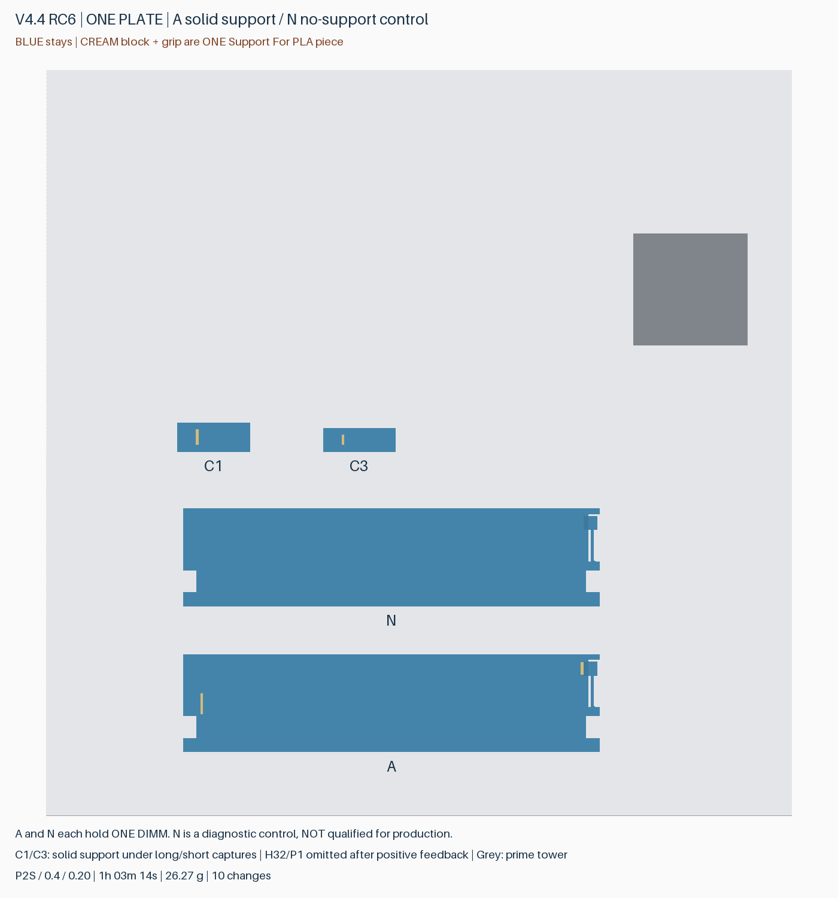
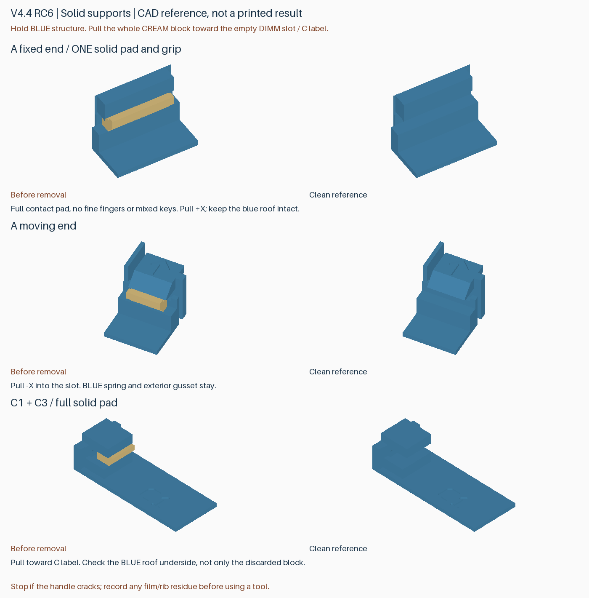

# v4.4 RC6：整块专用支撑与无支撑对照

RC5 的 DIMM 支撑在打印完成、尚未拆除时就出现散丝。RC6 取消细梳齿和 PLA/Support 锁键，把**可拆支撑体及把手全部做成连续的 Support For PLA 实体**；永久零件仍为普通 PLA。独立永久压条不再进入本轮试验。

本版只有一张局部测试盘，不是完整生产托盘。最新完整版本仍为 v4.3。

## 打印入口

[下载版本 ZIP](https://github.com/helixzz/rdimm-hdd-case/releases/tag/v4.4-rc6-solid-trial)，解压后以工程方式打开唯一的 **rdimm-4.4-rc6-solid-trial-plate-0-P2S-AMS2Pro.3mf**。

- P2S，0.4 mm 喷嘴，0.20 mm 层高，纹理 PEI 板，按层打印。
- 材料 1：Bambu PLA Basic；材料 2：**Bambu Support For PLA / GFS02**。映射到实际 AMS 2 Pro 槽位；不是 Support for PLA/PETG。
- 保留零件材料、禁支撑涂色和正常擦料塔，不要全局关闭支撑，也不要把全部自动支撑界面改成材料 2。专用支撑是显式建模的零件，切片中按材料识别。
- 双向冲刷仍为 800 mm³，不冲刷到模型、填充或支撑中。本轮没有用减少冲刷量或提高速度换取节省。
- 参考 **1 小时 03 分 14 秒，10 次换料**；PLA **20.49 g**＋Support **5.78 g**，总计 **26.27 g**，包含冲刷及擦料塔。实际专用支撑体约 0.117 g。

图中蓝色是保留件，米黄色是整块取出的专用支撑。只需两种耗材。几何参考 3MF 不含完整工艺，请使用 ZIP 中的已配置工程。

## 这盘验证什么

| 件 | 结构 | 检查内容 |
|---|---|---|
| A | 一体 DIMM 槽，固定端和活动端均使用整块支撑 | 支撑是否完整打印；是否容易整块取出；有无残留；永久齿头底面质量 |
| N | 与 A 相同的永久结构，仅识别字不同，完全不加局部支撑 | 首层悬空能否形成可用底面；是否下垂、缩窄槽口；DIMM 装卸与保持 |
| C1 | 长顶盖限位结构，整块专用支撑及把手 | 拆除难度、支撑残留、保留顶棚底面质量 |
| C3 | 短顶盖限位结构，同样采用整块支撑 | 与 C1 分别记录，避免只看丢弃支撑的表面 |

N 是诊断对照，**不是已经通过的免支撑方案**。同盘换料仍会发生，不可用 N 的打印时间推断独立单材料整套时间。H32、P1 已获得正面反馈，本轮不重复打印；完整研究继续保留 3.2 mm 孔及禁支撑。

## 拆除与记录

1. 冷却后先观察并记录：是否已有散丝、翘起、脱落或缺失的支撑。这样能区分打印失败和拆除断裂。
2. 扶住蓝色刚性框架，抓住米黄色宽把手，向开放的槽内拉出。A 两端都向 DIMM 槽中央拉；C 向标字的一侧拉。把手与支撑同材同体，不需要拆开它们。
3. 不用活动卡簧或顶棚当支点猛撬。如果仍需工具、仍会断裂或留薄层，请按真实体验记录，不必强求徒手。
4. 检查留下的 PLA 顶棚/齿头底面，分别记录拉丝、下垂、坑洞、残料。**支撑容易取下与功能面打印良好是两项不同指标。**
5. N 无支撑可拆。先与 A 比较槽口与底面，清掉松散碎屑后再轻试 DIMM；放不进时不要硬压。检查活动舌片回弹，以及轻微翻转时内存是否会脱出，不进行带真 DIMM 的跌落试验。

建议反馈格式：A 固定端 / A 活动端 / C1 / C3：打印是否完整、徒手或工具、残留、永久面质量；N：底面质量、DIMM 装卸、保持效果。

## 筛选与验证

完整产品先比较了两档实心宽把手：5.0 mm 顶高方案约 **4:51:09 / 32 次换料**；5.4 mm 约 **5:01:54 / 36 次换料**。本盘采用 5.0 mm；比上一轮未发布的高把手整块候选 **5:28:37 / 46 次**少约 37 分 28 秒、14 次换料。仍慢于历史 RC4 选择性界面候选约 4:10:29；没有实际制造时间或质量保证。

整盒 20 组支撑通过取出路径和实际刀路检查；所有 10 个安装孔无支撑，8 条自由弹臂通道无干涉。完整几何验证含 DIMM、载条托盘、底层释放与顶盖动作。此前版本的永久几何没有在本轮被改形。

这次额外检查了支撑**从第一层开始就是单个连续区域，并且逐层连续**。本盘首层与下方 PLA 刀路的投影覆盖约 97.1%–99.9%；规定接触区域的顶面刀路覆盖约 98.9%–100%。覆盖采样间距 0.05 mm，仍有最多 0.40 mm 的局部刀路间隙，不能称为每处绝对贴合。N 的两个接触面首层下方均没有直接承托。

这些是几何和名义挤出刀路检查，不是粘接、喷嘴碰撞、热变形或剥离力仿真。宽底面比细齿更连续，但能否稳定打印、是否更好拆、会不会因接触面积变大而更粘，都需要本轮实测。详见 [整盒比较报告](rc6-solid-study.zh-CN.md)。旧版标签和附件不覆盖。
