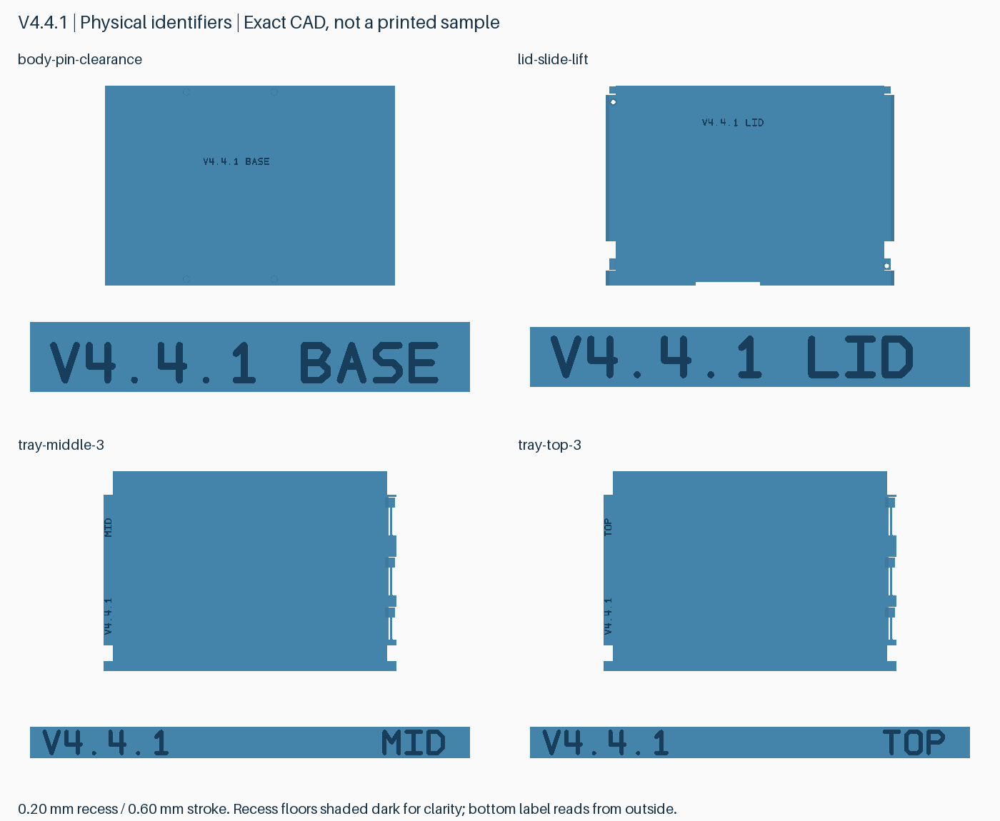
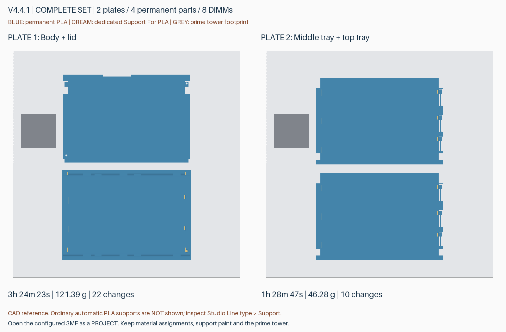
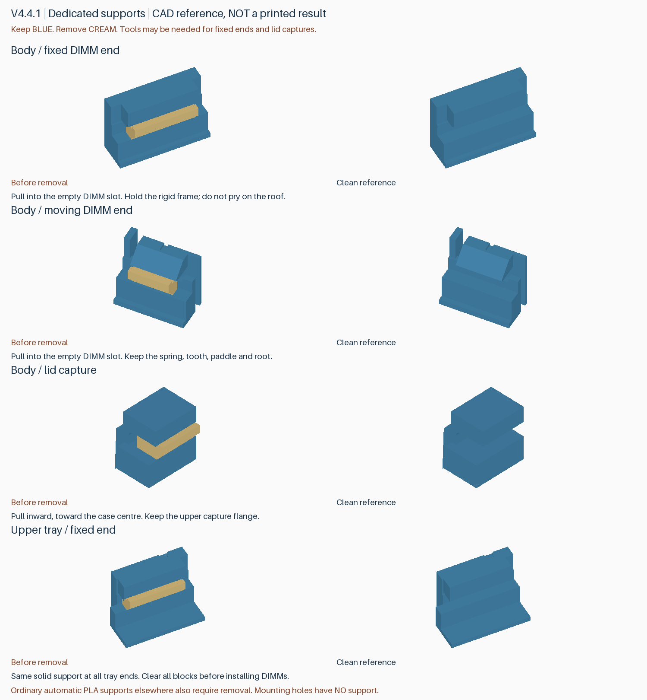

# v4.4.1：每个零件都有实物版本号

完整收纳盒可放 **8 条裸 DDR5 RDIMM**，外形 147×101.6×26 mm，底层两槽、两片活动托盘各三槽。采用 P2S＋AMS 2 Pro、PLA Basic＋Support For PLA 双材料工程。

本版在 v4.4 完整工程上增加可直接打印的版本号与零件代号，便于识别拆散、混放的零件。只增加非配合面的浅凹字，四个永久零件的装配尺寸、20 块专用支撑、3.2 mm 安装孔和日常操作不变。已有 v4.4 零件可以继续配合使用，无需仅因缺少标记而报废。

| 零件 | 实物文字 | 位置 |
|---|---|---|
| 外壳 | `V4.4.1 BASE` | 外壳底面，翻过来可正向阅读 |
| 上盖 | `V4.4.1 LID` | 上盖外侧平面 |
| 中层托盘 | `V4.4.1`、`MID` | 厚端梁顶面 |
| 顶层托盘 | `V4.4.1`、`TOP` | 厚端梁顶面 |

图为真实 CAD 几何示意，字槽底面加深颜色以便辨认；实际仍为同色单材料表面，没有额外换色。字深 **0.20 mm**、笔画宽 **0.60 mm**、字高约 3.6 mm。托盘薄底板、卡簧和 DIMM 接触面不刻字。保留原有操作提示。从本版起，后续版本的所有永久零件均须带完整版本号，试件还须带试件编号；一次性拆除的支撑不标号。

## 下载与打印

从 [v4.4.1 Release](https://github.com/helixzz/rdimm-hdd-case/releases/tag/v4.4.1) 下载 **rdimm-v4.4.1-complete-P2S-AMS2Pro.zip**。这是完整两盘工程，不是补丁文件。解压后以“工程”打开：

- `rdimm-4.4.1-plate-1-pin-clearance-P2S-AMS2Pro.3mf`：外壳＋上盖。
- `rdimm-4.4.1-plate-2-upper-trays-P2S-AMS2Pro.3mf`：中层＋顶层托盘。

| 打印盘 | 参考时间 | 总耗材（含冲刷、擦料塔） | 换料 |
|---|---:|---:|---:|
| 1 外壳＋上盖 | 3 小时 24 分 23 秒 | 121.39 g | 22 次 |
| 2 两片托盘 | 1 小时 28 分 47 秒 | 46.28 g | 10 次 |
| 整套 | **4 小时 53 分 10 秒** | **167.67 g** | **32 次** |

相比 v4.4，整套增加约 **2 分 6 秒**，换料次数不变。以上为 Bambu Studio 切片估算，不含换盘和后处理。P2S、0.4 mm 喷嘴、0.20 mm 层高、纹理 PEI 板、按层打印。材料 1：Bambu PLA Basic；材料 2：**Bambu Support For PLA / GFS02**，不是 Support for PLA/PETG。打印前映射至实际 AMS 槽位。

保留文件中的摆放、材料分配、禁支撑涂色和擦料塔；不要重新拆分模型、自动落底或全局禁用支撑。普通自动支撑仍用 PLA，20 块专用支撑及其把手均为 Support For PLA。双向冲刷各 800 mm³，不冲刷进成品或支撑。包内四份 STL 只供几何参考，不可替代配置工程；无 G-code。

## 拆支撑与装配

图中蓝色保留，米黄色拆除；另有未画出的普通 PLA 自动支撑，可用 Studio 的线类型预览检查。DIMM 两端支撑向空槽内侧取出，顶盖限位支撑向盒子中心取出。扶住刚性框架，不要在卡簧或顶棚上猛撬。固定端和顶盖限位仍可能需要工具；RC6 局部试件实测可一次拆净，不代表完整盒子的每处都能徒手拆除。十个底部/侧面安装孔均已屏蔽孔内支撑。

清理后先检查空盒卡簧回弹与上盖装卸，再安装内存；固定端先就位，拨开活动端装入。上盖沿 OPEN 方向滑动约 8 mm 后抬起，装回反向操作。3 mm 卡簧基座、齿头、PCB 承托台、盖板限位顶棚均保留。

参考兼容对象为三星 M321RAJA0MB2-CCP/CCPKF 一类无散热片 DDR5 RDIMM；不支持马甲条，未验证 DDR4 或其他板形。单侧 SATA 避让深 7.5 mm，无电气连接功能，实际硬盘槽/背板先用空盒验证。普通 PLA 无 ESD 防护认证。

## 验证范围与重建

- 几何标记均完整落在实体面上，字槽后方保留至少：外壳 2 mm、上盖/托盘 1 mm 的实体；四件保持连通、水密，文字不凸出外形。标记仅减料，其余结构沿用 v4.4 已检查的几何与装卸路径。
- 两盘重新切片无警告，配置导入网格、20 块专用支撑逐层连续及接触覆盖、10 孔无支撑、8 条 DIMM 弹臂通道、外壳锁扣自由通道重新通过检查。
- 186 个托盘卡簧根部层连接、8 处齿头间隙和 8 处普通支撑区域复核通过。六处文字区域的字槽内部采样无名义挤出覆盖、无自动支撑填入；版本号未在切片中被填平。
- 实物刻字清晰度受首层、平台纹理和耗材影响，尚待打印确认；完整双材料套件装配、抗冲击和疲劳仍未完成实物验证。数值检查不能证明这些性能。

源码入口：`build_v4_4_1.py` 生成几何；`manage_v4_4_1.py prepare --bambu <Studio路径> --profiles <官方BBL配置目录>` 配置并切片；依次运行 `manage_v4_4_1.py audit`、`manage_v4_4_1.py preview`。公开报告位于 `docs/reports/v4.4.1-*`。在干净 `v4.4.1` 标签提交运行 `manage_v4_4_1.py package` 生成完整包和 SHA-256。旧 v4.4 及其他已发布标签、附件保持不变。
