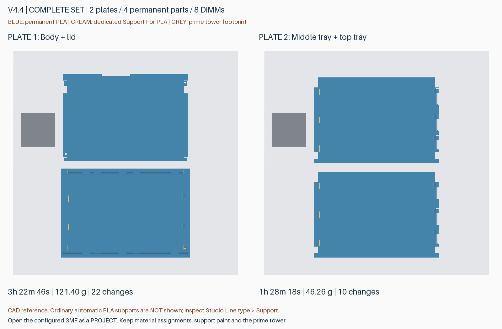
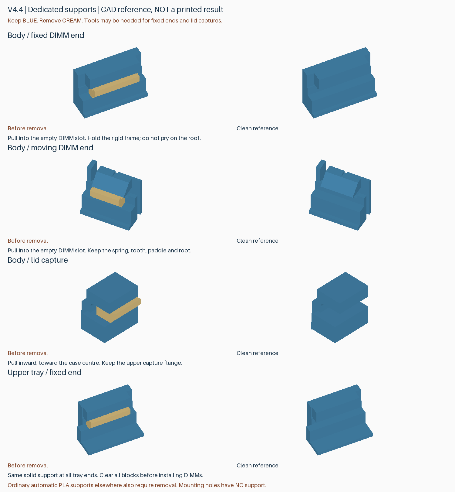

# v4.4：完整双材料打印工程

收纳 **8 条无散热片 DDR5 RDIMM**，外形 **147×101.6×26 mm**。底层两槽与外壳一体，两片活动托盘各放三条，滑动解锁上盖后逐层取放。日常操作不依赖螺丝；打印完成后的支撑清理仍可能需要工具。

本版将 RC6 实测能一次拆净的整块 Support For PLA 支撑整合到完整产品，共 **20 块**：16 块 DIMM 两端支撑、4 块顶盖限位支撑。支撑体与把手为同一专用材料，不再采用细梳齿、异材锁键或独立永久压条。不采用实测下垂、阻挡 DIMM 的 N 免支撑结构。

## 下载与打印

从 [v4.4 Release](https://github.com/helixzz/rdimm-hdd-case/releases/tag/v4.4) 下载 **rdimm-v4.4-complete-P2S-AMS2Pro.zip**。解压后分别以“工程”打开两份已配置 3MF，不要只导入为几何模型。

| 打印盘 | 内容 | 参考时间 | 总耗材 | 换料 |
|---|---|---:|---:|---:|
| 1 | 外壳＋盖板 | 3 小时 22 分 46 秒 | 121.40 g | 22 次 |
| 2 | 中层三槽托盘＋顶层三槽托盘 | 1 小时 28 分 18 秒 | 46.26 g | 10 次 |
| 完整一套 | 四个永久零件、两盘 | **4 小时 51 分 04 秒** | **167.66 g** | **32 次** |

上述数值包含冲刷与正常擦料塔，不含换盘、拆支撑及装配。全套 PLA 约 **148.87 g**，Support For PLA 约 **18.78 g**；实际专用支撑体约 **0.50 g**，其余专用料主要用于换料。各项按未舍入值求和。相比 v4.3 单材料参考 3:10:44，多约 1 小时 40 分钟；本版优先解决难清理、残留影响装配，不宣称制造提速。

工程文件：

- `rdimm-4.4-plate-1-pin-clearance-P2S-AMS2Pro.3mf`
- `rdimm-4.4-plate-2-upper-trays-P2S-AMS2Pro.3mf`

第 1 盘名称中的 `pin-clearance` 为沿用的内部标识，**本版孔径实际已统一为 3.2 mm**，不是旧版 3.6 mm。

配置为 P2S、0.4 mm 喷嘴、0.20 mm 层高、纹理 PEI、按层打印；材料 1 为 Bambu PLA Basic，材料 2 为 **Bambu Support For PLA / GFS02**，不是 Support for PLA/PETG。发送前将两种逻辑材料映射到实际 AMS 2 Pro 槽位。

保留摆放方向、零件材料、禁支撑涂色与擦料塔。普通自动支撑继续用 PLA；20 块专用支撑已建模并指定材料 2，在切片中属于模型路径，不应再额外填入自动支撑。不要全局禁用支撑，也不要把全部自动支撑界面改为专用材料。双向冲刷维持 800 mm³，不冲刷进成品或支撑中。

两盘是已检查的完整排版，没有证明是所有姿态与算法下的全局最少盘数。包内 STL 位于 `geometry-reference-only`，仅用于几何参考，不含材料分配或局部禁支撑，不能替代配置工程。包内不含 G-code。

## 支撑如何拆除

图中蓝色为永久结构，米黄色为整块专用支撑；颜色仅作说明。图中未绘出其他普通 PLA 自动支撑，可在 Bambu Studio 切片预览的“线类型”中单独查看 Support / Support interface；显式建模的专用支撑请按“耗材”查看。

1. 冷却后检查支撑是否完整，再开始拆除。先清掉松散碎屑。
2. DIMM 两端支撑均向空槽内侧取出；顶盖限位支撑向盒子中心取出。扶住刚性框架，必要时使用工具夹住支撑外露部分或从可达边缘逐步分离，避免猛撬永久顶棚、活动卡簧及根部。
3. **固定端和四处顶盖限位仍可能需要工具用力**。RC6 实测已能一次拆净，但没有实现这些位置徒手轻松拔除；完整盒子内的工具可达性也需实物复核。不以加大顶面间隙换取容易拆除，以免功能面再次下垂。
4. 另外拆除普通 PLA 支撑，包括外壳锁扣下方、SATA 避让顶棚、底层弹臂下方、盖板舌片下方，以及切片显示的其他必要支撑。**3 mm 卡簧基座、齿头、PCB 承托台和上盖限位顶棚都必须保留。**
5. 底部四孔和侧面六孔均不生成支撑，无需再从孔内撬支撑塞。孔口如有毛刺仅局部清理，勿整体扩孔或缩放零件。
6. 清理后先检查卡簧回弹、盖板空盒拆装，再轻放 DIMM、逐层放入托盘。固定端先就位，拨开活动端完成装入；遇到阻挡不要用颗粒或 PCB 作杠杆硬压。

上盖沿 OPEN 方向滑动约 8 mm 后抬起，装回反向操作。实际硬盘槽兼容性先用空盒验证；不要用装有真实内存的跌落试验代替机械验证。

## 相对 v4.3 的变化与复用

- 底部和侧面安装孔统一为用户选定的 **3.2 mm 公称孔径**，保留孔位与深度；普通 HDD 6-32 螺丝配合依赖实际打印，未预制标准金属内螺纹，勿过度拧紧。不同免工具定位销仍需实配。
- 移除活动托盘角部原有脆弱短片及其底部细条，不是移除用于约束 DIMM 的连续长挡边。
- DIMM 卡簧外侧拨片保留 RC6 同款斜面加固；3 mm 基座、齿头下框架避让、底部圆弧和侧壁加强棱继续保留。
- 新的完整工程采用整块专用支撑及局部禁支撑；未把尚未实测的剥离槽、薄接触筋或无支撑斜面加入正式基线。
- **上盖永久几何与 v4.3 相同，可复用旧上盖**。外壳孔径与托盘局部结构有更新；要获得完整改进，应使用本版外壳及两片托盘。不要通过拆分为普通对象打散一个永久件与其配套专用支撑，误把悬空支撑自动落到底板。

参考兼容对象为三星 M321RAJA0MB2-CCP/CCPKF 一类裸 DDR5 RDIMM；用户已做局部实装。**不支持带散热片的马甲条，不宣称兼容未测试的 DDR4 或其他板形。** 单侧 SATA 避让进深继续为 7.5 mm，无电气连接功能，实际背板与硬盘座需实配。普通 PLA 不提供 ESD 防护认证。

## 已检查与仍待实测

完整几何检查包含 512 个 DIMM 组合、242 个满载托盘入口位置、1520 个底层释放位置、132 个盖板路径位置及 660 个支撑退出姿态。盖板与 v4.3 的双向布尔差体积为零，四个永久零件均保持连通。

两盘 Bambu Studio 切片无警告，材料分配、支撑涂色和导入网格已核对。20 组专用支撑逐层连通及接触区覆盖、全部 10 孔零支撑、8 条 DIMM 弹臂通道、外壳锁扣自由通道、186 个上托盘卡簧根部逐层 PLA 连接、8 处齿头/框架间隙和 8 处其他必要自动支撑区域通过检查。专用料即使在切片中标为模型，也不会被计作永久 PLA 根部材料。

RC6 的实物结论仅是：A 基本合格，A/C 支撑能一次拆净，固定端/C 仍需工具；N 不能用。**v4.4 完整双材料套件尚未完成实物装配、实际耗时、振动或跌落验证。** 几何及名义挤出路径不模拟粘接力、喷嘴拖动、热翘曲或疲劳，仍先验证一套再批量生产。

包内提供切片、刀路、根部、齿头和自动支撑报告及 SHA-256。源代码重建入口为 `build_v4_4.py`、`prepare_v4_4.py`（传 Bambu 与官方 profiles 路径）、`audit_v4_4_details.py`、`preview_v4_4.py`；干净标签提交用 `package_v4_4.py` 打包。旧标签及附件保持不变。
