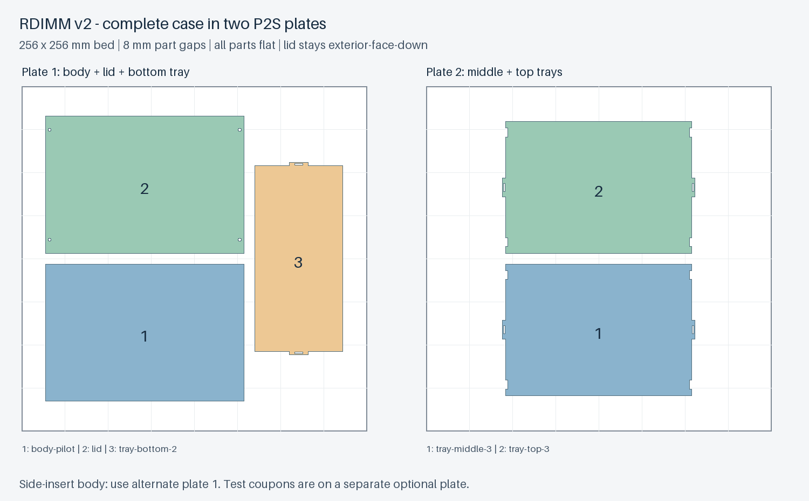

# v2 整盘打印排版（P2S）

完整盒子为 **两盘、共五个零件**。每盘提供相同排版的 STL 和通用 3MF，二选一导入，**不要两种格式同时导入**。无需逐件手动摆放。



## 打印哪些文件

| 文件（扩展名任选 `.stl` 或 `.3mf`） | 内容 | 是否必选 |
|---|---|---|
| `plate-1-pilot` | 普通攻牙外壳＋盖板＋两槽底托盘 | 与下一项二选一 |
| `plate-1-side-inserts` | 侧面嵌件外壳＋盖板＋两槽底托盘 | 与上一项二选一 |
| `plate-2-middle-top` | 三槽中托盘＋三槽顶托盘 | 必选 |
| `optional-test-plate` | 三个单槽试件＋试装平盖＋一个嵌件孔径试件 | 可选；不是正式盒内零件 |

默认打印 `plate-1-pilot` 和 `plate-2-middle-top` 即可得到一套。侧面嵌件版的指定五金与加工要求见 [v2 装配说明](../../docs/v2.zh-CN.md)。试件仍建议先试装；若只想先打一个单槽，原始单件文件在 `models/v2/`。

## 在 Bambu Studio 中使用

1. 新建项目，选择实际 **P2S、喷嘴、打印板和耗材**；本排版按 256 × 256 mm 热床制作。
2. 导入选定的第一盘文件。STL 已把同盘零件保存在同一个文件内；3MF 是保留相对位置的模型组件，**不含打印机/耗材/工艺预设**。若软件询问，按模型/几何导入。保持 **100% 比例**，不拆散后重新排列，不自动改变朝向。
3. 使用**逐层打印**，不要切换为逐对象顺序打印；8 mm 间距不是喷头逐对象避让距离。使用已有合适的耗材配置，0.4 mm 喷嘴可从 0.20 mm 层高开始检查。盖板已经外表面朝下，不要再次翻转。
4. 切片并检查床边、薄壁、侧孔桥接和首层。若需要 brim，可先将宽度控制在每件 3 mm 以内；更大的 brim、裙边或新增擦料塔可能需要重新检查排版。没有预生成 G-code，也没有发送到打印机。
5. 第一盘打印后取件、清理打印板，再打印第二盘。也可在同一个 Bambu Studio 项目中新建第二个打印盘，把第二盘文件导入那里。**不要把两个文件同时放到同一物理打印盘。**

每盘 STL 导入后被整体自动居中通常不影响相对布局；不要选择把各个实体重新自动排布。正式第一盘占地约 220.4 × 211.2 mm，第二盘约 142.8 × 203.6 mm。全部零件都接触 Z=0，未叠放打印。

## 为什么不能保持平放而合成单盘

对实际 v2 网格的 XY 投影做并集后，五个零件的投影面积合计约 **65,912.76 mm²**；256 × 256 mm 热床只有 **65,536 mm²**。即使不留任何间距，保持这些打印朝向也不能装进同一平面。这一结论不涉及把零件竖起来、修改设计或增加另一种支撑策略。

本排版只平移零件，并将两槽托盘绕 Z 轴旋转 90°，没有缩放或修改模型。正式两盘均留至少 8 mm 零件包围盒间距；第一盘最小床边余量约 17.8 mm，第二盘约 26.2 mm。两种第一盘是替代选项，不能同时打印当作同一套所需零件。

打印面积参考：[Bambu Lab 官方 P2S 介绍](https://blog.bambulab.com/the-icon-redefined-meet-the-p2s-a-completely-reengineered-version-of-the-ultra-productive-p1-series/)。

## 重建与验证

在项目根目录运行：

```sh
python src/layout_v2.py --output-dir plates/v2
```

生成器从现有 `models/v2/*.stl` 读取，检查尺寸保持、床内边界、8 mm 间距、STL 闭合性及实体数量、导出回读坐标/体积、3MF XML 网格回读；记录源 STL 的 SHA-256。详细结果在 `layout-verification.json`。

这些几何验证不是实际打印验证。Bambu Studio 的命令行导入/再导出检查另记录在 `bambu-import-check.json`，并不代表已切片或已选择你的耗材配置。v2 原有的实物验证与 ESD 限制仍适用。
